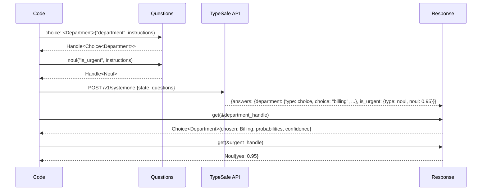
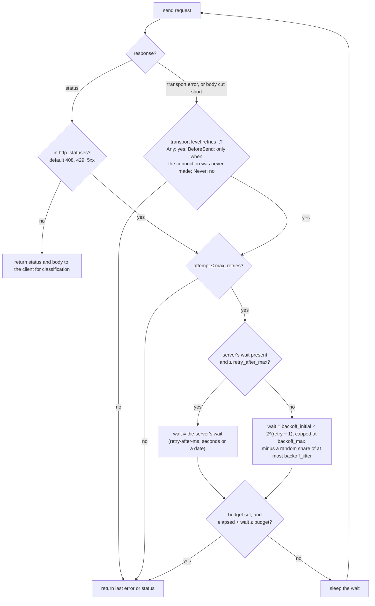

# How judgment works

A System One model answers typed questions about a state, and an application acts on the answers. Two things go wrong between the two: an answer is read as the wrong type, or a transient failure upstream fails a decision that a second attempt would have made. This page shows how the crate prevents each, with the two diagrams rustdoc cannot render. The reference for every type, error and default is the rustdoc (`cargo doc -p judgment --open`); this page is the overview it assumes.

## Typed handles

On the wire, questions and answers are two maps keyed by the same ids, and nothing ties a Noul question to a Noul answer. The crate closes that gap at compile time ([decision 0003](decisions/0003-typed-handles-between-questions-and-answers.md)). Adding a question returns a handle that fixes the answer's type. Reading through the handle yields a Rust enum, a probability or a score, or an error naming what did not fit. The error table and the `options!` macro are in the rustdoc.

A handle checks one answer when it is read. The whole response is checked before anyone reads it: the client holds every response against the questions it sent (`Response::verify`). That means:

- an answer for every question,
- of the question's primitive,
- a Choice that names only options it was offered, in its choice and in every key of its distribution,
- a Score whose legend is the levels sent and whose value is on their scale.

A response that does not fit is an error naming the question and the option or level. It carries TypeSafe's request id when the server sent one. It is not retried, because the call was billed. Its token usage is still reported, and the observer counts it as a failed attempt with status `unfit`, beside `decode` for a 2xx body that does not decode. The `Fake`, `Replay` and `Recorder` backends verify too, so a response that reaches the caller answers what was asked whichever backend is behind the `SystemOne` trait. The official SDKs check the shape of each answer and stop there. The consequence for an application: an option the model was never offered fails the call instead of being read as a guess.

## Retries

A transient failure must not fail a call that a second attempt would have completed, and a persistent one must surface quickly enough for the caller to fall back. The loop below, in the crate's `http` module, sits between those two costs. Its defaults are the official SDKs':

- two retries;
- 0.5 s doubling to 5 s, with a jitter that only ever shortens a wait;
- 408, 429, every 5xx and every transport failure retried;
- the server's wait (`retry-after-ms`, or `Retry-After` in seconds or as an HTTP date, measured against the response's `Date` header) honoured on any retried status, up to 30 s;
- no overall budget, which a caller may set.

The reasons for each, and a table of where the crate matches the SDKs and where it deliberately differs, are in the rustdoc of `RetryPolicy`. `RetryPolicy::conservative()` retries only 408, 429 and a connection that was never made, for a caller who would rather fail a billed call than pay for it twice. The loop is public (`judgment::http::send_with_retries`), so another client over `reqwest` in the same application can retry the same way and report to the same observer.

## Errors and the request id

Errors are grouped by what fixes them rather than by status code; the variants and their remedies are documented on the `Error` type. The client follows no redirect, as the Python SDK follows none. A 3xx is `Error::Http` with that status, not retried: the API never redirects its two paths, so a 3xx means the base URL points somewhere else, and following it would send a gateway header, and on a 307 or 308 the caller's state, to wherever the redirect names.

TypeSafe identifies a call by an `x-typesafe-request-id` response header, which both official SDKs expose. It is the one link from a failed call or a surprising answer to TypeSafe's own logs. The client keeps it in four places:

| Where | When |
|---|---|
| `Error::request_id()` | every error that came from an HTTP response, a 2xx whose body does not decode included |
| a ` [request_id …]` suffix on the error's message | the same errors, so a log line that keeps only the message still has it |
| `Response::request_id` | every successful response |
| the `request_id` field of the `typesafe.evaluate` and `typesafe.list_models` spans | every call |

Quote it to TypeSafe support when a call fails or an answer looks wrong. It is the last attempt's id when the call was retried, and there is none after a transport failure. It is optional everywhere, because the published OpenAPI document lists no response headers and a compatible server may not send one ([Laya does not](verification/laya-typed-decisions.md#what-the-two-servers-do-differently)). The hosted API sends it on every 2xx and 4xx ([hosted API](verification/hosted-typesafe.md)).

## What the crate does not do

- No sync client. The API documents one evaluation endpoint and a model listing, and every consumer so far is async. A caller that must block can block on the future.
- No batching or streaming. The API documents one request shape, and one request already carries many questions.
- No metrics backend. A library that named instruments would force its telemetry stack on every consumer. The crate emits `tracing` spans and hands token usage and failed attempts to an `Observer`; the application counts them where it counts everything else.
- No per-call options across the `SystemOne` trait. `Client::evaluate_with` takes a `CallOptions` for one call's timeout, retry policy, headers and extra body fields. A recording is filed under a hash of the state and the questions, and an extra field can change the answer, so options could cross the trait only by entering that hash. Until a backend needs them, keeping them off leaves every existing recording valid.
