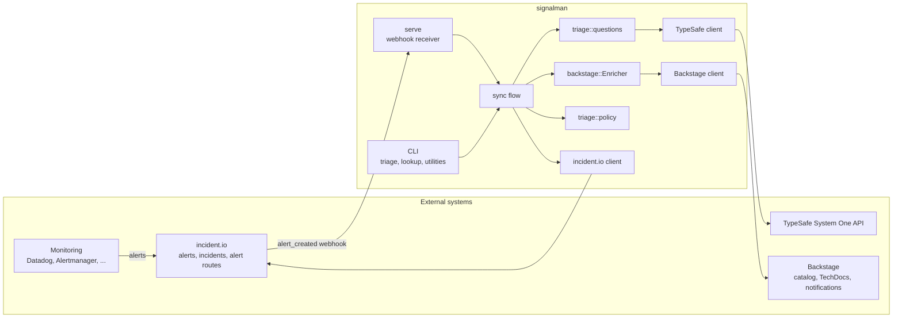
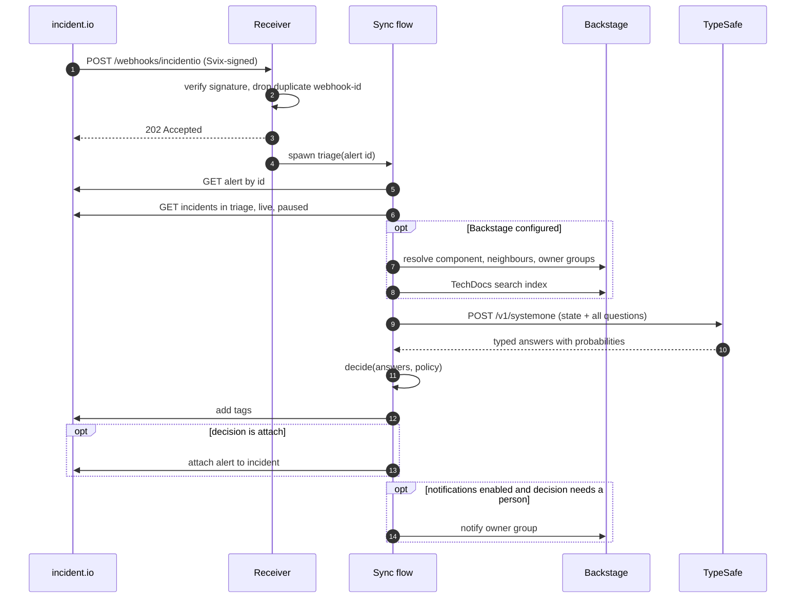

# Architecture

signalman is a single Rust process with two entry points, an HTTP receiver and a CLI, that share one library. The library talks to three external systems and owns no state beyond an in-memory set of seen webhook ids. This page describes the moving parts and the path an alert takes. The [C4 model](c4/context.md) gives the same picture at three zoom levels.

## Components

| Component | Module | Responsibility |
|---|---|---|
| Receiver | `src/serve.rs` | Verify the Svix signature, deduplicate deliveries, acknowledge, run the flow in the background |
| Sync flow | `src/incidentio/sync.rs` | Fetch fresh state, enrich, ask, decide, write back |
| Enricher | `src/backstage/enrich.rs` | Resolve the component, assemble owner candidates, pick the runbook, notify the owner |
| Questions | `src/triage/questions.rs` | Build the fan-out request with typed handles |
| Policy | `src/triage/policy.rs` | Turn typed answers into one decision with risk-scaled thresholds |
| TypeSafe client | `src/client.rs`, `src/question.rs`, `src/answer.rs` | Wire contract, typed handles, validated probabilities |
| incident.io client | `src/incidentio/client.rs`, `types.rs` | Incidents, alerts, tags, attachments, alert-source events |
| Backstage client | `src/backstage/client.rs`, `types.rs` | Catalog queries, TechDocs search index, notifications |
| Shared HTTP | `src/http.rs` | One retry loop for all three clients |
| CLI | `src/main.rs` | `triage`, `serve`, `models`, `incidentio`, `backstage` |

## The path of one alert

Fetching the alert and the incidents fresh (steps 5 and 6) is what makes delivery order irrelevant. The webhook carries an id and a snapshot; only the id is used.

## Boundaries

Three boundaries organise the design. Each is a decision record.

**Catalog versus model.** The catalog states facts: who owns what, what depends on what, what the runbook says. The model judges what those facts imply for this alert: which owner takes first response, how severe the impact is, whether it duplicates an open incident. The catalog never decides; the model never invents ownership. [ADR 0004](decisions/0004-catalog-is-the-ownership-source-of-truth.md).

**Model versus code.** The model answers narrow questions and returns probabilities. Code chooses the questions, the candidates, the thresholds and the actions. A threshold change never re-runs inference. [ADR 0002](decisions/0002-calibrated-judgments-over-generated-text.md).

**signalman versus incident.io.** signalman writes tags and attachments. incident.io owns incident creation, escalation and the human workflow. [ADR 0001](decisions/0001-incidentio-remains-the-alert-hub.md).

A fourth, internal boundary: every question returns a typed handle, and every answer is read through one. Wire strings become Rust types at exactly one place. [ADR 0003](decisions/0003-typed-handles-between-questions-and-answers.md).

## Failure containment

| Failure | Where it stops | Visible effect |
|---|---|---|
| Bad or missing signature | Receiver returns 401 | incident.io retries for 24 hours; fix the secret |
| Unparseable body | Receiver returns 400 | incident.io retries; check the event subscription |
| Duplicate delivery | Receiver returns 200 | none |
| Backstage unreachable or entity missing | Enricher | Missing entities degrade to the static team list; transport errors fail the triage |
| TypeSafe or incident.io error during the flow | Flow logs at `error` | Alert stays untagged; nothing is paged or suppressed |
| Notification fails | Enricher logs at `warn` | Tags and attachment already written stay |
| Transient upstream status (408, 429, 5xx) | Shared retry loop | Two retries with jittered backoff, `Retry-After` honoured |

The receiver acknowledges before the flow runs, so an upstream failure never causes incident.io to redeliver. That is deliberate: a redelivery would re-run the model on the same alert. The cost is that a failed triage needs the `incidentio triage-alert` command to retry by hand.

## Further reading

- [C4 model](c4/context.md): context, containers, components
- [Triage](triage.md): the questions and the policy
- [Backstage bridge](backstage.md): resolution, candidates, runbooks
- [incident.io integration](incidentio.md): webhook verification and write-back
