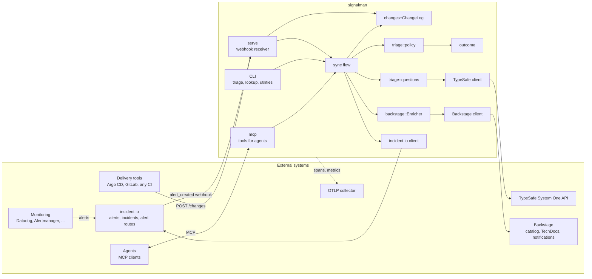
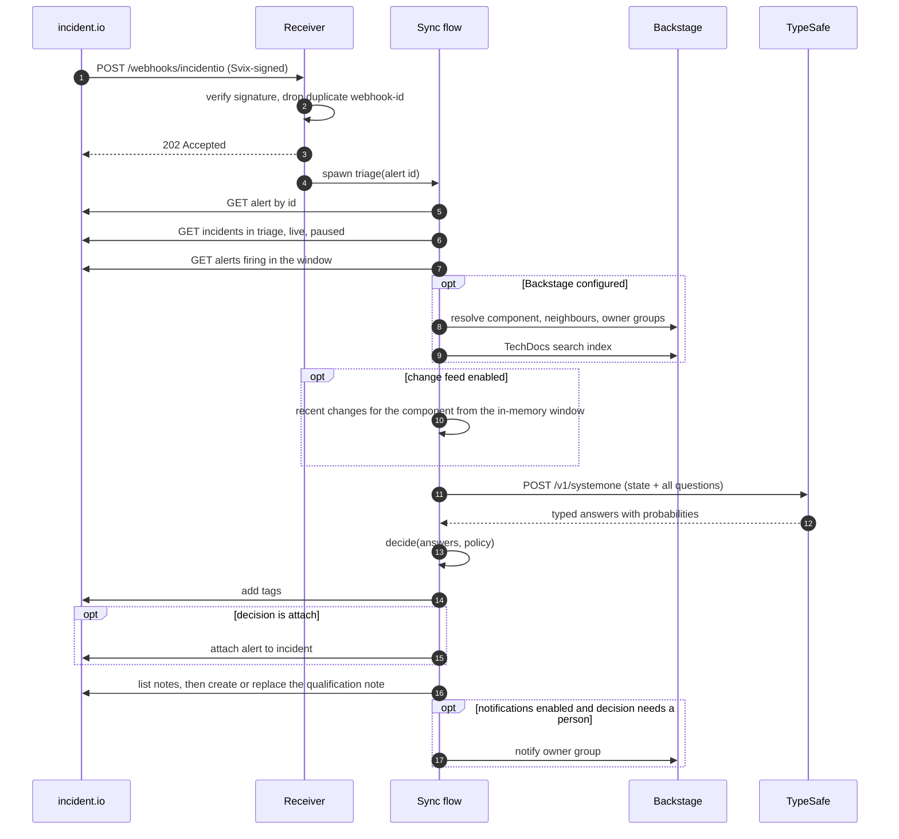

# Architecture

An alert reaches a responder through incident.io with nothing attached that says who owns it, how bad it is, or whether it is already being handled. signalman adds those judgments as tags, an attachment and a note before a person looks, without taking over incident creation or escalation. This page describes the moving parts and the path an alert takes. The [C4 model](c4/context.md) gives the same picture at three zoom levels.

signalman is one Rust binary with three ways to run it: `serve` is the HTTP receiver, `mcp` serves the same judgments to agents over stdio or HTTP, and every other subcommand is a CLI operation. All three share one library that talks to three external systems.

## State

signalman has no database. Each replica holds three in-memory stores. Each is in memory because losing it costs less than the dependency a shared store would add, and each is bounded so a replica cannot grow without limit.

| Store | Module | Bound | Why in memory, per replica |
|---|---|---|---|
| Seen webhook ids | `src/serve.rs` | 4,096 most recent | Stops a Svix resend from re-running the model on the same alert. A miss after a restart, or on another replica, costs one repeated model call; tag adds are idempotent, so nothing else happens |
| Change window | `src/changes/mod.rs` | 1,000 newest changes | A change is context for `caused_by_change`. Losing the window after a restart returns the flow to where it was before the feed existed: the question is not asked. [Decision 0007](decisions/0007-changes-are-pushed-not-polled.md) chose this over a store or a poll of delivery tools |
| Readiness report | `src/readiness.rs` | one report, reused for `server.readiness_cache_seconds` (default 30) | Keeps probe storms and many replicas from turning `GET /readyz` into load on the upstreams. The staleness accepted is one cache period of a wrong verdict in either direction: a failed check stays cached too |

The cost is per-replica truth: two replicas hold two seen sets, two change windows and two readiness verdicts. [Operations](operations.md) says what that means when scaling.

## Components

| Component | Module | Problem it solves |
|---|---|---|
| Receiver | `src/serve.rs` | incident.io retries any non-2xx for 24 hours, so the endpoint must accept fast and refuse only what it cannot take: it verifies the Svix signature, drops duplicate `webhook-id`s, refuses work beyond the replica's capacity with 503, answers 202, then runs the flow under a deadline. Hosts `/changes` and `/mcp` when their tokens are set |
| Readiness probe | `src/readiness.rs` | Tells the Service whether this replica can do its job, not only that it runs: the cheapest authenticated call per upstream, concurrent, under a per-check deadline, cached |
| Change feed | `src/changes/` | Fills `alert.recent_changes` from pushed change events so `caused_by_change` is asked in production; `argocd.rs` and `gitlab.rs` translate those tools' native payloads into the same change ([Change feed](changes.md)) |
| Sync flow | `src/incidentio/sync.rs` | One order of operations for every triage, whichever entry point started it: fetch fresh state, enrich, ask, decide, write back |
| Qualification note | `src/incidentio/note.rs` | Puts what the tags cannot carry (probabilities, alternatives, links) where the responder already is, from a fixed template, replaced in place so notes never stack |
| Webhook verifier | `src/incidentio/webhook.rs` | Proves a delivery came from incident.io before any of it is parsed; reads the signing secret itself |
| Enricher | `src/backstage/enrich.rs` | Turns catalog facts into the closed set of owner candidates and the context the model reasons over, and hands the decision to the owning group ([Backstage bridge](backstage.md)) |
| Questions | `src/triage/questions.rs` | Asks every question in one request and returns typed handles, so an answer cannot be read as the wrong type |
| Policy | `src/triage/policy.rs` | Turns probabilities into one decision with thresholds that rise with the cost of being wrong; a threshold change never re-runs inference |
| Triage types | `src/triage/mod.rs` | The alert, candidate and answer types that questions, policy and note share, and the built-in team list used when no catalog is configured |
| Outcome contract | `src/outcome.rs` | One versioned JSON document per triage, so scripts, log pipelines and agents index fields instead of parsing prose; schema committed and drift-tested |
| MCP server | `src/mcp.rs`, `src/mcp/http.rs` | Lets agents call the judgments the CLI already exposes: five read-only tools plus the gated `apply_qualification`, over one dry-run `Triager`, on stdio or Streamable HTTP behind a bearer token ([MCP](mcp.md)) |
| Evaluation harness | `src/eval/`, `crates/judgment/src/eval/` | Grades judgments and decisions against labelled alerts, and replays recorded responses so thresholds and wording are tuned without calling the model The measuring (recordings, per-question grading, accuracy, Brier, calibration error) is the judgment crate's; the labels, the question-to-label mapping and the decision are signalman's |
| TypeSafe client | `crates/judgment/src/client.rs`, `crates/judgment/src/question.rs`, `crates/judgment/src/answer.rs`, `crates/judgment/src/error.rs` | The wire contract, typed handles and validated probabilities: wire strings become Rust types at one place |
| incident.io client | `src/incidentio/client.rs`, `types.rs`, `error.rs` | Incidents, alerts, tags, attachments, notes and alert-source events; wire types ignore unknown fields so an API addition is not an outage |
| Backstage client | `src/backstage/client.rs`, `types.rs`, `error.rs` | Catalog queries, the TechDocs search index and notifications; lenient entity types so catalog drift is a named `Decode` error, not a panic |
| Shared HTTP | `crates/judgment/src/http.rs` | One retry loop for all three clients, so transient statuses are handled the same way everywhere and every failed attempt is counted once |
| Telemetry | `src/telemetry.rs` | The `tracing` subscriber, OTLP/HTTP export of spans and metrics when an endpoint is set, and the one place that names an instrument, so the table in [Observability](observability.md) has a single source |
| Configuration | `src/config.rs` | One function resolves default, file, environment and flag, so the precedence table in [Configuration](configuration.md) describes code rather than approximating it |
| CLI | `src/main.rs` | `triage`, `eval`, `serve`, `mcp`, `models`, `incidentio`, `backstage`, `config`, `schema`; builds every client and the flow from the resolved configuration |

Configuration enters once: `config::Config` resolves defaults, the TOML file, environment variables and flags in that order at start-up, and `main` builds every client and the flow from it. `src/config.rs` is the only module that reads a non-secret environment variable. Secrets are refused from the file and read by the module that uses them, so a reviewed `ConfigMap` cannot be persuaded into holding one ([decision 0006](decisions/0006-layered-configuration.md)). Those reads are `TYPESAFE_API_KEY`, `INCIDENTIO_API_KEY` and `BACKSTAGE_TOKEN` in the three clients, `INCIDENTIO_WEBHOOK_SECRET` in the webhook verifier, `SIGNALMAN_CHANGES_TOKEN` in the change feed, `SIGNALMAN_MCP_TOKEN` in the MCP HTTP endpoint, and `OTEL_EXPORTER_OTLP_HEADERS` in the OpenTelemetry exporter. The alert source token for `triage --forward-to-incidentio`, `INCIDENTIO_ALERT_SOURCE_TOKEN`, is read by the incident.io client too; the source's id is ordinary configuration (`incidentio.alert_source_config_id`) and goes through `config.rs` like every other setting.

## The path of one alert

Deliveries beyond the replica's running and waiting capacity are refused with 503 before being marked seen, so incident.io's retry is the backpressure, and each spawned triage runs under a deadline ([Operations](operations.md#backpressure)). Fetching the alert and the incidents fresh (steps 5 and 6) is what makes delivery order irrelevant. The webhook carries an id and a snapshot; only the id is used. Step 7 is context and degrades to an empty list on failure; the note is a convenience on top of the tags and its failure is logged, not propagated.

## Boundaries

Four boundaries organise the design. Each is a decision record.

**Catalog versus model.** The catalog states facts: who owns what, what depends on what, what the runbook says. The model judges what those facts imply for this alert: which owner takes first response, how severe the impact is, whether it duplicates an open incident. The catalog never decides; the model never invents ownership. [ADR 0004](decisions/0004-catalog-is-the-ownership-source-of-truth.md).

**Model versus code.** The model answers narrow questions and returns probabilities. Code chooses the questions, the candidates, the thresholds and the actions. A threshold change never re-runs inference. [ADR 0002](decisions/0002-calibrated-judgments-over-generated-text.md).

**signalman versus incident.io.** signalman writes tags, attachments and one note. incident.io owns incident creation, escalation and the human workflow. [ADR 0001](decisions/0001-incidentio-remains-the-alert-hub.md).

**signalman versus agents.** signalman is a tool that agents call: it answers with typed judgments over a versioned JSON contract ([Triage](triage.md#the-outcome-contract)) and tools over the [Model Context Protocol](mcp.md), read-only except for one write tool that is off by default (`signalman mcp`, or `/mcp` on the receiver). The agent owns the investigation and the conversation; no model inside signalman chooses actions or writes prose. [ADR 0008](decisions/0008-signalman-is-a-tool-for-agents.md).

A fifth, internal boundary: every question returns a typed handle, and every answer is read through one. Wire strings become Rust types at exactly one place. [ADR 0003](decisions/0003-typed-handles-between-questions-and-answers.md).

## Failure containment

| Failure | Where it stops | Visible effect |
|---|---|---|
| Bad or missing signature | Receiver returns 401 | incident.io retries for 24 hours; fix the secret |
| Unparseable body | Receiver returns 400 | incident.io retries; check the event subscription |
| Duplicate delivery | Receiver returns 200 | none |
| Component not in the catalog | Enricher | Every catalog group whose `spec.type` is in `backstage.group_types` becomes a candidate, capped at 24; the triage continues. The compiled team list is used only when no catalog is configured at all |
| Backstage transport or auth error | Enricher | The triage fails and is logged; the alert stays untagged. A token without the `techdocs` plugin only loses the runbook, at `warn` |
| TypeSafe or incident.io error during the flow | Flow logs at `error` | Alert stays untagged; nothing is paged or suppressed |
| Notification fails | Enricher logs at `warn` | Tags and attachment already written stay |
| Change feed token unset | Receiver | `/changes` is not routed; `recent_changes` stays empty and `caused_by_change` is not asked |
| Transient upstream status (408, 429, 5xx) | Shared retry loop | Two retries with jittered backoff, `Retry-After` honoured |
| OTLP collector down or slow | OpenTelemetry SDK, on its own thread | The SDK logs a warning; no triage waits on export or fails because of it |

The receiver acknowledges before the flow runs, so an upstream failure never causes incident.io to redeliver. That is deliberate: a redelivery would re-run the model on the same alert. The cost is that a failed triage needs the `incidentio triage-alert` command to retry by hand.

## Further reading

- [C4 model](c4/context.md): context, containers, components
- [Triage](triage.md): the questions and the policy
- [Backstage bridge](backstage.md): resolution, candidates, runbooks
- [incident.io integration](incidentio.md): webhook verification and write-back
- [Change feed](changes.md): how deploys reach `recent_changes`
- [MCP](mcp.md): the tools agents call
