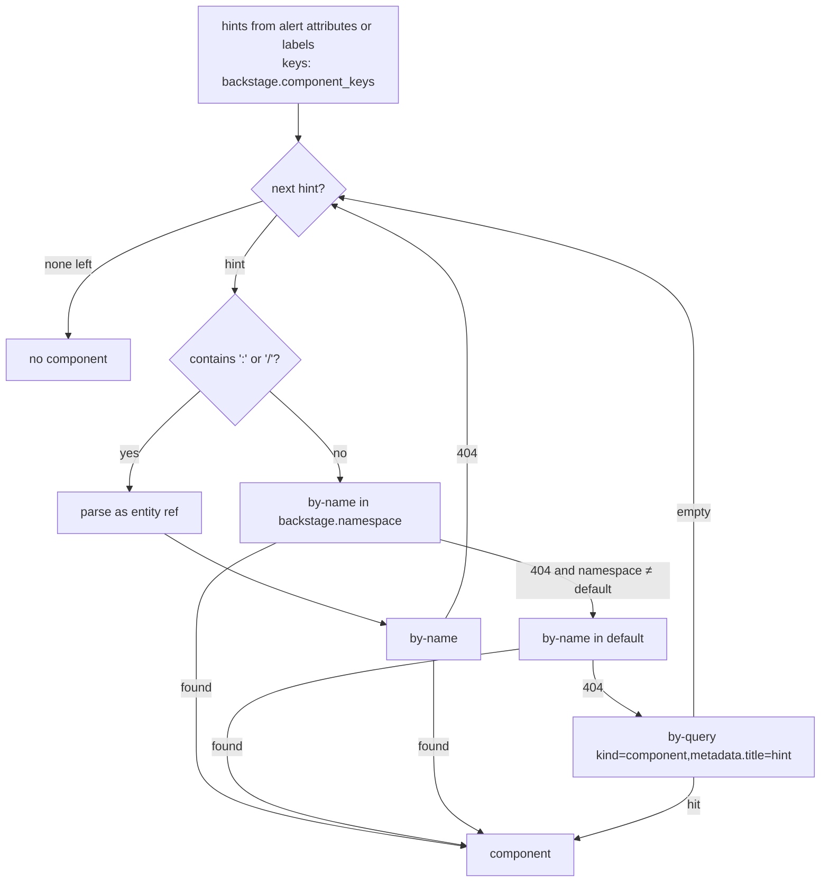
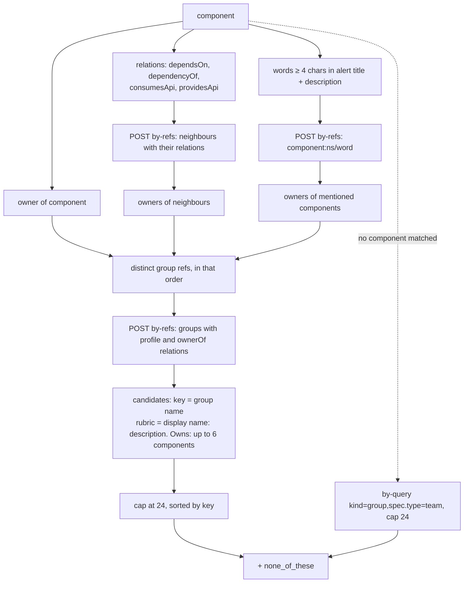
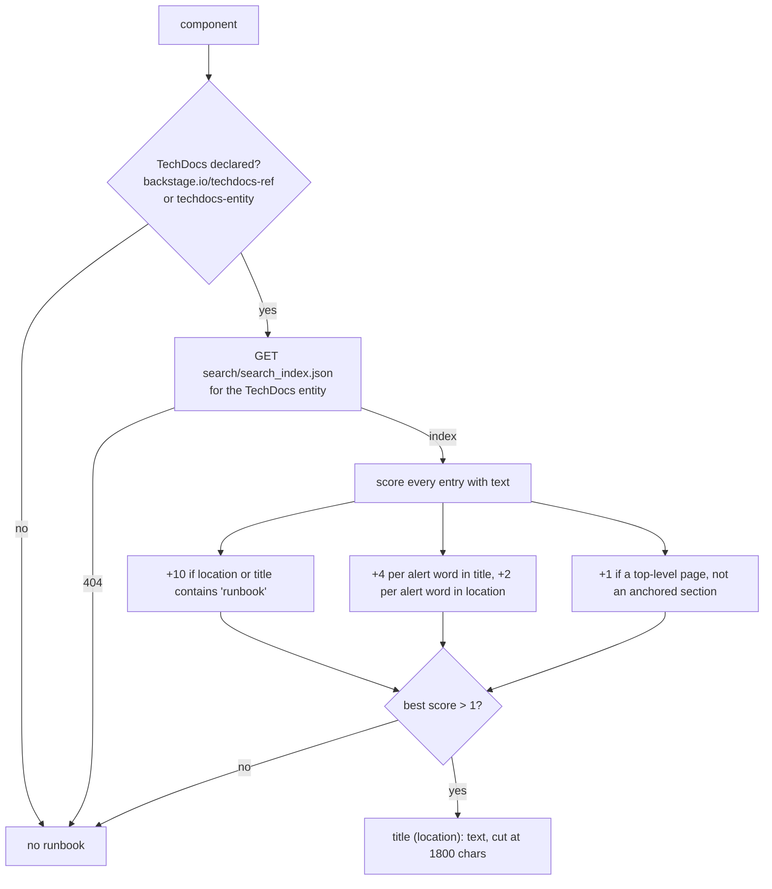
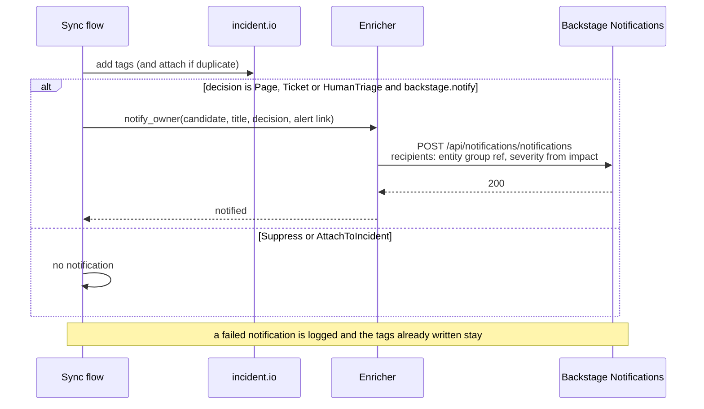

# Backstage bridge

Without a catalog, signalman routes to a team list compiled into the binary: one organisation's snapshot of who owned what. The Backstage software catalog holds the current answer and more: dependencies, lifecycle, runbooks. The bridge turns that referential into triage inputs and turns the triage output into a message the owning group sees in the portal. The rule it follows is [ADR 0004](decisions/0004-catalog-is-the-ownership-source-of-truth.md): the catalog supplies facts and candidates; the model still judges.

Everything below lives in `src/backstage/enrich.rs`. Several of its numbers (the candidate cap, the excerpt length, the word lengths, the runbook weights) are hand-tuned defaults with no measured basis yet: nothing has been run against a live catalog. Where a number has a reason, this page gives it; where it only has a trade-off, this page says which side it takes.

Contract sources: the [catalog REST API](https://backstage.io/docs/features/software-catalog/software-catalog-api), the [descriptor format](https://backstage.io/docs/features/software-catalog/descriptor-format), [service-to-service auth](https://backstage.io/docs/auth/service-to-service-auth) and the [Notifications plugin](https://backstage.io/docs/notifications/).

## What the catalog contributes

| Catalog fact | Where it goes | Why it matters |
|---|---|---|
| The component matched by the alert's service name | `alert.component` | The model reasons about the real service, not a label |
| `ownedBy` relation | `alert.component.owner`; first owner candidate | The registered owner is a fact; the model decides whether this alert is an exception |
| `dependsOn`, `dependencyOf`, `consumesApi`, `providesApi` | `depends_on`, `dependents`; their owners become candidates | Alerts fire on symptoms; the cause and the blast radius live in the neighbours |
| Components named in the alert text | their owners become candidates | An alert on `checkout-api` that mentions `payments-gateway` may belong to the gateway's team |
| `spec.lifecycle`, `spec.type`, `spec.system`, tags, link titles | `alert.component` | Impact and actionability differ for experimental and production services |
| TechDocs search index | `alert.runbook` | The runbook page that best matches the alert, as plain text |

## Resolving the component

The problem: an alert names its service the way the monitoring tool does, in a label whose key and spelling vary by source, and the catalog knows the component by `metadata.name` in a namespace. Resolution has to find the entity from that label without guessing, because a wrong component is worse than none: the model would reason about the wrong owner, neighbours and runbook, whereas no component leads to the honest fallback below.



**Which labels are hints.** The values of alert attributes (or CLI labels) whose names are in `backstage.component_keys`, compared case-insensitively. The default list in the code is `component, service, app, application, Service, Component`; because the comparison ignores case, the capitalised pair matches nothing the lower-case pair does not, so there are four distinct keys. The list is ordered, and hints are collected in key order, so the operator's order is the priority order: with the default, a `component` attribute beats a `service` one. The first hint that resolves wins; the rest are never tried. Duplicated values are collapsed.

**Why exact lookups in this order.** A hint containing `:` or `/` is treated as an entity reference and looked up once: someone supplied the exact identity, so nothing is guessed. A bare name is looked up by `metadata.name` in the configured namespace, then in `default` when that differs, then by `metadata.title` with a filter query. The order is from cheapest and least ambiguous to most: `by-name` is one GET on a unique key; the title query is a filter over the whole catalog and takes the first hit, so a duplicated title resolves arbitrarily. The title step exists because alert attributes often carry the human name a team gave its service, not the slug the catalog was registered under. The `default` retry exists because most catalogs register everything there, and a deployment that sets `backstage.namespace` for its own components still shares platform components in `default`. Its cost is one extra 404 round trip for every hint that does not resolve in the configured namespace.

**What was rejected.** Fuzzy or full-text matching on the name. It would raise the hit rate and also the rate of confident wrong components, which the fallback cannot repair. If live use shows many alerts resolving nothing, the place to widen matching is the title step, and the signal to watch is how often `matched_by` is empty in the enrichment logs.

## Owner candidates

The problem: the owner question is a Choice, so the model needs a closed set of options and can never invent a team ([ADR 0004](decisions/0004-catalog-is-the-ownership-source-of-truth.md)). Too few options and the right team is missing; too many and each is a rubric paragraph of input tokens per triage, and the model spreads probability across teams that were never plausible.



**Who is a candidate.** The registered owner first, then the owners of the component's direct neighbours (what it depends on, what depends on it, the APIs it consumes and provides), then the owners of any component whose name appears in the alert text. Neighbours are there because alerts fire on symptoms: the cause is usually upstream and the blast radius downstream, so their teams are the plausible exceptions to the registered owner. Mentions are there because alert text often names the failing dependency outright. Everything else in the catalog is excluded, on purpose: the candidate set is the graph around the alert, not the organisation.

**Why the order matters even though the list is sorted.** Group references are collected owner first, neighbours second, mentions third, and the cap is applied in that order, so the registered owner is never the one truncated. The surviving list is then sorted by key so that the order the model sees does not depend on the order the graph walk happened to produce, and the same alert yields the same request on every run, which is what makes recorded responses replayable in the evaluation harness.

**Why mentions need four characters.** Alert text is split on non-word characters and every word of at least four characters that contains a letter is tried as `component:<namespace>/<word>`, at most 40 words, in one `by-refs` request. The four-character floor is a hand-tuned trade-off with no stated basis in the code: shorter tokens (`api`, `db`, `web`, `app`) are the names of many components and would pull in unrelated teams on nearly every alert, while any real component whose name is three characters is missed. The 40-word cap bounds the size of that one request. Mentions are matched by exact word against `metadata.name` in the configured namespace only; matching titles as well would cost one filter query per word instead of one request for all of them.

**Why the rubric looks the way it does.** The model reads the rubric to choose, so each candidate is `display name: description. Owns: a, b, c`, with up to six owned components. The owned names make a group's remit concrete when its description is empty or generic, which is common in catalogs. Six is a hand-tuned token budget, not a measured one. The key is the group's `metadata.name`, so the `ai-team-<key>` tag written back to incident.io and the keys in a `[[triage.teams]]` fallback list share one identifier space.

**Why 24.** The Choice primitive allows 255 options; the cap of 24 (`DEFAULT_MAX_CANDIDATES`) is a token budget, since every option costs input tokens on every triage. It is a public field on `Enricher` that the configuration layer does not set, so changing it is a code change today. Raise it if the logs show the registered owner's neighbourhood being truncated; lower it if the owner distribution is flat across many teams.

**When no component resolves, or no group could be fetched.** Every catalog group of `spec.type: team` becomes a candidate, capped at 24 in whatever order the catalog returns them, then sorted. This is the honest fallback: the model is asked to pick from the real teams with no neighbourhood hint, and `HumanTriage` is the likely outcome. What was rejected is falling back to the compiled `[[triage.teams]]` list when a catalog is configured: that list is a snapshot and would silently diverge from the source of truth. The compiled list is used only when no catalog is configured at all; then this module is never called. The cost is that a catalog with more than 24 teams is truncated by an order this page cannot promise, since the catalog API does not document one; that is unverified.

## Runbook selection

The problem: a runbook page tells the model what "normal" and "act now" mean for this service, but a TechDocs site has many pages and the model should read the one that applies, not the site. TechDocs publishes the mkdocs search index alongside the site, which is the plain text of every page and section; that makes it a better source than scraping HTML, and a missing site is not an error.



**The scoring.** Every index entry with text is scored against the alert's words (three characters or more, lower-cased; a different floor from the four used for mentions, because here a short word only adds a few points rather than fetching an entity). The weights are hand-tuned and the test pins the behaviour they produce, not the numbers:

- `+10` when the location or title contains `runbook`. This dominates any number of word matches, so a runbook page that matches one alert word beats an overview page that matches three. The premise is that a page a team filed under runbooks is the page a responder should read, whatever it is called.
- `+4` per alert word in the title, `+2` per word in the location. The title is written by a person to name the page; the location is derived from the file path and repeats the title's words in slug form, so it counts for half rather than doubling the same evidence.
- `+1` for a top-level page over an anchored section, all else equal. The page holds the whole procedure; the anchored entries are fragments of it. Among equal scores the shorter location wins for the same reason: the parent page over a deeper one.

**The cutoff.** A page must score more than 1 to be chosen. A score of exactly 1 is a top-level page that matched nothing about the alert and is not a runbook; below that floor, the result would be a random page, and no runbook is better than a wrong one. The test `runbook_prefers_runbook_pages_matching_the_alert` checks the floor with an unrelated ADR page.

**The excerpt.** `Title (location): text`, cut at 1,800 characters on a character boundary (`DEFAULT_RUNBOOK_CHARS`, a public field the configuration layer does not set). The length is a token budget with no measured basis: long enough for a heading and the first steps, short enough that the runbook is not the largest part of the state. Multi-page runbooks are not stitched. The `runbook_url` points at the page, so the responder reads the rest there.

## Notification

The problem: the tags route escalation in incident.io, and the note lives on the alert, but the owning team may work from the portal and never see either. The Notifications plugin puts one line in front of the group. The decision is to send it only when a person is expected to act.



**Why only three decisions.** `Suppress` means the model is confident nobody needs to act, and a notification would undo the suppression. `AttachToIncident` means responders on the existing incident already know; a second channel to a different group is noise. `Page`, `Ticket` and `HumanTriage` each name a person who has not yet seen the alert.

| Decision | Title | Severity |
|---|---|---|
| Page, impact Outage | `Page: <alert>` | critical |
| Page, any lower impact | `Page: <alert>` | high |
| Ticket | `Ticket: <alert>` | normal |
| HumanTriage | `Needs triage: <alert>` | normal |

**Why that severity map.** A page is already urgent, so the notification's severity only distinguishes a full outage from everything else; a ticket or a request to triage wakes nobody, so it is `normal`. The description is a fixed sentence built from the typed decision (owner, impact, whether ownership needs confirming, whether a change is suspected), the same rule as the qualification note: the model judges, it does not write.

**What it costs and what it needs.** `backstage.notify` (`BACKSTAGE_NOTIFY`, `serve --notify-owners`) is off by default because it needs a backend plugin the catalog does not, and because a notification per decision is a real interruption while the decisions are unverified against live alerts. Only candidates that carry an entity reference can be notified, so a team from the compiled fallback list is never notified. A failed notification is logged at `warn` and never undoes the tags: the tags are the contract, the notification is a convenience.

## Setup

1. Create a static external-access token in `app-config.yaml`:

   ```yaml
   backend:
     auth:
       externalAccess:
         - type: static
           options:
             token: ${SIGNALMAN_BACKSTAGE_TOKEN}
             subject: signalman
           accessRestrictions:
             - plugin: catalog
             - plugin: techdocs
             - plugin: notifications
   ```

2. Set `BACKSTAGE_BASE_URL` to the backend URL without `/api` and `BACKSTAGE_TOKEN` to the token. `serve` enables enrichment when the URL is set; the CLI needs `--enrich-from-backstage`.
3. Check with `signalman backstage lookup checkout-api --text "HighErrorRate 5xx"`: it prints the resolved component, the owner candidates as the model will see them, and the runbook excerpt.
4. Make sure alerts carry the component identity: an incident.io alert attribute named `Service` or `Component` whose value is the catalog name. The [incident.io catalog importer](https://github.com/incident-io/catalog-importer) can sync Backstage components into incident.io so that attribute is a real catalog entry.

## Registering signalman

`catalog-info.yaml` declares signalman as a `Component` of type `service` with TechDocs built from `docs/` by `mkdocs.yml`, plus two `Resource` entities, incident.io and the TypeSafe API, that it `dependsOn`. Register the file's URL or let the GitHub discovery provider find it. Replace the placeholder owner `group:default/platform-engineering` with the group that runs it. Mermaid diagrams in these pages need the TechDocs Mermaid addon to render in Backstage ([Development](development.md#techdocs)).

## Related plugins

Among the community plugin workspaces, `firehydrant`, `ilert` and `healert` cover incident tooling, `grafana`, `sentry`, `newrelic`, `dynatrace` and `splunk` cover signals, and `github`, `argocd`, `flux` and `octopus-deploy` cover deployments. None is required. The deployment plugins are not how `recent_changes` is filled: [decision 0007](decisions/0007-changes-are-pushed-not-polled.md) rejected polling them because their backend routes are internal to each plugin version, not a published contract, and the catalog would become a proxy for operational data it was not designed to serve. Delivery tools post to the [change feed](changes.md) instead. The incident.io Backstage plugin (`@incident-io/backstage`) shows incident.io incidents on a component page through a custom field mapped to the Backstage component catalog type, which pairs with the attributes signalman tags.

## Limits and unverified points

- Not yet run against a real Backstage instance. Shapes follow the OpenAPI specification and TypeScript types; drift surfaces as a `Decode` error naming the field.
- Owner candidates are capped at 24 per triage. Each is a Choice option and costs input tokens. The cap and the 1,800-character excerpt are compiled defaults, not settings.
- Mentioned components are matched by exact word against `metadata.name` in the configured namespace only.
- The runbook excerpt is one page, at most 1,800 characters. Multi-page runbooks are not stitched.
- Notifications need the Notifications backend installed and the token allowed on the `notifications` plugin.
- Which 24 teams survive the all-teams fallback depends on the catalog's return order, which its API does not document.
