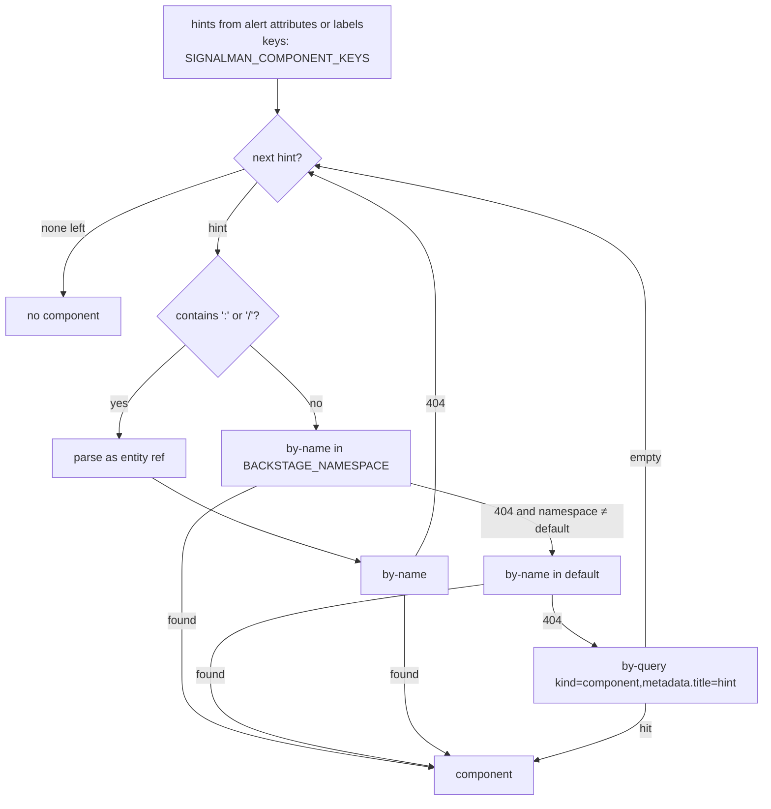
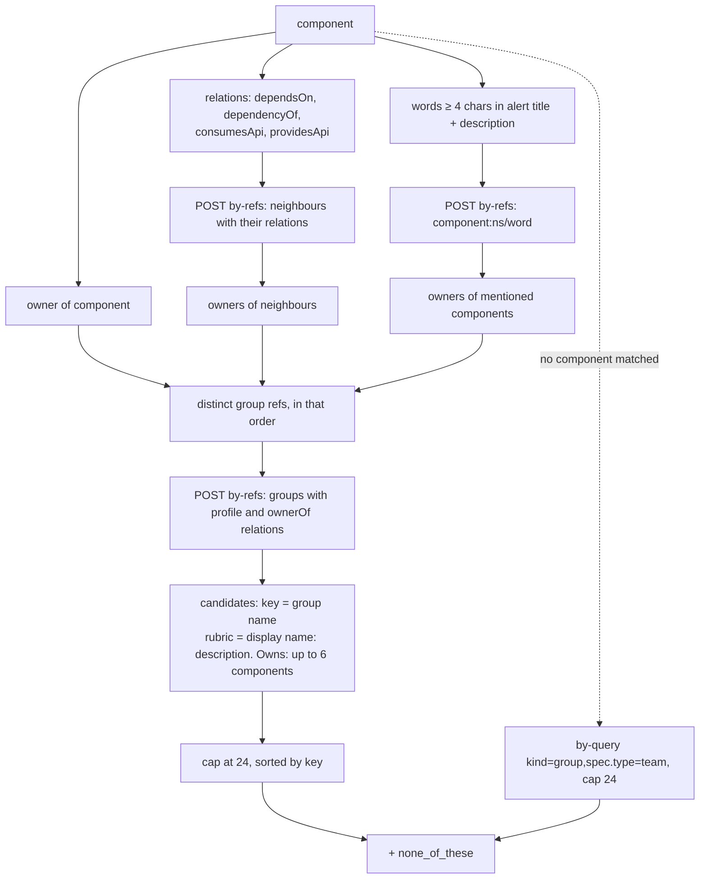
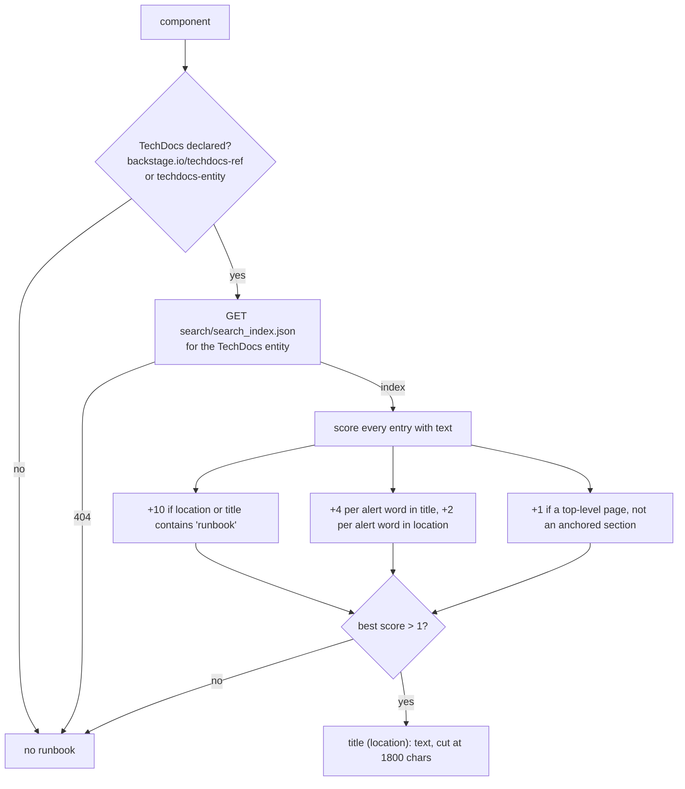

# Backstage bridge

Without a catalog, signalman routes to a team list compiled into the binary: one organisation's snapshot of who owned what. The Backstage software catalog holds the current answer and more: dependencies, lifecycle, runbooks. The bridge turns that referential into triage inputs and turns the triage output into a message the owning group sees in the portal. The rule it follows is [ADR 0004](decisions/0004-catalog-is-the-ownership-source-of-truth.md): the catalog supplies facts and candidates; the model still judges.

Contract sources: the [catalog REST API](https://backstage.io/docs/features/software-catalog/software-catalog-api), the [descriptor format](https://backstage.io/docs/features/software-catalog/descriptor-format), [service-to-service auth](https://backstage.io/docs/auth/service-to-service-auth) and the [Notifications plugin](https://backstage.io/docs/notifications/).

## What the catalog contributes

| Catalog fact | Where it goes | Why it matters |
|---|---|---|
| The component matched by the alert's service name | `alert.component` | The model reasons about the real service, not a label |
| `ownedBy` relation | `alert.component.owner`; first owner candidate | The registered owner is a fact; the model decides whether this alert is an exception |
| `dependsOn`, `dependencyOf`, `consumesApi`, `providesApi` | `depends_on`, `dependents`; their owners become candidates | Alerts fire on symptoms; the cause and the blast radius live in the neighbours |
| Components named in the alert text | their owners become candidates | An alert on `checkout-api` that mentions `payments-gateway` may belong to the gateway's team |
| `spec.lifecycle`, `spec.type`, `spec.system`, tags, link titles | `alert.component` | Impact and actionability differ for experimental and production services |
| TechDocs search index | `alert.runbook` | The runbook page that best matches the alert, as plain text |

## Resolving the component



Hints are the values of alert attributes (or CLI labels) whose names are in `SIGNALMAN_COMPONENT_KEYS`, case-insensitive, default `component, service, app, application`. The first hint that resolves wins.

## Owner candidates



If the component resolved but no group could be fetched, the all-teams fallback also applies. Without any Backstage configuration the static `Team` list is used and this module is never called.

## Runbook selection



TechDocs publishes the mkdocs search index alongside the site; it is the plain-text form of every page, which makes it a better source than scraping HTML. A missing site is not an error.

## Notification

```mermaid
sequenceDiagram
    participant F as Sync flow
    participant IO as incident.io
    participant E as Enricher
    participant BS as Backstage Notifications
    F->>IO: add tags (and attach if duplicate)
    alt decision is Page, Ticket or HumanTriage and --notify-owners
        F->>E: notify_owner(candidate, title, decision, alert link)
        E->>BS: POST /api/notifications/notifications<br/>recipients: entity group ref, severity from impact
        BS-->>E: 200
        E-->>F: notified
    else Suppress or AttachToIncident
        F->>F: no notification
    end
    Note over F,BS: a failed notification is logged; the tags already written stay
```

| Decision | Title | Severity |
|---|---|---|
| Page, impact Outage | `Page: <alert>` | critical |
| Page, impact Major | `Page: <alert>` | high |
| Ticket | `Ticket: <alert>` | normal |
| HumanTriage | `Needs triage: <alert>` | normal |

## Setup

1. Create a static external-access token in `app-config.yaml`:

   ```yaml
   backend:
     auth:
       externalAccess:
         - type: static
           options:
             token: ${SIGNALMAN_BACKSTAGE_TOKEN}
             subject: signalman
           accessRestrictions:
             - plugin: catalog
             - plugin: techdocs
             - plugin: notifications
   ```

2. Set `BACKSTAGE_BASE_URL` to the backend URL without `/api` and `BACKSTAGE_TOKEN` to the token. `serve` enables enrichment when the URL is set; the CLI needs `--enrich-from-backstage`.
3. Check with `signalman backstage lookup checkout-api --text "HighErrorRate 5xx"`: it prints the resolved component, the owner candidates as the model will see them, and the runbook excerpt.
4. Make sure alerts carry the component identity: an incident.io alert attribute named `Service` or `Component` whose value is the catalog name. The [incident.io catalog importer](https://github.com/incident-io/catalog-importer) can sync Backstage components into incident.io so that attribute is a real catalog entry.

## Registering signalman

`catalog-info.yaml` declares signalman as a `Component` of type `service` with TechDocs built from `docs/` by `mkdocs.yml`, plus two `Resource` entities, incident.io and the TypeSafe API, that it `dependsOn`. Register the file's URL or let the GitHub discovery provider find it. Replace the placeholder owner `group:default/platform-engineering` with the group that runs it. Mermaid diagrams in these pages need the TechDocs Mermaid addon to render in Backstage ([Development](development.md#techdocs)).

## Related plugins

Among the community plugin workspaces, `firehydrant`, `ilert` and `healert` cover incident tooling, `grafana`, `sentry`, `newrelic`, `dynatrace` and `splunk` cover signals, and `github`, `argocd`, `flux` and `octopus-deploy` cover deployments. None is required. The deployment plugins are the natural source for `recent_changes` (roadmap). The incident.io Backstage plugin (`@incident-io/backstage`) shows incident.io incidents on a component page through a custom field mapped to the Backstage component catalog type, which pairs with the attributes signalman tags.

## Limits and unverified points

- Not yet run against a real Backstage instance. Shapes follow the OpenAPI specification and TypeScript types; drift surfaces as a `Decode` error naming the field.
- Owner candidates are capped at 24 per triage. Each is a Choice option and costs input tokens.
- Mentioned components are matched by exact word against `metadata.name` in the configured namespace only.
- The runbook excerpt is one page, at most 1,800 characters. Multi-page runbooks are not stitched.
- Notifications need the Notifications backend installed and the token allowed on the `notifications` plugin.
