# C4 level 3: components

This level opens the triage library. The `Triager` orchestrates; everything else is a collaborator with one job. The split follows the boundaries in [Architecture](../architecture.md#boundaries): the model is known to two components, the wire formats to one each, and every write-back is a function the CLI, the receiver and the MCP server all call.

```mermaid
C4Component
    title Components of the signalman library
    Container_Boundary(lib, "Triage library") {
        Component(triager, "Triager", "incidentio::sync", "Fetch fresh state, enrich, ask, decide, write back; builds the Outcome")
        Component(outcome, "Outcome", "outcome", "The versioned JSON contract of one triage; schema v1, drift-tested; the inverse that replays a decision")
        Component(enricher, "Enricher", "backstage::enrich", "Resolve component, assemble owner candidates, select runbook, notify owner")
        Component(changelog, "ChangeLog", "changes", "Bounded in-memory window of pushed changes; Argo CD and GitLab adapters")
        Component(questions, "TriageQuestions", "triage::questions", "Build the fan-out with typed handles; read answers")
        Component(policy, "Policy / decide", "triage::policy", "Thresholds that turn answers into one Decision")
        Component(note, "Qualification note", "incidentio::note", "Fixed template over typed answers; marker line; replaced in place")
        Component(mcpsrv, "MCP server", "mcp, mcp::http", "Six tools over one dry-run Triager; stdio or Streamable HTTP behind a token")
        Component(readiness, "Readiness probe", "readiness", "Cheapest authenticated call per upstream, concurrent, cached")
        Component(telemetry, "Telemetry", "telemetry", "Subscriber, OTLP export, every instrument name")
        Component(tsclient, "TypeSafe client", "client, question, answer", "Wire contract, Handle<A>, Probability, Confidence")
        Component(ioclient, "incident.io client", "incidentio::client", "Incidents, alerts, tags, attachments, notes, alert events")
        Component(bsclient, "Backstage client", "backstage::client", "by-name, by-query, by-refs, TechDocs index, notifications")
        Component(webhook, "Webhook verifier", "incidentio::webhook", "Svix HMAC-SHA256, tolerance, envelope parsing")
        Component(http, "Retry loop", "http", "RetryPolicy, backoff, Retry-After; counts failed attempts")
    }
    System_Ext(incidentio, "incident.io")
    System_Ext(typesafe, "TypeSafe")
    System_Ext(backstage, "Backstage")
    Rel(triager, ioclient, "get alert, list incidents and alerts, add tags, attach, notes")
    Rel(triager, enricher, "enrich(hints, text); notify_owner")
    Rel(triager, changelog, "recent(hints, window)")
    Rel(triager, questions, "for_alert_with(alert, candidates); read(response)")
    Rel(triager, policy, "decide(answers)")
    Rel(triager, note, "render(input)")
    Rel(triager, outcome, "Outcome::build")
    Rel(triager, tsclient, "system_one(state, questions)")
    Rel(mcpsrv, triager, "dry-run triage, candidates, incidents")
    Rel(mcpsrv, outcome, "validate, decision, answers, expected_tags")
    Rel(readiness, ioclient, "identity")
    Rel(readiness, tsclient, "models")
    Rel(readiness, bsclient, "one by-query")
    Rel(enricher, bsclient, "catalog, techdocs, notifications")
    Rel(questions, tsclient, "Questions, Handle<A>")
    Rel(tsclient, http, "send_with_retries")
    Rel(ioclient, http, "send_with_retries")
    Rel(bsclient, http, "send_with_retries")
    Rel(http, telemetry, "upstream error counter")
    Rel(ioclient, incidentio, "REST v2")
    Rel(tsclient, typesafe, "REST v1")
    Rel(bsclient, backstage, "REST")
    UpdateLayoutConfig($c4ShapeInRow="3", $c4BoundaryInRow="1")
```

## Components

| Component | Module | Depends on | Owns | Why it is separate |
|---|---|---|---|---|
| `Triager` | `incidentio::sync` | incident.io client, Enricher, ChangeLog, TriageQuestions, policy, TypeSafe client, note, Outcome | The order of operations and the write-back rules | One flow for every entry point, so the receiver, the CLI and the MCP server cannot drift on what a triage does |
| `Outcome` | `outcome` | triage types, answers, changes | The wire shape of one triage, the schema, `validate`, and the inverse (`decision`, `answers`, `expected_tags`) that `apply_qualification` replays | The contract is the boundary with agents and scripts ([ADR 0008](../decisions/0008-signalman-is-a-tool-for-agents.md)); defining it once, apart from the domain types, means a Rust rename cannot change the wire |
| `Enricher` | `backstage::enrich` | Backstage client, triage types | Hint resolution, neighbourhood walk, candidate rubric, runbook scoring, notification payloads | Catalog facts become candidates here and nowhere else ([ADR 0004](../decisions/0004-catalog-is-the-ownership-source-of-truth.md)); without a catalog the component is never constructed |
| `ChangeLog` | `changes`, `changes::argocd`, `changes::gitlab` | none | The bounded window, matching by component and time, the two native payload translations | Pushed changes are state the receiver owns and the flow reads; the adapters read a body and call nothing, so no delivery-tool client exists ([ADR 0007](../decisions/0007-changes-are-pushed-not-polled.md)) |
| `TriageQuestions` | `triage::questions` | TypeSafe question builder | Which questions exist, when the speculative ones are asked, the instruction text | Adding a question touches this file and the policy field that reads it, nothing else ([ADR 0003](../decisions/0003-typed-handles-between-questions-and-answers.md)) |
| `Policy` and `decide` | `triage::policy` | Typed answers | Thresholds and their order of precedence | A threshold change never re-runs inference ([ADR 0002](../decisions/0002-calibrated-judgments-over-generated-text.md)); `eval --replay` grades recorded answers against a new policy |
| Qualification note | `incidentio::note` | triage types, answers | The marker line, the fixed template, the rule that a note is replaced, never stacked | The model judges, it does not write; the template is the only prose on the alert and it is code |
| MCP server | `mcp`, `mcp::http` | `Triager`, `Outcome`, rmcp | Tool schemas, the dry-run guard, the `allow_write` gate, the HTTP token layer | Every tool wraps a `Triager` method the CLI already calls, so decision logic is never reimplemented for agents; the token check sits in front of the protocol handler so an unauthenticated request never reaches it ([MCP](../mcp.md)) |
| Readiness probe | `readiness` | the three clients | Per-check deadline, concurrent checks, the cached report | Probes must not become upstream load, and a bad key should fail at rollout, not at the first alert; the trade-off is that an upstream outage marks every replica unready ([Operations](../operations.md)) |
| Telemetry | `telemetry` | OpenTelemetry SDK | Subscriber setup, exporters, every instrument name | One module names instruments so the table in [Observability](../observability.md) has one source; export runs on the SDK's thread so no triage waits on a collector |
| TypeSafe client | `client`, `question`, `answer` | Retry loop | `Handle<A>`, `Response::get`, `Probability`, `Confidence`, the `options!` macro | Wire strings become Rust types at one place ([ADR 0003](../decisions/0003-typed-handles-between-questions-and-answers.md)) |
| incident.io client | `incidentio::client` | Retry loop | Endpoint paths, per-endpoint authentication, error body parsing | Only module that knows incident.io's paths; its types ignore unknown fields so an API addition is not an outage |
| Backstage client | `backstage::client` | Retry loop | Filter set encoding, cursor pagination, lenient entity types | Only module that knows the catalog's paths; leniency turns catalog drift into a named `Decode` error |
| Webhook verifier | `incidentio::webhook` | none | Signature check pinned to Svix's published test vector; event envelope; reads the signing secret | Nothing is parsed before the signature is proven; keeping it apart from the router makes the check testable against the vector alone |
| Retry loop | `http` | reqwest, telemetry | Which statuses are transient, how long to wait, `Retry-After`, the per-service failure counter | Three clients, one policy: transient handling and error counting cannot differ by client |

## Where the model boundary sits

Only `TriageQuestions` and the TypeSafe client know the model exists. `Policy` receives typed answers; `Triager` receives a `Decision`; `Outcome` carries probabilities but never calls anything. Replacing the model, or adding a question, touches `questions.rs` and the policy field that reads it, nothing else. The MCP server sits on the other side of `Triager`: it can start a dry-run triage and replay an `Outcome`, and it cannot reach a question or an answer directly.
