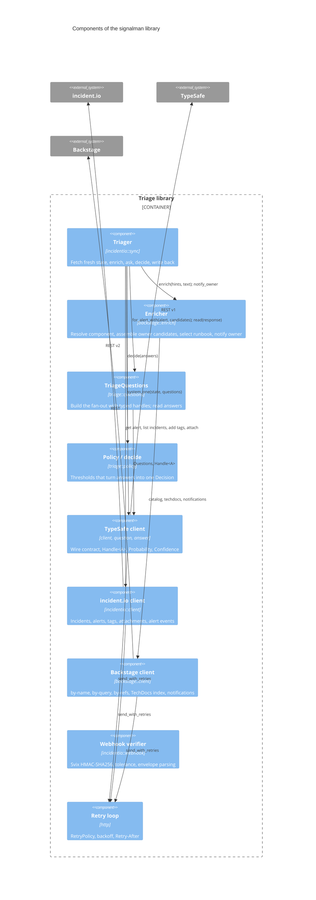

# C4 level 3: components

This level opens the triage library. The `Triager` orchestrates; everything else is a collaborator with one job.

## Components

| Component | Depends on | Owns |
|---|---|---|
| `Triager` | incident.io client, Enricher, TriageQuestions, policy, TypeSafe client | The order of operations and the write-back rules; `Outcome` |
| `Enricher` | Backstage client, triage types | Hint resolution, neighbourhood walk, candidate rubric, runbook scoring, notification payloads |
| `TriageQuestions` | TypeSafe question builder | Which questions exist, when the speculative ones are asked, the instruction text |
| `Policy` and `decide` | Typed answers | Thresholds and their order of precedence |
| TypeSafe client | Retry loop | `Handle<A>`, `Response::get`, `Probability`, `Confidence`, the `options!` macro |
| incident.io client | Retry loop | Endpoint paths, per-endpoint authentication, error body parsing |
| Backstage client | Retry loop | Filter set encoding, cursor pagination, lenient entity types |
| Webhook verifier | none | Signature check pinned to Svix's published test vector; event envelope |
| Retry loop | reqwest | Which statuses are transient, how long to wait |

## Where the model boundary sits

Only `TriageQuestions` and the TypeSafe client know the model exists. `Policy` receives typed answers; `Triager` receives a `Decision`. Replacing the model, or adding a question, touches `questions.rs` and the policy field that reads it, nothing else.
