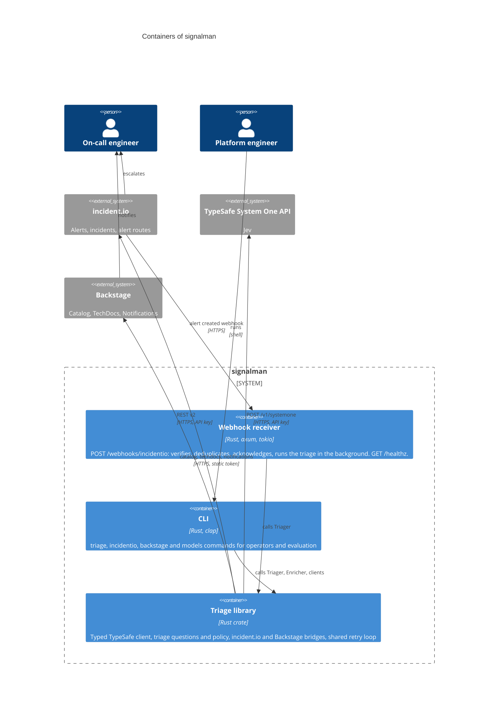

# C4 level 2: containers

signalman ships as one binary. Running it as `signalman serve` gives the webhook receiver; every other subcommand is the CLI. Both use the same library, so this level has two containers sharing one code path.

## Containers

| Container | Technology | Responsibilities | Configuration |
|---|---|---|---|
| Webhook receiver | axum on tokio | Signature verification, `webhook-id` deduplication (4,096 most recent), 202 acknowledgement, background execution of the flow, liveness endpoint | `SIGNALMAN_ADDR`, `INCIDENTIO_WEBHOOK_SECRET`, `--dry-run`, `--notify-owners` |
| CLI | clap | `triage` on a file with optional catalog enrichment, incident dedup candidates and forwarding; `incidentio whoami`, `open-incidents`, `triage-alert`; `backstage lookup`; `models` | Same variables; flags per command |
| Triage library | Rust crate `signalman` | Everything the two entry points share; the [component view](component.md) opens it | |

## Deployment notes

- One replica is enough for moderate alert volume; the binding limit is incident.io's 60 requests per minute on listing incidents, one call per triage.
- Horizontal scaling is safe for correctness: tag adds are idempotent, and duplicate deliveries across replicas cost a repeated model call, nothing else. The in-memory seen set is per replica.
- No persistent storage. The deployment's shape is a TOML file (a `ConfigMap`); secrets arrive as environment variables (a `Secret`); flags and variables override the file ([Configuration](../configuration.md)).
