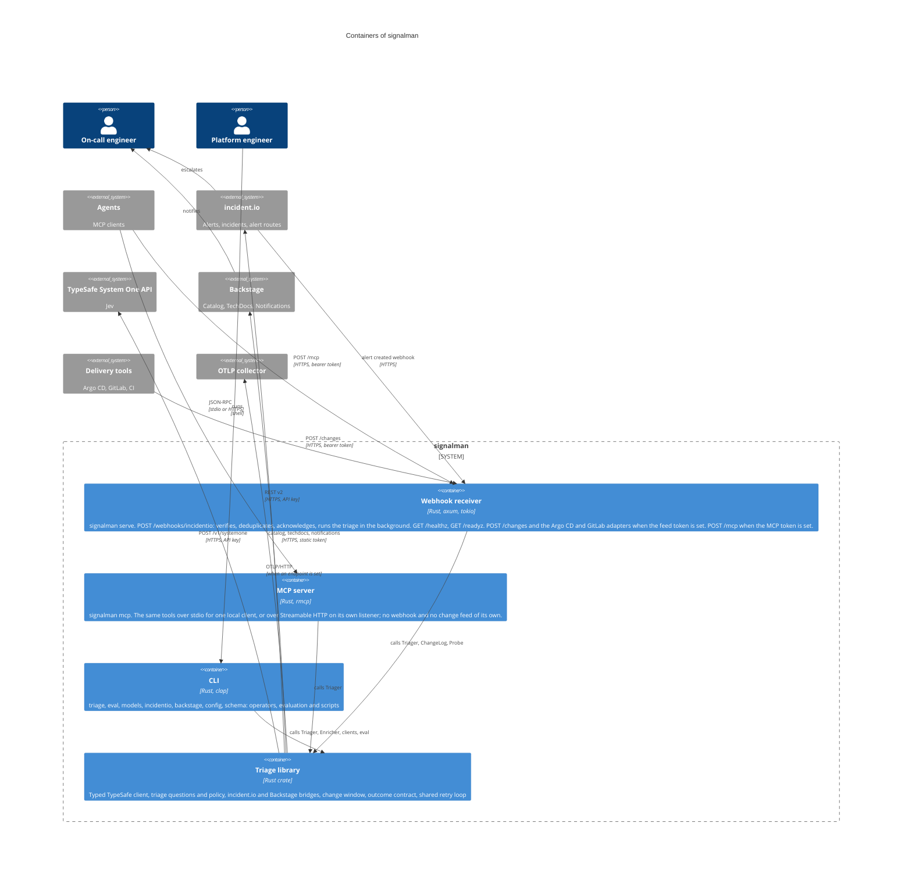

# C4 level 2: containers

signalman ships as one binary. `signalman serve` is the HTTP receiver; `signalman mcp` serves the same judgments to agents over stdio or HTTP; every other subcommand is the CLI. All three call one library, so this level has one code path reached from three run modes. Keeping them in one binary is what lets every MCP tool and every receiver write-back be a function the CLI already calls, and therefore testable without a model or an agent in the loop ([ADR 0008](../decisions/0008-signalman-is-a-tool-for-agents.md)).

## Containers

| Container | Technology | Responsibilities | Configuration |
|---|---|---|---|
| Webhook receiver | axum on tokio | Signature verification, `webhook-id` deduplication (4,096 most recent), admission control (503 beyond capacity), 202 acknowledgement, background execution of the flow under a deadline; `GET /healthz` for liveness and `GET /readyz` for readiness against the upstreams; `POST /changes`, `/changes/argocd` and `/changes/gitlab` into the in-memory change window when `SIGNALMAN_CHANGES_TOKEN` is set; `POST /mcp` when `SIGNALMAN_MCP_TOKEN` is set | `server.*` (`SIGNALMAN_ADDR`, concurrency, timeouts, readiness cache), `INCIDENTIO_WEBHOOK_SECRET`, `SIGNALMAN_CHANGES_TOKEN`, `SIGNALMAN_MCP_TOKEN`, `--dry-run`, `--notify-owners` |
| MCP server | rmcp | `qualify_alert` (always a dry run), `related_alerts`, `recent_changes`, `lookup_owner`, `open_incidents`, and `apply_qualification` only when `mcp.allow_write` is true; over stdio, or over Streamable HTTP on `mcp.bind_address` with `GET /healthz` | `mcp.*` (`SIGNALMAN_MCP_ENABLED`, `SIGNALMAN_MCP_TRANSPORT`, `SIGNALMAN_MCP_BIND_ADDRESS`, `SIGNALMAN_MCP_ALLOWED_HOSTS`, `SIGNALMAN_MCP_ALLOW_WRITE`), `SIGNALMAN_MCP_TOKEN` |
| CLI | clap | `triage` on a file with optional catalog enrichment, incident dedup candidates, forwarding and `--json`; `eval` to grade labelled cases and replay recorded responses; `incidentio whoami`, `open-incidents`, `triage-alert`; `backstage lookup`; `models`; `config show`; `schema outcome` | Same file and variables; flags per command |
| Triage library | Rust crate `signalman` | Everything the three run modes share; the [component view](component.md) opens it | |

## Why one process, not two

**MCP as a mode of the same binary.** An agent needs `recent_changes` to be live, and the change window is in memory in the process that received the posts. The MCP endpoint is therefore mounted on the receiver's router (`/mcp` on `serve`) so it reads the same window; `signalman mcp` over HTTP is for deployments without the webhook, and its start-up log says `recent_changes` will be empty. A separate MCP service with its own store was rejected because it would need either a shared database for the window or a second `/changes` endpoint for pipelines to post to; one place to post, one place to be reached ([MCP transports](../mcp.md#transports)). The cost is that the receiver's listener carries a second authenticated surface, with its own token and rate limits.

**No database for the change window.** A change is context, not a record: losing it on restart returns the flow to a question not asked. A store would add a dependency to every replica for data whose value expires in two hours ([ADR 0007](../decisions/0007-changes-are-pushed-not-polled.md)). The cost is per-replica windows; a change posted to one replica is unknown to the other, and a restart forgets it.

## Deployment notes

- One replica is enough for moderate alert volume; the binding limit is incident.io's 60 requests per minute on listing incidents, one call per triage.
- Horizontal scaling is safe for correctness: tag adds are idempotent, and duplicate deliveries across replicas cost a repeated model call, nothing else. The in-memory seen set, change window and readiness cache are per replica ([Architecture](../architecture.md#state)).
- The MCP HTTP endpoint is stateless (no session id), so two replicas behind one Service need no affinity ([MCP transports](../mcp.md#transports)).
- Readiness marks every replica unready during an upstream outage, so the Service stops accepting deliveries it could not process and incident.io's 24-hour retry keeps them; the other side of that trade-off is described in [Operations](../operations.md).
- No persistent storage. The deployment's shape is a TOML file (a `ConfigMap`); secrets arrive as environment variables (a `Secret`); flags and variables override the file ([Configuration](../configuration.md)).
