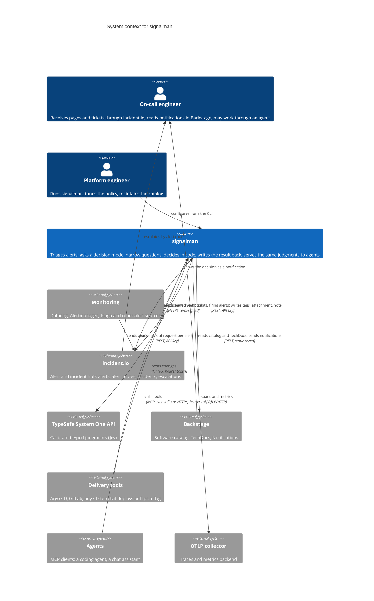

# C4 level 1: system context

The context diagram answers one question: what does signalman talk to, and why. Every external system here is a credential to hold, a contract to track and a failure mode to contain, so each one has to earn its place; the ones that were considered and left out are listed at the end. Everything inside the boundary is described at the next level in [containers](container.md).

## Relationships

| From | To | What flows | Protocol | Why it is in the picture |
|---|---|---|---|---|
| Monitoring | incident.io | Alerts | Vendor integrations, unchanged by signalman | signalman never talks to a monitoring tool; every signal, including Tsuga's, enters through the hub ([ADR 0005](../decisions/0005-observability-signals-enter-through-incidentio.md)) |
| incident.io | signalman | `public_alert.alert_created_v1` webhook | HTTPS POST, Svix HMAC-SHA256 signature | The hub already receives every alert; a webhook per alert is the only trigger signalman needs |
| signalman | incident.io | Alert by id; incidents in triage, live and paused; alerts firing in the window; add tags; attach alert to incident; create or replace the qualification note | REST v2, API key | incident.io stays the hub: signalman writes tags, one attachment and one note, and alert routes decide escalation ([ADR 0001](../decisions/0001-incidentio-remains-the-alert-hub.md)) |
| signalman | TypeSafe | One request: state plus every question; answers with probabilities | REST v1, API key | The one model call; it returns calibrated probabilities, not text, so code can hold thresholds ([ADR 0002](../decisions/0002-calibrated-judgments-over-generated-text.md)) |
| signalman | Backstage | Entities by name, query and refs; TechDocs search index; notification to a group | REST, static external-access token | The catalog is the ownership source of truth, so candidates come from it rather than from a compiled list ([ADR 0004](../decisions/0004-catalog-is-the-ownership-source-of-truth.md)) |
| Delivery tools | signalman | Change events: what was deployed or toggled, when, where | HTTPS POST, bearer token; native Argo CD and GitLab payloads accepted | Recent changes are pushed by the tool that made them rather than polled from each tool's API, so signalman holds one token and no delivery-tool client ([ADR 0007](../decisions/0007-changes-are-pushed-not-polled.md)) |
| Agents | signalman | Tool calls: qualify, related alerts, recent changes, owner lookup, open incidents; optionally apply a qualification | MCP over stdio, or Streamable HTTP with a bearer token | signalman is a tool for agents, not an agent: responders get its judgments inside the assistant they already use, and no model inside signalman chooses actions ([ADR 0008](../decisions/0008-signalman-is-a-tool-for-agents.md)) |
| signalman | OTLP collector | Spans over every triage and upstream call; product and upstream metrics | OTLP/HTTP, only when `telemetry.otlp_endpoint` is set | Operators need to see decisions, latency and upstream failures per alert; without an endpoint nothing is exported ([Observability](../observability.md)) |
| incident.io | On-call engineer | Escalation decided by alert routes reading the `ai-*` tags | incident.io native | The page still comes from the tool the responder already trusts |
| Backstage | On-call engineer | Notification with decision, severity and alert link | Notifications plugin | Teams that work from the portal see the decision without opening incident.io |

## What is deliberately outside

- **Monitoring systems.** signalman reads no dashboards, metrics or alert history from Datadog, Alertmanager or Tsuga. Related alerts come from incident.io, which already aggregates them; a direct Tsuga client would add a credential and an unverified contract for signals the hub already carries ([ADR 0005](../decisions/0005-observability-signals-enter-through-incidentio.md)).
- **Paging and incident creation.** signalman never pages a person or creates an incident; it tags, and alert routes escalate ([ADR 0001](../decisions/0001-incidentio-remains-the-alert-hub.md)). A wrong judgment is a wrong tag, reversible in the UI.
- **Delivery-tool APIs.** No client for Argo CD, Flux, GitHub or GitLab; they post to signalman ([ADR 0007](../decisions/0007-changes-are-pushed-not-polled.md)).
- **A generative model.** No agent loop or text generation runs inside the triage path ([ADR 0008](../decisions/0008-signalman-is-a-tool-for-agents.md)).
- **A database.** The only state is in memory, per replica: recent webhook ids, the change window and the cached readiness report ([Architecture](../architecture.md#state)).
