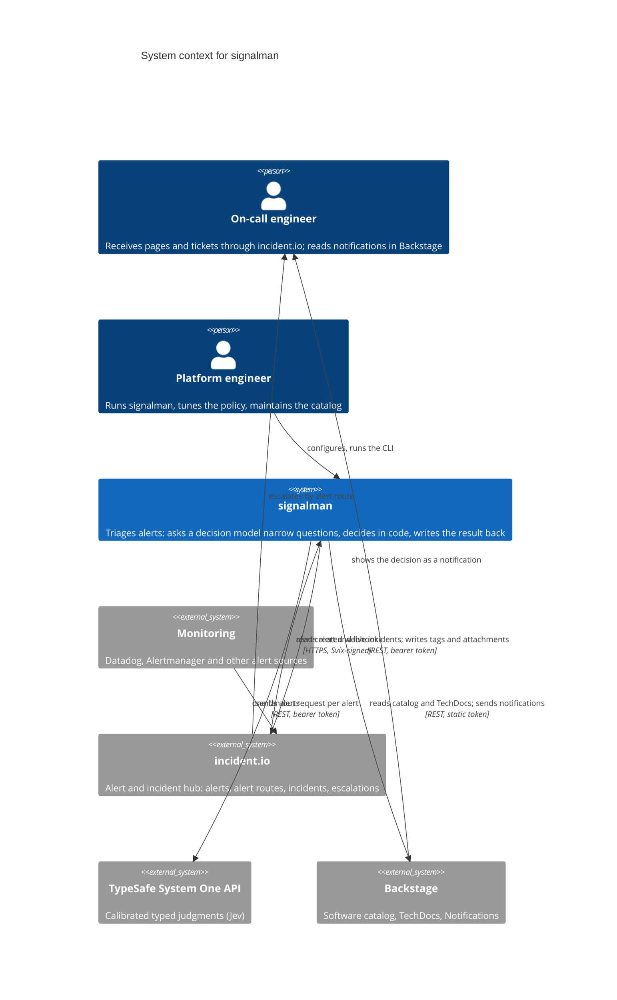

# C4 level 1: system context

The context diagram answers one question: what does signalman talk to, and why. Everything inside the boundary is described at the next level in [containers](container.md).

## Relationships

| From | To | What flows | Protocol |
|---|---|---|---|
| Monitoring | incident.io | Alerts | Vendor integrations, unchanged by signalman |
| incident.io | signalman | `public_alert.alert_created_v1` webhook | HTTPS POST, Svix HMAC-SHA256 signature |
| signalman | incident.io | Alert by id; incidents in triage, live and paused; add tags; attach alert to incident | REST v2, API key |
| signalman | TypeSafe | One request: state plus every question; answers with probabilities | REST v1, API key |
| signalman | Backstage | Entities by name, query and refs; TechDocs search index; notification to a group | REST, static external-access token |
| incident.io | On-call engineer | Escalation decided by alert routes reading the `ai-*` tags | incident.io native |
| Backstage | On-call engineer | Notification with decision, severity and alert link | Notifications plugin |

## What is deliberately outside

signalman does not talk to the monitoring systems, does not page anyone directly, and does not create incidents. Those are incident.io's roles ([ADR 0001](../decisions/0001-incidentio-remains-the-alert-hub.md)). It holds no database; the only state is an in-memory set of recent webhook ids.
