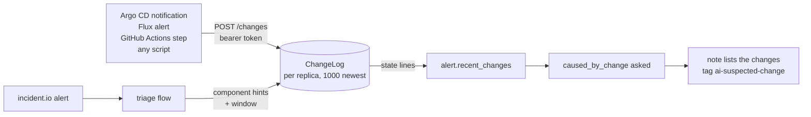

# Change feed

"What changed?" is the first question a responder asks, and `caused_by_change` is the judgment signalman has for it. Until the feed existed the question was never asked in production: it is only posed when `alert.recent_changes` is non-empty, and nothing filled that list in the webhook flow.

signalman does not poll delivery tools. It accepts change events on `POST /changes` from whatever performed the change, keeps a bounded in-memory window per replica, and at triage time offers the changes that touched the alerting component, or the whole platform, within the last two hours ([decision 0007](decisions/0007-changes-are-pushed-not-polled.md)).



## Posting a change

```sh
curl -X POST https://signalman.example.com/changes \
  -H "Authorization: Bearer $SIGNALMAN_CHANGES_TOKEN" \
  -H "Content-Type: application/json" \
  -d '{"at": "2026-09-21T11:50:00Z", "kind": "deploy", "component": "checkout-api",
       "summary": "checkout-api v2.31.0 by alice", "source": "argocd",
       "url": "https://argocd.example.com/applications/checkout-api"}'
```

One object or an array. The endpoint answers `202` with `{"recorded": n, "held": total}`, `401` on a missing or wrong token, `400` on a body that does not parse or lacks `kind` or `summary`, and is not routed at all when `SIGNALMAN_CHANGES_TOKEN` is unset. `GET /changes` with the same token lists what the replica holds.

| Field | Required | Meaning |
|---|---|---|
| `kind` | yes | `deploy`, `config`, `flag`, `infra`, `migration`, or any short word |
| `summary` | yes | one line: what, version, who |
| `component` | no | the component as the alert labels name it (`service`, `component`, `app` attributes, or the catalog name). Absent means platform-wide: offered to every alert |
| `at` | no | RFC 3339; receipt time when absent or unparsable |
| `source` | no | the tool that posted it |
| `url` | no | link to the deploy, pull request or commit |

The model reads each change as one line, time first: `2026-09-21T11:50:00Z deploy checkout-api v2.31.0 by alice (checkout-api) https://…`.

## Matching and window

At triage time the hints are the alert's component labels ([`backstage.component_keys`](configuration.md#backstage)) plus the catalog component name when Backstage resolved one. A change is offered when its `component` matches a hint case-insensitively, or when it has no component. Newest first, at most `flow.change_max` (10), within `flow.change_window_minutes` (120, `0` disables). An alert that already carries `recent_changes` from its source keeps them; the feed fills only an empty list.

The window is two hours by default, wider than the related-alert window, because a deploy causes an incident hours later more often than minutes later: caches expire, a batch job runs, traffic peaks.

## Wiring the sources

**Argo CD notifications**, a webhook service and a template on `on-deployed`:

```yaml
# argocd-notifications-cm
service.webhook.signalman: |
  url: https://signalman.example.com/changes
  headers:
    - name: Authorization
      value: Bearer $signalman-changes-token      # from argocd-notifications-secret
    - name: Content-Type
      value: application/json
template.signalman-deployed: |
  webhook:
    signalman:
      method: POST
      body: |
        {"kind": "deploy", "source": "argocd",
         "component": "{{.app.metadata.name}}",
         "summary": "{{.app.metadata.name}} {{.app.status.sync.revision | trunc 7}} to {{.app.spec.destination.namespace}}",
         "url": "{{.context.argocdUrl}}/applications/{{.app.metadata.name}}"}
trigger.on-deployed: |
  - when: app.status.operationState.phase in ['Succeeded'] and app.status.health.status == 'Healthy'
    send: [signalman-deployed]
```

**Flux** notification-controller: a `Provider` of type `generic` with the token in a `Secret`, an `Alert` on `Kustomization` and `HelmRelease` reconciliations; the generic payload differs from the schema above, so put a small transform (a CDEvents or a webhook relay) in between or use the Argo CD shape as the reference.

**GitHub Actions**, after the deploy step:

```yaml
- name: Tell signalman
  run: |
    curl -fsS -X POST "$SIGNALMAN_URL/changes" \
      -H "Authorization: Bearer ${{ secrets.SIGNALMAN_CHANGES_TOKEN }}" \
      -H "Content-Type: application/json" \
      -d "$(jq -nc --arg s "${{ github.repository }} ${{ github.sha }} by ${{ github.actor }}" \
                 --arg u "${{ github.server_url }}/${{ github.repository }}/commit/${{ github.sha }}" \
                 '{kind: "deploy", source: "github-actions", component: "checkout-api", summary: $s, url: $u}')"
```

Name `component` the way the alert labels will: the value of the `service` attribute in incident.io, or the catalog component name. Anything else and the change is not matched, which the `recent_changes` count in the outcome and the log line make visible.

## What the responder sees

When changes were offered, the [qualification note](incidentio.md#the-qualification-note) lists them under the cause line, and `ai-suspected-change` is tagged when the probability clears `policy.flag_change_above`. The `Outcome` carries `recent_changes`, the count offered.

## Limits

- In memory, per replica. A restart forgets the window; with several replicas each holds what was posted to it. Point the delivery tools at one replica, or accept that a change may be missing from some triages: the consequence is a question not asked, which is where the flow stood before the feed existed.
- Newest 1,000 changes are kept; older ones are evicted regardless of window.
- No deduplication: two identical posts are two lines. Post once per deploy, from the tool that knows it finished.
- Nothing has been wired to a real Argo CD or GitHub Actions yet; the templates above follow the tools' documentation and the payload contract in `src/changes.rs`.
