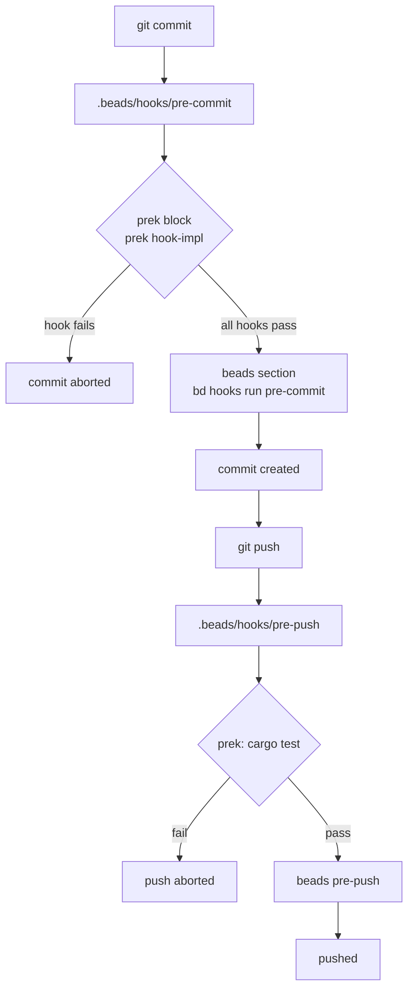

# Development

## Tools

[mise](https://mise.jdx.dev) pins every tool in `mise.toml`: the Rust toolchain (the same version as `rust-toolchain.toml`, which rustup and CI read) and [prek](https://prek.j178.dev) for git hooks. The beads CLI `bd` comes from the GitHub release binary rather than the npm package, whose postinstall step downloads a platform binary and fails behind some proxies.

```sh
mise install        # tools
mise run setup      # git hooks: prek (pre-commit, pre-push) chained before beads
mise tasks          # everything below
```

## Tasks

| Task | What it runs |
|---|---|
| `check` | `fmt:check`, `lint`, `check:minimal`, `test`, `doc`, `docs:check`, in CI order |
| `fmt` / `fmt:check` | `cargo fmt --all` / with `--check` |
| `lint` | `cargo clippy --all-targets --all-features` with `RUSTFLAGS=-D warnings` |
| `check:minimal` | `cargo check -p judgment --no-default-features --all-targets`: the judgment crate and its tests without the `http` feature |
| `test` | `cargo test --all-features` |
| `doc` | `cargo doc --no-deps --document-private-items` with `RUSTDOCFLAGS=-D warnings` |
| `docs:check` | frontmatter on `README.md` and `docs/**`; `docs/llms.txt` and `docs/llms-full.txt` match the nav and frontmatter |
| `docs:llms` | regenerate `docs/llms.txt` and `docs/llms-full.txt` from `mkdocs.yml` and page frontmatter |
| `schema` | regenerate `docs/schema/outcome.v1.json` from the wire types in `src/outcome.rs` |
| `precommit` | `prek run --all-files` |
| `build` | release build |
| `serve` | `cargo run -- serve` plus any flags |
| `triage <file>` | `cargo run -- triage <file>` plus any flags |
| `triage:examples` | print the TypeSafe request for every example alert |
| `eval [args]` | `cargo run -- eval examples/eval/cases.jsonl` plus any flags |
| `config:show` | effective configuration after file, environment and flags |
| `bd:ready` / `bd:export` | ready issues / refresh the JSONL snapshot |

## Quality gates

Clippy runs with the `pedantic` group plus `unwrap_used` and `expect_used`, warnings denied. Tests never reach the network: `wiremock` stands in for all three APIs, and policy tests round-trip fake responses through the real handles. Doc tests cover the examples the libraries carry: the crate-level walkthroughs in `src/lib.rs` and `crates/judgment/src/lib.rs` are `no_run`, so they compile against the public API on every test run without an API key; the `options!` example in `crates/judgment/src/question.rs` runs and asserts the generated enum's keys; and the `RetryPolicy` example in `crates/judgment/src/http.rs` builds a policy with a budget by struct update, which pins that the struct stays constructible that way. CI (`.github/workflows/ci.yml`) runs the same gates plus `prek run --all-files`, using GitHub-owned actions only.

The repository is a Cargo workspace: the root package is `signalman` and `crates/judgment` is its one member ([decision 0010](decisions/0010-extract-the-judgment-core-into-a-crate.md)). Package fields, dependency versions and the lint set live in the root manifest and are inherited, so the two crates are held to the same bar and cannot drift in Rust version or lints; every gate runs with `--workspace` so the crate's tests and doc tests count. `cargo check -p judgment --no-default-features` must keep passing: the crate's questions, answers, recordings and metrics build without its `http` feature, for a project that brings its own transport, and `mise run check` and CI run it as `check:minimal`. `cargo package -p judgment --list` shows what a publish would ship, which is how to see that a file added to the crate is included before the first `cargo publish -p judgment`.

The exceptions to "tests never reach the network" are two targets whose tests are all `#[ignore]`, so the gate builds them and never runs them. `crates/judgment/tests/live.rs` runs by hand with `cargo test -p judgment --test live -- --ignored` against the server named in `JUDGMENT_LIVE_BASE_URL`. It exists because a mock encodes what the client author believed about the wire, and only a real server can contradict that belief; [judgment against Laya typed-decisions](judgment-laya-typed-decisions.md) is the record of one such run. The crate's `typed_decisions` example is the same idea at benchmark scale. `crates/judgment/tests/openapi_drift.rs` is the second: one ignored test that needs only the network (no key, no server of your own), described below.

`docs/schema/outcome.v1.json` is generated, not hand-edited: `tests/outcome_contract.rs` fails when the committed file no longer matches the types, and its message says to run `mise run schema` and then classify the change as additive or breaking ([the outcome contract](triage.md#the-outcome-contract)). The same test file checks that the example in `docs/triage.md` is a document the schema accepts.

The TypeSafe OpenAPI document is vendored at `crates/judgment/tests/fixtures/typesafe-openapi.json`, a copy of <https://api.typesafe.ai/openapi.json>, and it is never hand-edited. `crates/judgment/tests/contract.rs` validates against it every request shape the crate's builders produce (with the method, path, content type and bearer scheme the document names), every `Fake` response and every committed recording, and pins each place the crate and the schema disagree at its own path; `tests/typesafe_contract.rs` does the same for signalman's own traffic: the triage request for every example alert, the shared TypeSafe mocks in `tests/common/` and the committed Jev run. Both run offline in the default gate. The copy goes stale only when TypeSafe publishes a new document, and `cargo test -p judgment --test openapi_drift -- --ignored` says so, naming the paths and schemas that differ. `JUDGMENT_OPENAPI_WRITE=1 cargo test -p judgment --test openapi_drift -- --ignored` refreshes it, written canonically (sorted keys, final newline, which `contract.rs` checks) so the diff is only the contract's change. Review a refresh by rerunning `cargo test -p judgment --test contract`: a pinned gap the new document closes fails at its own path, and every request, Fake and recording is checked against the new schemas.

`docs/llms.txt` and `docs/llms-full.txt` ([llmstxt.org](https://llmstxt.org)) are generated the same way, by `scripts/gen-llms-txt.sh` from the `mkdocs.yml` nav and each page's frontmatter: one line per page with its title and description, in nav order, top-level pages first and each nav group as its own section, linking the raw Markdown on the default branch; the full file concatenates the pages. A page opts out of both with `llms: false` in its frontmatter, which only the decision-record template does. `docs:check` regenerates both into a temporary directory and fails when the committed files differ, so a new page, a changed description or a nav edit cannot leave the index stale; a page under `docs/` that the nav does not list fails the check too. `mise run docs:llms` rewrites them. The script is POSIX `sh` and `awk`, like `check-frontmatter.sh`, so it needs nothing `mise install` does not already provide.

## Git hooks

Git's `core.hooksPath` is `.beads/hooks`, set by `bd init`. Those files are tracked and hold a beads-managed section between markers; beads preserves anything outside the markers when it upgrades them. `scripts/setup-hooks.sh` inserts a marked block before the beads section that runs prek, so the order on every commit and push is prek first, beads second. Never run `prek install`: it would replace the beads files with prek's own shim.



`.pre-commit-config.yaml` on commit: whitespace and line-ending fixes, YAML (multi-document allowed), TOML and JSON syntax, merge markers, large files, private keys, no commits on `main`, `cargo fmt --check`, `cargo clippy`, Markdown frontmatter, a stale `docs/llms.txt`, a refusal to commit `.env`. On push: `cargo test`. Beads-managed files and `Cargo.lock` are excluded from the fixers. Run everything without committing with `mise run precommit`.

## Layout

```
crates/judgment/   the judgment crate (decision 0010): the typed client, reusable on its own
  src/client.rs    TypeSafe HTTP client
  src/http.rs      shared retry loop, backoff, the server's wait (the other clients use it too)
  src/question.rs  Questions builder, Options trait, options! macro, Handle<A>
  src/answer.rs    Answer wire shape, Probability/Confidence, typed views, Response::verify
  src/error.rs     TypeSafe-side error enum
  src/backend.rs   SystemOne: the trait; Client, Fake, Recorder and Replay implement it
  src/eval/        recordings, one Judgment per answer and label, per-question metrics
  src/observer.rs  the Observer seam: token usage and failed attempts, reported to the application
  tests/client.rs  the client against a mock TypeSafe API; tests/backend.rs the other backends
  tests/spans.rs   what the client records on its spans, through a capturing layer
  tests/observer.rs what the client reports to the global observer; a target of its own
                   because the global observer is set once per process
  tests/contract.rs requests, Fakes and recordings against the vendored OpenAPI document
  tests/openapi_drift.rs ignored: the vendored OpenAPI document against the live one (network only)
  tests/fixtures/  the vendored typesafe-openapi.json (written only by openapi_drift.rs) and models.json
  tests/live.rs    ignored tests against a real server, run by hand (JUDGMENT_LIVE_BASE_URL)
  examples/        typed_decisions.rs replays the typed-decisions benchmark; typed-decisions/ holds a sample and the export script
src/               the signalman application, depending on judgment by path
  triage/          Alert state, owner candidates, questions, Decision policy
  eval/            evaluation harness: cases, grading, metrics, record and replay
  changes/         change feed: window and matching, Argo CD and GitLab adapters
  incidentio/      client, types, webhook verification, sync flow, errors
  backstage/       catalog client, entity types, enrichment, notifications
  serve.rs         axum webhook receiver
  readiness.rs     GET /readyz: upstream checks, deadline, cached report
  outcome.rs       the outcome contract: wire types, builder, schema
  config.rs        configuration layers: file schema, env, flags, resolve
  telemetry.rs     OpenTelemetry: subscriber, OTLP export, every instrument
  main.rs          CLI
tests/             wiremock integration tests and end-to-end webhook runs; tests/common/ holds the shared fixtures (clients, the al-1 scene, the TypeSafe answers and model list, the committed schema); tests/typesafe_contract.rs checks signalman's TypeSafe requests and mocks against the vendored OpenAPI document
examples/          sample alerts and a sample webhook delivery
docs/              this documentation (TechDocs source); docs/schema/ and docs/llms*.txt are generated
scripts/           check-frontmatter.sh, gen-llms-txt.sh, setup-hooks.sh
.beads/            issue tracker data and git hooks
.claude/           agents, hooks, settings for Claude Code
catalog-info.yaml  Backstage registration; mkdocs.yml builds docs/ as TechDocs
```

## Planning with beads

Issues live in a local Dolt database under `.beads/`, managed with `bd`. `bd ready` lists unblocked work; claim with `bd update <id> --claim`, finish with `bd close <id>`. `bd remember` stores durable project knowledge; `bd memories` searches it.

Cross-machine sync uses `bd dolt push` and `pull` over `refs/dolt/data` on the git remote. The environment that seeded the backlog could not push that ref, so `.beads/issues.jsonl` holds a snapshot. Import it once with `bd import .beads/issues.jsonl`, push with `bd dolt push`, then treat Dolt as the source of truth and drop the file.

## TechDocs

`mkdocs.yml` builds `docs/` as TechDocs for the `signalman` component declared in `catalog-info.yaml`. Page frontmatter is read as mkdocs page meta. Mermaid blocks are declared as a superfences custom fence so they survive the build; rendering them in Backstage requires the `backstage-plugin-techdocs-addon-mermaid` frontend addon. GitHub renders the same blocks without any setup.

## Claude Code harness

The harness exists because the same mistakes recurred across sessions: a setting added in six of its seven places, a documentation index left stale, a span forgotten on a new client method, a pull request argued with a CI that has never run. Each hook removes a class of mistake at the moment it would be made; each agent carries the checklist for one job so the main session does not have to hold it.

`.claude/settings.json` pins the `typesafe@typesafe-ai` skill plugin, pre-allows the read-only and build commands used here, denies reading `.env`, and wires four hooks:

| Hook | Script | Effect |
|---|---|---|
| `SessionStart` | `bd prime --hook-json` | injects the beads workflow |
| `PreToolUse` on Bash | `.claude/hooks/guard-bash.sh` | denies pushes to `main`, the interactive `bd edit`, committing `.env`, `cargo publish`; matches command positions only and ignores here-doc bodies |
| `PostToolUse` on Edit/Write | `.claude/hooks/rustfmt-on-edit.sh` | formats a Rust file right after it is written, so diffs carry no formatting noise |
| `PostToolUse` on Edit/Write | `.claude/hooks/llms-on-docs-edit.sh` | regenerates `docs/llms.txt` and `docs/llms-full.txt` after a page, the README or `mkdocs.yml` is written, so the index cannot lag the frontmatter |

Subagents in `.claude/agents/`. Reviewers and auditors are read-only and report; writers edit. Delegate the job to the agent and keep the conclusion:

| Agent | Kind | Use it for |
|---|---|---|
| `contract-reviewer` | reviews | boundary code against the live TypeSafe, incident.io, Backstage and MCP documentation |
| `config-reviewer` | reviews | a new, renamed or removed setting: the seven places it must appear and the layering rules of decision 0006 |
| `observability-reviewer` | reviews | spans, metrics and log fields on a change: names, no secrets in fields, instruments only in `src/telemetry.rs`, the docs table |
| `question-designer` | proposes | questions, criteria and policy thresholds |
| `test-writer` | writes | tests in this repository's style: wiremock per upstream, a real listener for transports, a negative case per gate, the footguns already paid for |
| `docs-writer` | writes | README and `docs/`, explaining the problem solved and the trade-off taken, not only the mechanism |
| `docs-auditor` | reports | every documentation claim the code no longer supports, every page that says how without why, drift in the generated index |
| `refactor-scout` | reports | dead public items, duplicated logic, stale comments and unused dependencies, as a ranked plan with evidence |
| `pr-shepherd` | acts | opening a pull request in the repository's shape and telling the CI billing block apart from a real failure, with the one standing-down comment |

A typical feature runs `test-writer` and `docs-writer` in parallel with the code, then `config-reviewer` and `observability-reviewer` on the diff, then `pr-shepherd`. A cleanup pass starts with `refactor-scout` and `docs-auditor` and feeds their reports to the main session and `docs-writer`.

`CLAUDE.md` holds the short list of rules that are easy to get wrong and points here for everything else.
