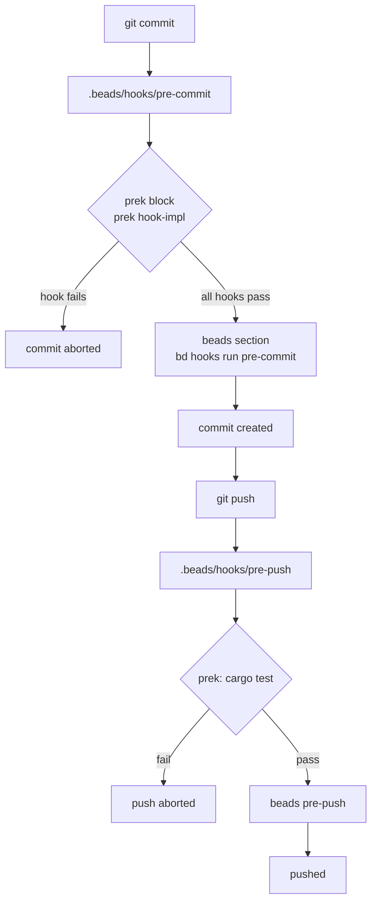

# Development

## Tools

[mise](https://mise.jdx.dev) pins every tool in `mise.toml`: the Rust toolchain (the same version as `rust-toolchain.toml`, which rustup and CI read) and [prek](https://prek.j178.dev) for git hooks. [mr boxington](https://mr-boxington.jdx.dev) (`mbx`) is a shared Cargo build cache: the `wrappers.cargo` entry routes plain `cargo` through it in `mise run`, `mise exec`, activated shells and shims, so a rebuild after a small edit restores unchanged crates from `~/.cache/mbx` instead of recompiling them. Run `mbx doctor` if a build seems to bypass it. CI does not use it: the repository policy allows only GitHub-owned actions. The beads CLI `bd` comes from the GitHub release binary rather than the npm package, whose postinstall step downloads a platform binary and fails behind some proxies.

```sh
mise install        # tools
mise run setup      # git hooks: prek (pre-commit, pre-push) chained before beads
mise tasks          # everything below
```

## Tasks

| Task | What it runs |
|---|---|
| `check` | `fmt:check`, `lint`, `check:minimal`, `test`, `doc`, `docs:check`, in CI order |
| `fmt` / `fmt:check` | `cargo fmt --all` / with `--check` |
| `lint` | `cargo clippy --all-targets --all-features` with `RUSTFLAGS=-D warnings` |
| `check:minimal` | `cargo check -p judgment --no-default-features --all-targets`: the judgment crate and its tests without the `http` feature |
| `test` | `cargo test --all-features` |
| `doc` | `cargo doc --no-deps --document-private-items` with `RUSTDOCFLAGS=-D warnings` |
| `docs:check` | frontmatter on `README.md`, `docs/**` and `crates/judgment/docs/**`; each documentation set's `llms.txt` and `llms-full.txt` match its nav and frontmatter |
| `docs:llms` | regenerate `llms.txt` and `llms-full.txt` for both documentation sets from their `mkdocs.yml` and page frontmatter |
| `schema` | regenerate `docs/schema/outcome.v1.json` from the wire types in `src/outcome.rs` |
| `precommit` | `prek run --all-files` |
| `build` | release build |
| `image` | `docker build` of the container image as `signalman:dev` ([Operations](operations.md#container-image)) |
| `serve` | `cargo run -- serve` plus any flags |
| `triage <file>` | `cargo run -- triage <file>` plus any flags |
| `triage:examples` | print the TypeSafe request for every example alert |
| `eval [args]` | `cargo run -- eval examples/eval/cases.jsonl` plus any flags |
| `config:show` | effective configuration after file, environment and flags |
| `bd:ready` / `bd:export` | ready issues / refresh the JSONL snapshot |

## Quality gates

Clippy runs with the `pedantic` group plus `unwrap_used` and `expect_used`, warnings denied. Tests never reach the network: `wiremock` stands in for all three APIs, and policy tests round-trip fake responses through the real handles. Doc tests cover the examples the library carries: the crate-level walkthrough in `src/lib.rs` is `no_run`, so it compiles against the public API on every test run without an API key; the judgment crate's doc tests run in its repository. CI (`.github/workflows/ci.yml`) runs the same gates plus `prek run --all-files`, using GitHub-owned actions only; a third job builds the container image with plain `docker` and publishes it to GHCR on a `v*` tag.

The root package `signalman` is the one package in this repository since the `judgment` crate moved to its own ([decision 0012](decisions/0012-the-judgment-crate-moves-to-its-own-repository.md); [Extracting the judgment crate](judgment-extraction.md) records how). signalman takes the crate from crates.io, `judgment = "0.3"`, in `[dependencies]` and, with the `openapi` feature, in `[dev-dependencies]`; the requirement names the minor because a 0.x minor may break, the two move together, deliberately, and until they move a change to the crate does not reach signalman's tests. The `[workspace]` table stays, so every gate still runs with `--workspace`.

The exceptions to "tests never reach the network" moved with the crate: its ignored live tests and its OpenAPI drift test run from its repository (`mise run live:typesafe` there, with the key from `.env`). They exist because a mock encodes what the client author believed about the wire, and only a real server can contradict that belief; [judgment against Laya typed-decisions](https://github.com/chussenot/judgment/blob/main/docs/verification/laya-typed-decisions.md) and [judgment against the hosted TypeSafe API](https://github.com/chussenot/judgment/blob/main/docs/verification/hosted-typesafe.md) are the records of two such runs. Nothing in this repository's gate reaches the network.

`docs/schema/outcome.v1.json` is generated, not hand-edited: `tests/outcome_contract.rs` fails when the committed file no longer matches the types, and its message says to run `mise run schema` and then classify the change as additive or breaking ([the outcome contract](triage.md#the-outcome-contract)). The same test file checks that the example in `docs/triage.md` is a document the schema accepts.

The TypeSafe OpenAPI document is vendored in the judgment crate (its `tests/fixtures/typesafe-openapi.json`, a copy of <https://api.typesafe.ai/openapi.json>, refreshed only through its drift test and contract-tested there) and reaches this repository as `judgment::contract::OPENAPI_DOCUMENT`, the crate's `openapi` feature, on in the dev-dependencies. `tests/typesafe_contract.rs` validates signalman's own traffic against it, offline and in the default gate: the triage request for every example alert, the shared TypeSafe mocks in `tests/common/` and the committed Jev run. A new document is therefore a crate change first, then a pin bump here, and the bump is where a shape the new document refuses shows up.

The documentation's `llms.txt` and `llms-full.txt` are generated the same way, from the nav and page frontmatter ([Documentation](#documentation)).

## Git hooks

Git's `core.hooksPath` is `.beads/hooks`, set by `bd init`. Those files are tracked and hold a beads-managed section between markers; beads preserves anything outside the markers when it upgrades them. `scripts/setup-hooks.sh` inserts a marked block before the beads section that runs prek, so the order on every commit and push is prek first, beads second. Never run `prek install`: it would replace the beads files with prek's own shim.


```mermaid
flowchart TD
    C[git commit] --> H[.beads/hooks/pre-commit]
    H --> P{prek block<br/>prek hook-impl}
    P -->|hook fails| X[commit aborted]
    P -->|all hooks pass| B[beads section<br/>bd hooks run pre-commit]
    B --> D[commit created]
    D --> PU[git push] --> H2[.beads/hooks/pre-push]
    H2 --> T{prek: cargo test}
    T -->|fail| Y[push aborted]
    T -->|pass| B2[beads pre-push] --> Z[pushed]
```

`.pre-commit-config.yaml` on commit: whitespace and line-ending fixes, YAML (multi-document allowed), TOML and JSON syntax, merge markers, large files, private keys, no commits on `main`, `cargo fmt --check`, `cargo clippy`, Markdown frontmatter, a stale `docs/llms.txt`, a refusal to commit `.env`. On push: `cargo test`. Beads-managed files and `Cargo.lock` are excluded from the fixers. Run everything without committing with `mise run precommit`.

## Layout

```
src/               the signalman application, depending on judgment by path
  triage/          Alert state, owner candidates, questions, Decision policy
  eval/            evaluation harness: cases, grading, metrics, record and replay
  changes/         change feed: window and matching, Argo CD and GitLab adapters
  incidentio/      client, types, webhook verification, sync flow, errors
  backstage/       catalog client, entity types, enrichment, notifications
  serve.rs         axum webhook receiver
  readiness.rs     GET /readyz: upstream checks, deadline, cached report
  outcome.rs       the outcome contract: wire types, builder, schema
  config.rs        configuration layers: file schema, env, flags, resolve
  telemetry.rs     OpenTelemetry: subscriber, OTLP export, every instrument
  main.rs          CLI
tests/             wiremock integration tests and end-to-end webhook runs; tests/common/ holds the shared fixtures (clients, the al-1 scene, the TypeSafe answers and model list, the committed schema); tests/typesafe_contract.rs checks signalman's TypeSafe requests and mocks against the vendored OpenAPI document
examples/          signalman's samples: alerts, change-feed payloads, a config file, evaluation cases and runs, a webhook delivery
docs/              signalman's documentation (TechDocs source); docs/schema/ and docs/llms*.txt are generated
scripts/           check-frontmatter.sh, gen-llms-txt.sh, setup-hooks.sh, incidentio-create-key.sh
.beads/            issue tracker data and git hooks
.claude/           agents, hooks, settings for Claude Code
catalog-info.yaml  Backstage registration of signalman and the judgment crate; each mkdocs.yml builds its docs/ as TechDocs
```

## Planning with beads

Issues live in a local Dolt database under `.beads/`, managed with `bd`. `bd ready` lists unblocked work; claim with `bd update <id> --claim`, finish with `bd close <id>`. `bd remember` stores durable project knowledge; `bd memories` searches it.

Cross-machine sync uses `bd dolt push` and `pull` over `refs/dolt/data` on the git remote. The environment that seeded the backlog could not push that ref, so `.beads/issues.jsonl` holds a snapshot. Import it once with `bd import .beads/issues.jsonl`, push with `bd dolt push`, then treat Dolt as the source of truth and drop the file.

## Documentation

The documentation here is signalman's; the `judgment` crate's is in its own repository, [chussenot/judgment](https://github.com/chussenot/judgment) ([decision 0011](decisions/0011-documentation-lives-with-its-concern.md) split the sets by concern, [decision 0012](decisions/0012-the-judgment-crate-moves-to-its-own-repository.md) the repositories). A page belongs to the crate when it would still be true, and still be needed, if signalman did not exist; it is then written there, in a pull request on that repository. A page that informs both stays here and says what it means for the crate in a section of its own.

| | signalman, here | the `judgment` crate, in its repository |
|---|---|---|
| Front door | `README.md` | `README.md` (no frontmatter: crates.io renders it) |
| Pages | `docs/` | `docs/` |
| Nav | `mkdocs.yml` | `mkdocs.yml` |
| Map of the pages | `docs/index.md` | `docs/index.md` |
| Decision records | `docs/decisions/` | `docs/decisions/` |
| `llms.txt` preamble | `docs/llms-intro.txt` | `docs/llms-intro.txt` |
| TechDocs component | `signalman` | `judgment` |

Decision records share one numbering sequence across the two repositories and live with the code they govern; signalman's index keeps a row for each crate record, so the sequence has no hole.

Links inside this set are relative. Links to the crate's pages are absolute GitHub URLs on its default branch, the only form that resolves on GitHub and in a TechDocs build; the cost is that such a link points at what is merged there, so a page renamed in the crate's repository breaks it until the docs auditor's link check finds it.

## Claude Code harness

The harness exists because the same mistakes recurred across sessions: a setting added in six of its seven places, a documentation index left stale, a span forgotten on a new client method, a pull request argued with a CI that was refused at scheduling. Each hook removes a class of mistake at the moment it would be made; each agent carries the checklist for one job so the main session does not have to hold it.

`.claude/settings.json` pins the `typesafe@typesafe-ai` skill plugin, pre-allows the read-only and build commands used here, denies reading `.env`, and wires four hooks:

| Hook | Script | Effect |
|---|---|---|
| `SessionStart` | `bd prime --hook-json` | injects the beads workflow |
| `PreToolUse` on Bash | `.claude/hooks/guard-bash.sh` | denies pushes to `main`, the interactive `bd edit`, committing `.env`, `cargo publish`; matches command positions only and ignores here-doc bodies |
| `PostToolUse` on Edit/Write | `.claude/hooks/rustfmt-on-edit.sh` | formats a Rust file right after it is written, so diffs carry no formatting noise |
| `PostToolUse` on Edit/Write | `.claude/hooks/llms-on-docs-edit.sh` | regenerates both documentation sets' `llms.txt` and `llms-full.txt` after a page, a README, an `llms-intro.txt` or a `mkdocs.yml` is written, so neither index can lag its frontmatter |

Subagents in `.claude/agents/`. Reviewers and auditors are read-only and report; writers edit. Delegate the job to the agent and keep the conclusion:

| Agent | Kind | Use it for |
|---|---|---|
| `contract-reviewer` | reviews | boundary code against the live TypeSafe, incident.io, Backstage and MCP documentation |
| `config-reviewer` | reviews | a new, renamed or removed setting: the seven places it must appear and the layering rules of decision 0006 |
| `observability-reviewer` | reviews | spans, metrics and log fields on a change: names, no secrets in fields, instruments only in `src/telemetry.rs`, the docs table |
| `question-designer` | proposes | questions, criteria and policy thresholds |
| `test-writer` | writes | tests in this repository's style: wiremock per upstream, a real listener for transports, a negative case per gate, the footguns already paid for |
| `docs-writer` | writes | signalman's documentation, with what belongs to the crate sent to its repository (decision 0011), explaining the problem solved and the trade-off taken, not only the mechanism |
| `docs-auditor` | reports | every documentation claim the code no longer supports, every page that says how without why, a page that belongs in the crate's repository, a broken link into it, drift in the generated index |
| `refactor-scout` | reports | dead public items, duplicated logic, stale comments and unused dependencies, as a ranked plan with evidence |
| `pr-shepherd` | acts | opening a pull request in the repository's shape and reading its CI checks: the first failing step reproduced locally, and the one standing-down comment when a failure is not the change's (refused at scheduling, or red on `main` too) |

A typical feature runs `test-writer` and `docs-writer` in parallel with the code, then `config-reviewer` and `observability-reviewer` on the diff, then `pr-shepherd`. A cleanup pass starts with `refactor-scout` and `docs-auditor` and feeds their reports to the main session and `docs-writer`.

`CLAUDE.md` holds the short list of rules that are easy to get wrong and points here for everything else.
