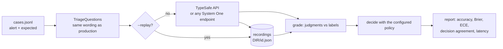

# Evaluation harness

Thresholds, wording and the fallback team list are configuration; the model's calibration in this domain is an empirical question. `signalman eval` answers it with numbers: it replays labelled alerts through the same questions the webhook flow asks, grades every judgment against what a responder said, applies the policy, and reports how often the decision would have been right. The measuring itself, recordings, per-question grading and the calibration metrics, lives in the `judgment` crate ([decision 0010](decisions/0010-extract-the-judgment-core-into-a-crate.md)) so any project built on it can grade its own judgments the same way; this page describes the harness signalman builds on top: its labels, its question-to-label mapping and the decision it grades.



## Cases

A JSON Lines file, one case per line. `alert` is exactly what `signalman triage` accepts; `expected` is what a responder would have said, every field optional. Blank lines and lines starting with `#` are ignored. [`examples/eval/cases.jsonl`](https://github.com/chussenot/signalman/blob/main/examples/eval/cases.jsonl) labels the three example alerts.

```json
{"id": "crashloop",
 "alert": {"source": "prometheus", "title": "KubePodCrashLooping", "description": "...", "labels": {"service": "checkout-api"},
           "recent_changes": ["deploy checkout-api v2.31.0"], "open_incidents": [{"id": "INC-4821", "summary": "..."}]},
 "expected": {"owner": "application", "impact": "major", "actionable": true,
              "duplicate_of": "none", "caused_by_change": true, "action": "page"}}
```

| Label | Values | Graded against |
|---|---|---|
| `owner` | a key from the fallback team list or `none_of_these` | the chosen option |
| `impact` | `none`, `minor`, `major`, `outage` | the level nearest the weighted score, as the policy reads it |
| `actionable` | `true`, `false` | probability at or above 0.5 |
| `duplicate_of` | an `open_incidents` id or `none` | the chosen option; `none` with certainty when the question was not asked |
| `caused_by_change` | `true`, `false` | probability at or above 0.5; `false` when no changes were listed |
| `action` | `suppress`, `attach_to_incident`, `page`, `ticket`, `human_triage` | the decision the configured policy reached |

The best labels are observed outcomes: the team that actually took the alert, the severity the incident ended at, whether anyone acted. Labels written by hand, as in the example file, measure agreement with one reader.

## Running

```sh
signalman eval examples/eval/cases.jsonl                       # call the model, print the report
signalman eval cases.jsonl --record runs/jev-1.13.0            # also keep every graded response
signalman eval cases.jsonl --replay runs/jev-1.13.0            # re-grade under the current configuration, no model call
signalman eval cases.jsonl --json > report.json                # the full report, every case included
```

One recording is committed: `examples/eval/runs/jev-1.13.0` holds the raw `jev-1.13.0` answers to the three example cases from the first live run (2026-09-23), so `--replay examples/eval/runs/jev-1.13.0` grades a policy change with no key and no model call. A wording change invalidates it, as explained below.

`--model`, the configuration file and the environment choose the model and the wording, exactly as for `serve` ([Configuration](configuration.md)). The harness uses the fallback team list as owner candidates: no catalog lookup, so a case is reproducible from the file alone. Put the resolved `component` into the alert JSON if the catalog context should be part of the state.

## The report

Measured on 2026-09-21 against Laya's English checkpoint on CPU ([Laya](laya.md)), the three example cases, default policy:

```
cases     3   model laya:english
decision  labelled 3  agreement 0.00

question             n   acc  brier   ece conf|right conf|wrong
owner                3  0.00   1.19  0.29          -       0.29
impact               3  0.33   0.89  0.03       0.39       0.35
actionable           3  1.00   0.25  0.34       0.66          -
duplicate_of         3  0.67   0.50  0.14       1.00       0.43
caused_by_change     3  0.67   0.46  0.21       0.91       0.81

latency   p50 3260 ms  p95 8197 ms  mean 4508 ms   tokens in 3212 out 0

mismatches (10):
  crashloop      duplicate_of     expected none, got INC-4821 (p 0.14, confidence 0.43)
  crashloop      owner            expected application, got platform (p 0.09, confidence 0.23)
  crashloop      decision         expected page, got human_triage
  dns            caused_by_change expected yes, got no (p 0.19, confidence 0.81)
  dns            impact           expected outage, got major (p 0.17, confidence 0.39)
  dns            owner            expected network, got none_of_these (p 0.07, confidence 0.45)
  dns            decision         expected page, got human_triage
  disk-noise     impact           expected none, got major (p 0.04, confidence 0.32)
  disk-noise     owner            expected platform, got none_of_these (p 0.11, confidence 0.18)
  disk-noise     decision         expected suppress, got human_triage
```

Replaying the same recordings with `suppress_below = 0.55` in `[policy]` moved decision agreement to 0.33 (the noise case is suppressed) with no model call and every question row unchanged, which is the tuning loop below in one line.

| Column | Meaning | Reading |
|---|---|---|
| `n` | cases carrying a label for that question | |
| `acc` | share of correct predictions | the headline, but blind to how sure the model was |
| `brier` | mean multi-class Brier score: squared distance between the reported distribution and the truth; 0 perfect, 2 confidently wrong | rewards honest probabilities, punishes confident misses; an expected option the model was never offered counts as a full miss |
| `ece` | expected calibration error over 10 confidence bins: how far "80 % confident" is from "right 80 % of the time" | the number the [thresholds](triage.md#the-decision) depend on; high ECE means confidence cannot be thresholded |
| `conf\|right`, `conf\|wrong` | mean confidence when right and when wrong | the gap between them is what a threshold can exploit; no gap, no useful threshold |
| decision `agreement` | share of labelled cases where the policy reached the expected action | the product metric: everything above feeds it |

Confidence is the Choice or Score confidence for those primitives and `max(p, 1 - p)` for a Noul. The JSON report adds per-question confusion tables, the decision confusion table, and every graded case with its full distributions.

### An answer that does not fit

The TypeSafe client checks every response against the questions it was sent (`Response::verify` in the `judgment` crate): an answer for every question, of the right primitive, a Choice naming only options it was offered, a Score whose legend is the levels sent and whose value is on their scale. A response that does not fit is an error, not an answer to grade. A live run does not stop there: one such case would otherwise throw away the rest of a run that has already been paid for. The case is listed under `failed` in the JSON report, and after the mismatches in the text report, with the error naming the question and the option or level, and TypeSafe's request id, when the API sent one, to report it with. It is not graded, so every figure above is over the graded cases, and `cases` counts only those. Under `--record` it gets no `<id>.json` (one an earlier run left there is removed, so it cannot be graded as this run's answer) and is listed instead in `failed.jsonl` beside the recordings, one case per line; the file is removed by a run in which nothing failed. A `--replay` of the directory over the same cases file reports those cases as failed again, rather than stopping at the missing recording. A case with neither a recording nor a line in `failed.jsonl` still stops a replay. Any other error (the network, the key, a case that does not parse) still stops the run. A report in which every case was graded has no `failed` key, so it reads as before.

```
failed (1), not graded: the answer did not fit the questions, so the figures above are over the 2 graded cases:
  oom            answer "owner" names option "made-up-team", which its question does not offer [request_id req-…]
```

## Tuning without re-running inference

Judgments do not depend on the policy ([decision 0002](decisions/0002-calibrated-judgments-over-generated-text.md)), so a threshold change needs no new model call:

1. `signalman eval cases.jsonl --record runs/<model>` once per model version.
2. Edit `[policy]` (or the question and guidance wording in `[triage.text]`, which changes only how the recorded answers are read, not the answers) in the configuration file. Not `impact_levels` or the team keys: a recorded answer echoes the levels it was asked with and chooses among the keys it was offered, so a replay under other levels or other keys no longer answers the questions being asked, and it fails naming the question (the check is `Response::verify`, run by `TriageQuestions::read`). Changing those needs a new recording.
3. `signalman eval cases.jsonl --replay runs/<model> --config candidate.toml` and compare decision agreement.
4. Pin `typesafe.model` to the version recorded against, in the same file as the thresholds.

Pick thresholds from the `conf|right` and `conf|wrong` columns per question: the automatic-routing threshold should sit above most wrong confidences, the human-triage threshold below most right ones. When the two means are close, no threshold will separate them and the fix is the question's wording or the state, not the number.

Wording changes do need a new run to be measured: they change the request, and a replay reads the old answers under the new wording. Record each variant under its own directory and compare. A replay whose recordings no longer fit the questions (reworded levels, a renamed team) stops with an error naming the question; re-record rather than edit the recordings.

## Comparing models

Any endpoint that speaks the System One shape can be evaluated by pointing `typesafe.base_url` at it, which is how [Laya](laya.md) was measured. Run the same cases against each, `--json` both, and compare `questions.*.accuracy`, `questions.*.ece` and `decision.accuracy`. Three cases are a smoke test; a comparison needs enough labelled history that the confidence bins are populated (tens of cases per question at least).

## Limits

- Grading is argmax against one label. Alerts with two acceptable owners, or an impact between two levels, count as wrong unless the label says otherwise; the JSON report's `p_expected` shows how much probability the model gave the label.
- The harness does not consult Backstage; catalog candidates can be reproduced by writing the `component` and the owner list into the case.
- The example file's labels are the maintainers' reading of three synthetic alerts. The harness has run against Laya through a local shim, which is the report above; it has not yet been run against Jev, TypeSafe's hosted model, nor against real alert history ([roadmap](roadmap.md)). The numbers above say how the harness reads, not how Jev performs.
