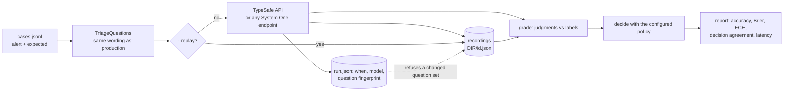

# Evaluation harness

Thresholds, wording and the fallback team list are configuration; the model's calibration in this domain is an empirical question. `signalman eval` answers it with numbers: it replays labelled alerts through the same questions the webhook flow asks, grades every judgment against what a responder said, applies the policy, and reports how often the decision would have been right. The measuring itself, recordings, per-question grading and the calibration metrics, lives in the `judgment` crate ([decision 0010](decisions/0010-extract-the-judgment-core-into-a-crate.md)) so any project built on it can grade its own judgments the same way; this page describes the harness signalman builds on top: its labels, its question-to-label mapping and the decision it grades.


```mermaid
flowchart LR
    C[cases.jsonl<br/>alert + expected] --> Q[TriageQuestions<br/>same wording as production]
    Q --> M{--replay?}
    M -- no --> TS[TypeSafe API<br/>or any System One endpoint]
    TS --> R[(recordings<br/>DIR/id.json)]
    M -- yes --> R
    TS --> G[grade: judgments vs labels]
    R --> G
    G --> P[decide with the configured policy]
    P --> REP[report: accuracy, Brier, ECE,<br/>decision agreement, latency]
    TS --> MAN[(run.json: when, model,<br/>question fingerprint)]
    MAN -. refuses a changed question set .-> R
```

## Cases

A JSON Lines file, one case per line. `alert` is exactly what `signalman triage` accepts; `expected` is what a responder would have said, every field optional. Blank lines and lines starting with `#` are ignored. [`examples/eval/cases.jsonl`](https://github.com/chussenot/signalman/blob/main/examples/eval/cases.jsonl) labels the three example alerts.

```json
{"id": "crashloop",
 "alert": {"source": "prometheus", "title": "KubePodCrashLooping", "description": "...", "labels": {"service": "checkout-api"},
           "recent_changes": ["deploy checkout-api v2.31.0"], "open_incidents": [{"id": "INC-4821", "summary": "..."}]},
 "expected": {"owner": "application", "impact": "major", "actionable": true,
              "duplicate_of": "none", "caused_by_change": true, "action": "page"},
 "provenance": {"method": "author-synthetic", "source": "maintainers' reading while writing the harness"},
 "rationale": "OOMKilled minutes after a deploy of the same service: the owning team can roll back, so page."}
```

| Label | Values | Graded against |
|---|---|---|
| `owner` | a key from the fallback team list or `none_of_these` | the chosen option |
| `impact` | `none`, `minor`, `major`, `outage` | the level nearest the weighted score, as the policy reads it |
| `actionable` | `true`, `false` | probability at or above 0.5 |
| `duplicate_of` | an `open_incidents` id or `none` | the chosen option; `none` with certainty when the question was not asked |
| `caused_by_change` | `true`, `false` | probability at or above 0.5; `false` when no changes were listed |
| `action` | `suppress`, `attach_to_incident`, `page`, `ticket`, `human_triage` | the decision the configured policy reached |

Three more fields say what the labels are worth. They travel into the report, never to the model.

| Field | Values | Why |
|---|---|---|
| `split` | `development` (the default), `held-out` | thresholds are chosen on the development cases; the held-out cases are graded once, with the policy already chosen, so a number reported on them was not fitted to them. `--split` selects one set |
| `provenance` | `{"method": …, "source": "…"}`, method one of `observed-outcome`, `human-labelled`, `author-synthetic`, `unspecified` | the report counts cases per method, so an accuracy reads as accuracy against what happened, or against one reader's opinion, or against the harness author's own examples, which is what the example file is. A misspelt field is an error, not a case silently counted as unspecified |
| `rationale` | free text | why the labels are what they are, for the next person who edits the case |

The best labels are observed outcomes: the team that actually took the alert, the severity the incident ended at, whether anyone acted. Labels written by hand, as in the example file, measure agreement with one reader, and `provenance` is how a report says which of the two it is reporting. An accuracy over cases of unknown origin is a number about nothing in particular, which is why absent provenance is reported as `unspecified` rather than hidden.

## Running

```sh
signalman eval examples/eval/cases.jsonl                       # call the model, print the report
signalman eval cases.jsonl --record runs/jev-1.13.0            # also keep every graded response
signalman eval cases.jsonl --replay runs/jev-1.13.0            # re-grade under the current configuration, no model call
signalman eval cases.jsonl --replay runs/jev-1.13.0 --split development --freeze-policy   # keep the chosen policy beside the recordings
signalman eval cases.jsonl --replay runs/jev-1.13.0 --split held-out   # the held-out cases once, under the frozen policy only
signalman eval cases.jsonl --replay runs/old --stale-ok        # grade answers recorded under other question texts anyway, marked as such
signalman eval cases.jsonl --json > report.json                # the full report, every case included
```

Two recordings are committed, both of `jev-1.13.0` answering the three example cases, each with its `run.json` manifest. `examples/eval/runs/jev-1.13.0-state-guard` (2026-10-03, `signalman-whv.5`) was recorded under the current default questions, so `--replay examples/eval/runs/jev-1.13.0-state-guard` grades a policy change with no key, no model call and no `--stale-ok`. `examples/eval/runs/jev-1.13.0` is the first live run (2026-09-23), recorded before the rule every instruction now ends with ([Triage](triage.md#which-questions-are-asked)); its manifest carries the earlier question fingerprint, so it replays only with `--stale-ok`. It is kept so the rule's effect is a comparison of two recordings, [below](#what-the-state-rule-changed), not an assumption.

`--model`, the configuration file and the environment choose the model and the wording, exactly as for `serve` ([Configuration](configuration.md)). The harness uses the fallback team list as owner candidates: no catalog lookup, so a case is reproducible from the file alone. Put the resolved `component` into the alert JSON if the catalog context should be part of the state.

## The report

The committed `jev-1.13.0-state-guard` run, replayed on 2026-10-03 under the default policy:

```
cases     3   model jev-1.13.0
decision  labelled 3  agreement 1.00  95% 0.44..1.00
evidence  replay recorded 2026-10-03T07:18:53.830808109Z  questions 1677815da49da9d9
policy    cdddb2572b782200
origin    split development 3   labels author-synthetic 3

question             n   acc    acc 95%  brier   ece conf|right conf|wrong
owner                3  1.00 0.44..1.00   0.00  0.00       1.00          -
impact               3  0.67 0.21..0.94   0.45  0.28       0.98       0.79
actionable           3  1.00 0.44..1.00   0.02  0.09       0.91          -
duplicate_of         3  1.00 0.44..1.00   0.00  0.04       0.96          -
caused_by_change     3  1.00 0.44..1.00   0.01  0.06       0.94          -

latency   p50 173 ms  p95 563 ms  mean 300 ms   tokens in 3733 out 381

mismatches (1):
  dns            impact           expected outage, got major (p 0.17, confidence 0.79)
```

Read the second line with the fourth: three author-written cases decided as their authors expected is agreement 1.00 with an interval reaching down to 0.44, which is the honest claim. The same three cases against Laya's English checkpoint on CPU (2026-09-21, [Laya](laya.md)) gave decision agreement 0.00 with ten mismatches, and replaying those recordings with `suppress_below = 0.55` in `[policy]` moved it to 0.33 (the noise case is suppressed) with no model call and every question row unchanged, which is the tuning loop below in one line.

| Column | Meaning | Reading |
|---|---|---|
| `n` | cases carrying a label for that question | |
| `acc` | share of correct predictions | the headline, but blind to how sure the model was |
| `acc 95%`, decision `95%` | Wilson score interval for that share at 95% | what the share is worth: 3 of 3 is `0.44..1.00`, 300 of 300 would be `0.99..1.00`. It assumes independent cases; several variants of one alert make it optimistic |
| `brier` | mean multi-class Brier score: squared distance between the reported distribution and the truth; 0 perfect, 2 confidently wrong | rewards honest probabilities, punishes confident misses; an expected option the model was never offered counts as a full miss |
| `ece` | expected calibration error over 10 confidence bins: how far "80 % confident" is from "right 80 % of the time" | the number the [thresholds](triage.md#the-decision) depend on; high ECE means confidence cannot be thresholded |
| `conf\|right`, `conf\|wrong` | mean confidence when right and when wrong | the gap between them is what a threshold can exploit; no gap, no useful threshold |
| decision `agreement` | share of labelled cases where the policy reached the expected action | the product metric: everything above feeds it |
| `evidence` | `live` or `replay`, when the answers were recorded, the fingerprint of the question texts and owner candidates they are graded under, and `STALE` with the recorded fingerprint when the two differ, or `(recording has no manifest)` for a directory older than manifests | whether the numbers say how the model answers these questions, or how the policy reads answers to earlier ones |
| `policy` | fingerprint of the thresholds the decisions were made under, `(frozen)` when it is the policy frozen beside the recordings, or the frozen one's fingerprint when it is not | whether the decision agreement is under the policy chosen on the development cases, which is the only one a held-out number may be reported under |
| `origin` | cases per split and per provenance method | whether the accuracy is against observed outcomes or against the harness author's own examples, and whether it was fitted to the cases it is reported on |

Confidence is the Choice or Score confidence for those primitives and `max(p, 1 - p)` for a Noul. The JSON report adds per-question confusion tables, the decision confusion table, an `evidence` object with the same fields as the two lines above, and every graded case with its full distributions.

### What the state rule changed

The two committed runs differ only in the rule appended to every instruction: same model (`jev-1.13.0`, pinned with `--model`), same case file (cases fingerprint `9535a2944387f859`), same policy. Replaying both under the default policy:

| | before the rule (2026-09-23) | with the rule (2026-10-03) |
|---|---|---|
| question fingerprint | `0165f119e3162330` | `1677815da49da9d9` |
| decision agreement | 1.00 (3 of 3) | 1.00 (3 of 3) |
| per-question accuracy | as labelled except `dns` impact | as labelled except `dns` impact |
| `dns` impact, p(`outage`) / confidence | 0.26 / 0.70 | 0.17 / 0.79 |
| impact Brier / ECE | 0.36 / 0.26 | 0.45 / 0.28 |
| input tokens, three cases | 2,851 | 3,733 (+31 %, about 59 per question) |

What this measures: the rule costs about 59 input tokens per question, and on these three cases it changed no decision and no reported answer. What it does not: three author-written cases cannot show whether the rule biases an inferential question. The one movement, `dns` impact drifting further from the labelled `outage` and the model growing surer of `major`, is a single answer and as consistent with run-to-run variation as with the rule's "do not invent details" clause leaning a Score toward the milder level, which is the bias the rule was reworded once to avoid ([Decision recipes](research/decision-recipes.md)). It is a reason to watch impact when labelled history arrives (`signalman-ufg.6`), not a finding. For scale: the hosted API is not deterministic at the two decimals it sends: two sets of three identical requests to `jev-1.13.0` on 2026-10-03 returned probabilities 0.01 apart in one set and 0.05 apart in the other, with the same decision every time ([judgment against the hosted TypeSafe API](judgment-typesafe-live.md#beyond-the-test-file)), so a move of 0.09 is at the edge of run-to-run noise, and one answer. Thresholds need that margin, and a replay reproduces a recording, not the model. Latency is lower in the second run; nothing in the rule would make a request faster, so read it as the service's variation, not an effect.

### An answer that does not fit

The TypeSafe client checks every response against the questions it was sent (`Response::verify` in the `judgment` crate): an answer for every question, of the right primitive, a Choice naming only options it was offered, a Score whose legend is the levels sent and whose value is on their scale. A response that does not fit is an error, not an answer to grade. A live run does not stop there: one such case would otherwise throw away the rest of a run that has already been paid for. The case is listed under `failed` in the JSON report, and after the mismatches in the text report, with the error naming the question and the option or level, and TypeSafe's request id, when the API sent one, to report it with. It is not graded, so every figure above is over the graded cases, and `cases` counts only those. Under `--record` it gets no `<id>.json` (one an earlier run left there is removed, so it cannot be graded as this run's answer) and is listed instead in `failed.jsonl` beside the recordings, one case per line; the file is removed by a run in which nothing failed. A `--replay` of the directory over the same cases file reports those cases as failed again, rather than stopping at the missing recording. A case with neither a recording nor a line in `failed.jsonl` still stops a replay. Any other error (the network, the key, a case that does not parse) still stops the run. A report in which every case was graded has no `failed` key, so it reads as before.

```
failed (1), not graded: the answer did not fit the questions, so the figures above are over the 2 graded cases:
  oom            answer "owner" names option "made-up-team", which its question does not offer [request_id req-…]
```

### What a recording answers

A recorded run writes `run.json` beside the recordings: when it finished, the model asked for, the `signalman` version, a fingerprint of the question texts and owner candidates in force, a fingerprint of the case file as read, and the case counts per split and per provenance method. The question fingerprint covers everything that shapes a request apart from the alert itself (`[triage.text]`, the rule included, and the fallback team list), so two runs with the same fingerprint asked the same questions and a replay under another one is reading answers to questions that were never asked.

That is why a replay compares the manifest's fingerprint with the current configuration's and stops when they differ, naming both and the recording date, rather than printing a report that looks like a measurement of the current wording. `--stale-ok` grades the recordings anyway, with `STALE` on the evidence line and `stale: true` in the JSON, for the one legitimate use: seeing how a policy change reads old answers while a new recording is on its way. A directory recorded before manifests existed has no `run.json`; it is graded, and the evidence line says the recorded fingerprint is unknown. The checks on `Response::verify` below still apply on top: a changed level text or team key fails the question itself, manifest or not. The fingerprint is deliberately coarser than that check. It fires on a wording change that could not possibly have changed an answer, because whether a change could is exactly what cannot be known without recording again. The discipline is borrowed from jev-recipes' evaluation archive ([Decision recipes](research/decision-recipes.md)).

### Freezing the policy

A threshold chosen by looking at every labelled case is a number about those cases. The held-out split exists so that one set of cases is never looked at while choosing, and `policy.json` is what keeps that promise after the fact. `--replay DIR --split development --freeze-policy` writes it beside the recordings: the policy itself, its fingerprint, the question fingerprint in force, and the development figures it was chosen on (cases, labelled, agreement and its interval). It can only be written from a replay of the development split; a replay that graded a held-out case refuses to freeze, since a policy chosen with those cases in view is not one the held-out replay can vouch for.

`--replay DIR --split held-out` is then graded only under the frozen policy. Without `policy.json` it stops and says to freeze first; under a policy whose fingerprint differs from the frozen one it stops naming both fingerprints and the freeze date. There is no flag past that gate. The way to change the policy is to replay the development cases again with `--freeze-policy`, which replaces the file with a new date: the held-out cases have then been seen once per freeze, and the dates are the record of how many times. Every report prints the `policy` line, so a development replay under a candidate policy says it is not the frozen one, and the JSON `evidence` carries both fingerprints. A live run grades under the current policy and freezes nothing: the discipline applies to replays, where thresholds are chosen.

## Tuning without re-running inference

Judgments do not depend on the policy ([decision 0002](decisions/0002-calibrated-judgments-over-generated-text.md)), so a threshold change needs no new model call:

1. `signalman eval cases.jsonl --record runs/<model>` once per model version.
2. Edit `[policy]` (or the question and guidance wording in `[triage.text]`, which changes only how the recorded answers are read, not the answers) in the configuration file. Not `impact_levels` or the team keys: a recorded answer echoes the levels it was asked with and chooses among the keys it was offered, so a replay under other levels or other keys no longer answers the questions being asked, and it fails naming the question (the check is `Response::verify`, run by `TriageQuestions::read`). Changing those needs a new recording.
3. `signalman eval cases.jsonl --replay runs/<model> --config candidate.toml` and compare decision agreement.
4. Pin `typesafe.model` to the version recorded against, in the same file as the thresholds.
5. Keep a held-out set once there are enough cases: mark some `"split": "held-out"`, choose thresholds with `--split development`, freeze the choice with `--freeze-policy`, then grade `--split held-out` once; it is graded under the frozen policy and no other ([above](#freezing-the-policy)). A threshold tuned on the cases it is reported on is a number about those cases, not about the next alert.

Pick thresholds from the `conf|right` and `conf|wrong` columns per question: the automatic-routing threshold should sit above most wrong confidences, the human-triage threshold below most right ones. When the two means are close, no threshold will separate them and the fix is the question's wording or the state, not the number.

Wording changes do need a new run to be measured: they change the request, and a replay reads the old answers under the new wording. Record each variant under its own directory and compare. The manifest makes this a refusal rather than advice ([above](#what-a-recording-answers)): a replay under other texts or candidates stops naming both fingerprints, and `--stale-ok` is the explicit way past it. A replay whose recordings no longer fit the questions (reworded levels, a renamed team) stops with an error naming the question; re-record rather than edit the recordings.

## Comparing models

Any endpoint that speaks the System One shape can be evaluated by pointing `typesafe.base_url` at it, which is how [Laya](laya.md) was measured. Run the same cases against each, `--json` both, and compare `questions.*.accuracy`, `questions.*.ece` and `decision.accuracy`. Three cases are a smoke test; a comparison needs enough labelled history that the confidence bins are populated (tens of cases per question at least).

## Limits

- Grading is argmax against one label. Alerts with two acceptable owners, or an impact between two levels, count as wrong unless the label says otherwise; the JSON report's `p_expected` shows how much probability the model gave the label.
- The harness does not consult Backstage; catalog candidates can be reproduced by writing the `component` and the owner list into the case.
- The example file's labels are the maintainers' reading of three synthetic alerts. The harness has run against Laya through a local shim, which is the report above; it has not yet been run against Jev, TypeSafe's hosted model, nor against real alert history ([roadmap](roadmap.md)). The numbers above say how the harness reads, not how Jev performs.
