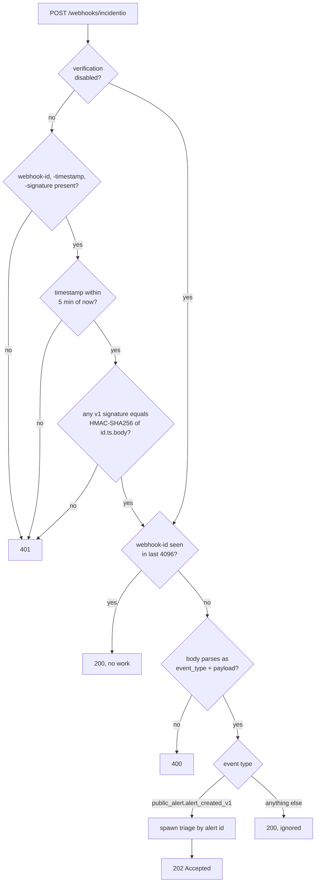

# incident.io integration

incident.io is the alert hub. Alerts from every source land there first; signalman reacts to them and writes judgments back as tags and attachments. It never creates incidents ([ADR 0001](decisions/0001-incidentio-remains-the-alert-hub.md)).

Contract sources: the [OpenAPI v3 specification](https://api.incident.io/v1/openapiV3.json), the [documentation index](https://docs.incident.io/llms.txt) and the [webhook guide](https://docs.incident.io/api-reference/webhooks.md).

## Receiving a webhook

The signature is Svix's: HMAC-SHA256 over `id.timestamp.raw body`, keyed with the base64 part of the `whsec_` secret, compared in constant time; several space-separated `v1,` signatures are accepted during rotation, and both `webhook-*` and `svix-*` header names are read. The implementation is pinned to Svix's published test vector.

Two responses are refusals, 401 and 400, and incident.io retries them for 24 hours. Everything else is acknowledged, including duplicates and event types signalman does not handle, because a retry would only repeat the same delivery. Private-resource events carry an id only and are ignored.

## The flow after acknowledgement

The receiver answers 202 before any upstream call. The flow then fetches the alert by id and the incidents in `triage`, `live` and `paused` categories, so late or reordered deliveries cannot apply a stale decision. The rest is the [triage](triage.md), optionally preceded by [catalog enrichment](backstage.md).

## What is written back

| Write | Endpoint | When |
|---|---|---|
| Tags `ai-team-<key>`, `ai-impact-<level>`, `ai-action-<decision>` | `POST /v2/alerts/{id}/actions/add_tags` | every triaged alert |
| Tag `ai-dup-<reference>` and the attachment | `add_tags` and `POST /v2/incident_alerts` | decision is attach |
| Tag `ai-suspected-change` | `add_tags` | `caused_by_change` above threshold |

Tag names are lowercase with hyphens and prefixed `ai-`, so alert routes can filter on them and humans can tell them from their own tags. `<key>` is the catalog group name when Backstage is configured, or the static team key otherwise. Existing tags are kept. `--dry-run` on `serve` and `incidentio triage-alert` computes everything and writes nothing.

## Setup

1. Create an API key with view alerts, view incidents, manage alert tags and manage incident alerts. `signalman incidentio whoami` prints the roles the key has.
2. Run the receiver where incident.io can reach it; for local work, Svix Play or ngrok.
3. Settings → Webhooks → add endpoint, subscribe to **Alert created (public)**, copy the signing secret into `INCIDENTIO_WEBHOOK_SECRET`.
4. Send a test event from the webhook settings page. A signature failure is a 401 with the reason in the body.
5. Fire a real alert and confirm tags appear on it.

## Alert routes

Tags are the handoff. Typical routes:

| Condition | Action in incident.io |
|---|---|
| `ai-action-page` and `ai-team-<group>` | escalate to that group's on-call |
| `ai-action-ticket` | create a low-urgency incident or a ticket, no page |
| `ai-action-suppress` | do not create an incident; keep the alert for review |
| `ai-action-human-triage` | route to the triage channel |
| `ai-action-attach` | nothing; the attachment is already made |

Tags arrive a few seconds after the alert is created. Routes should evaluate on alert update as well as creation, or wait for the tag. This has not yet been verified against a live account.

## Forwarding from the CLI

`triage --forward-to-incidentio` posts the alert to an HTTP alert source (`POST /v2/alert_events/http/{config id}`), authenticated with the source's token rather than the API key. The judgments travel under `metadata.ai` (`team`, `team_confidence`, `impact_level`, `impact_label`, `impact_score`, `actionable`, `decision`, `model`), and the resolved component under `metadata.component`. Map them to alert attributes in the source's template, then route on the attributes. Only `status: firing` is sent today.

## Candidate incidents

`GET /v2/incidents` with `status_category[one_of]` for each of `triage`, `live` and `paused` as repeated keys, paginated with the `after` cursor, filtered client-side to `mode: standard`, capped at 40. The multi-value filter form is inferred from single-value examples and is unverified; the fallback is one request per category. The list endpoint has its own limit of 60 requests per minute.

## Errors

`incidentio::Error` maps 401, 403, 404, 422 and 429 to variants carrying the `request_id` and, for 422, the field-level messages from the documented error body. `Retry-After` on 429 is honoured. Everything else is `Http` with the truncated body.
