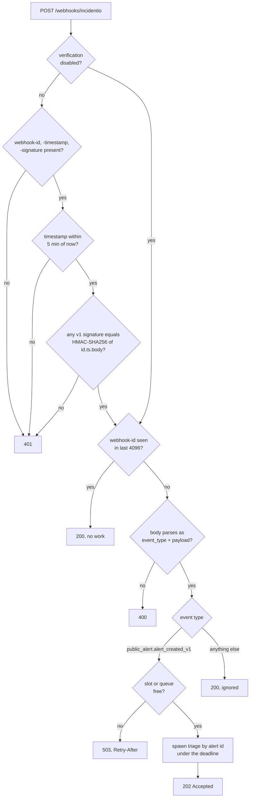

# incident.io integration

incident.io is the alert hub. Alerts from every source land there first; signalman reacts to them and writes judgments back as tags and attachments. It never creates incidents ([ADR 0001](decisions/0001-incidentio-remains-the-alert-hub.md)).

Contract sources: the [OpenAPI v3 specification](https://api.incident.io/v1/openapiV3.json), the [documentation index](https://docs.incident.io/llms.txt) and the [webhook guide](https://docs.incident.io/api-reference/webhooks.md).

## Receiving a webhook



The signature is Svix's: HMAC-SHA256 over `id.timestamp.raw body`, keyed with the base64 part of the `whsec_` secret, compared in constant time; several space-separated `v1,` signatures are accepted during rotation, and both `webhook-*` and `svix-*` header names are read. The implementation is pinned to Svix's published test vector.

Three responses are refusals and incident.io retries them for 24 hours: 401, 400, and 503 when the replica is at its [triage capacity](operations.md#backpressure), sent with `Retry-After` and before the delivery is marked seen. Everything else is acknowledged, including duplicates and event types signalman does not handle, because a retry would only repeat the same delivery. Private-resource events carry an id only and are ignored.

## The flow after acknowledgement

The receiver answers 202 before any upstream call. The flow then fetches the alert by id and the incidents in `triage`, `live` and `paused` categories, so late or reordered deliveries cannot apply a stale decision. It also lists the alerts that are firing in the recent window (`GET /v2/alerts?status[one_of]=firing&created_at[gte]=…`, one page of 50, default window 30 minutes) and puts up to 20 of them, newest first and without the alert itself, into the state as `related_alerts`. That lookup is context, not a prerequisite: if it fails, the triage continues with an empty list and a warning. The rest is the [triage](triage.md), optionally preceded by [catalog enrichment](backstage.md).

Alerts from any source that notifies incident.io appear in that list. Tsuga, the observability platform, forwards its monitor and SLO alerts through its own incident.io integration; signalman does not talk to Tsuga directly ([decision 0005](decisions/0005-observability-signals-enter-through-incidentio.md)).

## What is written back

| Write | Endpoint | When |
|---|---|---|
| Tags `ai-team-<key>`, `ai-impact-<level>`, `ai-action-<decision>` | `POST /v2/alerts/{id}/actions/add_tags` | every triaged alert |
| Tag `ai-dup-<reference>` and the attachment | `add_tags` and `POST /v2/incident_alerts` | decision is attach |
| Tag `ai-suspected-change` | `add_tags` | the decision flagged a recent change as the likely cause, which only `page` and `ticket` do |
| The qualification note | `POST /v1/alert_notes`, or `PUT /v1/alert_notes/{id}` on a later pass | every triaged alert unless `--no-note` |

Tag names are lowercase with hyphens and prefixed `ai-`, so alert routes can filter on them and humans can tell them from their own tags. `<key>` is the catalog group name when Backstage is configured, or the static team key otherwise. Existing tags are kept. `--dry-run` on `serve` and `incidentio triage-alert` computes everything and writes nothing.

The tag strings have one source, `src/outcome.rs`: the same functions produce the tags the flow writes and the tags the outcome document says it implies, so the two cannot drift and `Outcome::validate` can reject a tag the document does not explain. `ai-suspected-change` in particular is taken from the decision's own `suspected_change` flag, not recomputed from the `caused_by_change` probability, so the `flag_change_above` threshold lives in one place, the policy, and the tag remains derivable from the document. It therefore appears only on a `page` or a `ticket`, the two decisions that carry the flag.

The writes happen in a fixed order inside one `incidentio.write_back` span (absent on a dry run; its fields are the tag count and whether an attachment and a note were attempted, never their content): tags, then the attachment, then the note, then the owner notification through Backstage when it is enabled. The tags are the handoff, so a failure to write them fails the triage. The note and the notification are conveniences on top of the tags, so their failures are logged and recorded in the document and do not undo what was already written.

Every triage, applied or dry run, also returns [the outcome contract](triage.md#the-outcome-contract): one JSON document holding the judgments, the decision, the policy that produced it and what was written. `writes.mode` says `applied` or `dry_run`, `writes.note` says what became of the note, and `writes.attached` says whether the attachment happened. The tags are a lossy view of that document, and every one of them is derivable from it.

### The qualification note

Tags carry the verdict; the note carries what a responder needs to trust it and act, in the alert view they already have open. It is rendered from a fixed template in code, never by the model ([decision 0002](decisions/0002-calibrated-judgments-over-generated-text.md)), and reads:

```markdown
**Signalman qualification**

**Decision:** Page **Payments** (Major impact). Owner confidence is moderate: confirm ownership.

- Owner: [Payments](https://backstage.example.com/catalog/default/group/payments) (confidence 0.62; next: Data Platform 0.31)
- Impact: Major (P 0.71; Outage 0.22)
- Actionable: 0.95
- Duplicate of: none of the 3 open incidents offered (confidence 0.80)
- Recent change as cause: 0.71
  - 2026-09-21T11:50:00Z deploy checkout-api v2.31.0 by alice (checkout-api) https://argocd.example.com/applications/checkout-api
- Component: [checkout-api](https://backstage.example.com/catalog/default/component/checkout-api) (service, production), registered owner Payments; depended on by component storefront
- Runbook: [TechDocs page](https://backstage.example.com/docs/default/component/checkout-api/runbooks/high-error-rate/)
- Related firing alerts (last 30 min): 2
  - HighLatency payments-gateway (4 min ago, payments-gateway)
  - PodRestarts checkout-api (11 min ago, checkout-api)
- Upstream: https://app.datadoghq.eu/monitors/2

_Time to qualify: 42 s. Model jev-1.13.0. Tags: ai-team-payments, ai-impact-major, ai-action-page._
```

Every line is a judgment with its probability, a link, or a fact from the catalog or the hub. Alternatives are listed when they carry at least 0.05 probability, so a close call reads as one. The time to qualify is measured from the alert's `created_at` in incident.io to the decision and is also logged and returned in [the outcome contract](triage.md#the-outcome-contract) as `time_to_qualify_seconds`; it is the number this tool exists to lower.

The note starts with a fixed marker line. Before writing, signalman lists the alert's notes and, when one of them starts with the marker, replaces that note instead of adding another; a human's notes are never touched. One alert therefore carries at most one signalman note, always the latest pass, and a responder never has to work out which of several notes is current. Writing the note requires the manage alert notes scope. A failure to write it is logged and does not undo the tags or the attachment.

What became of the note is reported as `writes.note.status` in the outcome document:

| Status | Meaning |
|---|---|
| `created` | a first pass added a new note |
| `replaced` | the note signalman left on an earlier pass was rewritten in place; `writes.note.id` is its id |
| `failed` | the write failed; the tags and the attachment were still written and `writes.note.error` says why |
| `disabled` | the note is switched off (`--no-note`) |
| `skipped` | no note was attempted: a dry run, or the file-based CLI with no alert to write to |

## Setup

1. Create an API key with view alerts, view incidents, manage alert tags, manage incident alerts and manage alert notes. `signalman incidentio whoami` prints the roles the key has. incident.io names roles (`viewer`, `incident_editor`, …) without saying which one covers alert tags or notes, so `scripts/incidentio-create-key.sh` creates a key with the roles you name and probes every endpoint the flow uses with it (reads must answer 200; writes get an empty body and must answer 422, not 403), deleting the key again when a probe fails. It needs a calling key with `api_keys_manage`, which the shared key verified on 2026-09-23 did not have.
2. Run the receiver where incident.io can reach it; for local work, Svix Play or ngrok.
3. Settings → Webhooks → add endpoint, subscribe to **Alert created (public)**, copy the signing secret into `INCIDENTIO_WEBHOOK_SECRET`.
4. Send a test event from the webhook settings page. A signature failure is a 401 with the reason in the body.
5. Fire a real alert and confirm tags appear on it.

## Alert routes

Tags are the handoff. Typical routes:

| Condition | Action in incident.io |
|---|---|
| `ai-action-page` and `ai-team-<group>` | escalate to that group's on-call |
| `ai-action-ticket` | create a low-urgency incident or a ticket, no page |
| `ai-action-suppress` | do not create an incident; keep the alert for review |
| `ai-action-human-triage` | route to the triage channel |
| `ai-action-attach` | nothing; the attachment is already made |

Tags arrive a few seconds after the alert is created. Routes should evaluate on alert update as well as creation, or wait for the tag. This has not yet been verified against a live account.

## Forwarding from the CLI

`triage --forward-to-incidentio` posts the alert to the HTTP alert source named by `incidentio.alert_source_config_id` (`POST /v2/alert_events/http/{config id}`), authenticated with the source's token (`INCIDENTIO_ALERT_SOURCE_TOKEN`) rather than the API key. The judgments travel under `metadata.ai` (`team`, `team_confidence`, `impact_level`, `impact_label`, `impact_score`, `actionable`, `decision`, `model`), and the resolved component under `metadata.component`. Map them to alert attributes in the source's template, then route on the attributes. Only `status: firing` is sent today.

That block is flat on purpose and is not the same shape as [the outcome contract](triage.md#the-outcome-contract). Attribute templates in incident.io read flat paths, so the forwarded metadata stays flat and the versioned contract is free to nest. The two evolve separately. What incident.io accepted is reported back in the document as `writes.forwarded`. None of this has been checked against a live alert source.

## Candidate incidents

The `duplicate_of` question can only choose among incidents it is offered, so which incidents are fetched decides which duplicates can ever be caught, and every incident offered is one more Choice option the model must weigh and pay tokens for. The list is therefore narrowed three ways before it becomes state.

`GET /v2/incidents` with `status_category[one_of]` for each of `triage`, `live` and `paused` as repeated keys (the documentation shows single values; a live account honoured the repeated form on 2026-09-23), paginated with the `after` cursor, filtered client-side to `mode: standard`, capped at 40 (`DEFAULT_CANDIDATES` in `src/incidentio/sync.rs`). Each candidate is offered as `name [severity]: summary`, the summary cut at 280 characters: live summaries are whole markdown bodies, and forty of them would dominate the request.

- **Three status categories.** `triage`, `live` and `paused` are the categories in which responders are still working, or have deliberately paused; a new alert on the same problem belongs with them. `declined`, `merged`, `canceled`, `closed` and `learning` (post-incident) are finished work, and attaching a firing alert to one would bury it where nobody is looking.
- **`mode: standard` only.** incident.io also carries `test`, `tutorial` and `retrospective` incidents; none is live work a duplicate could join, and a retrospective describes a problem that is already over. The filter is applied client-side after the fetch; an incident with no `mode` field is kept. Whether the endpoint's own `mode` filter would do the same has not been checked against a live account.
- **At most 40.** Each candidate is one Choice option, and the Choice limit is 255, so the cap protects the request from an account with hundreds of open incidents; below the limit, each option still costs input tokens and dilutes the model's attention across more choices. Pagination stops as soon as 40 are collected, so the incidents offered are the first 40 the endpoint returns; the cap assumes that order is newest first, where a duplicate is most likely to be, and that assumption has not been checked against a live account. Forty is a default awaiting tuning on real alerts; the [roadmap](roadmap.md) lists candidate selection by team and recency as the next step, and the number was not measured.

The multi-value filter form is inferred from single-value examples and is unverified; the fallback is one request per category. The list endpoint has its own limit of 60 requests per minute, which is why the candidates are fetched once per triage and never polled.

## Errors

`incidentio::Error` maps 401, 403, 404, 422 and 429 to variants carrying the `request_id` and, for 422, the field-level messages from the documented error body. The server's wait (`retry-after-ms`, or `Retry-After` in seconds or as an HTTP date) is honoured on any retried status, up to 30 s, and the backoff's jitter only ever shortens a wait. Everything else is `Http` with the truncated body.
