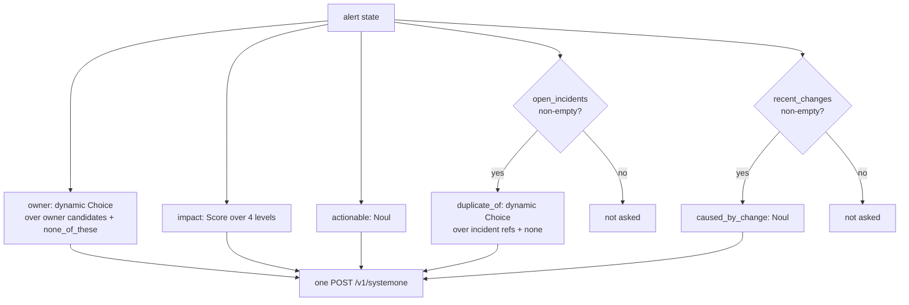
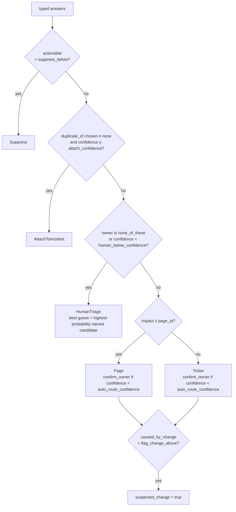

# Triage

Triage is one request to the model and one pass through a policy. The request asks every question the policy might need, including questions whose answers may go unused. The policy reads the answers in a fixed order of precedence and returns exactly one decision. Nothing in the policy calls the model, so thresholds can change without another request.

## State

The `state` is `{ "alert": Alert }`. Every field either answers a question or is left out; each one costs input tokens and dilutes attention.

| Field | Source | Read by |
|---|---|---|
| `source`, `title`, `description`, `labels` | the alert | every question |
| `runbook` | the alert, or TechDocs when Backstage is configured | owner, actionable |
| `open_incidents` | live incidents from incident.io, capped at 40 | `duplicate_of` |
| `recent_changes` | the alert file, or the [change feed](changes.md): deploys and changes posted by delivery tools that touched the component or the platform in the last two hours | `caused_by_change` |
| `component` | the Backstage catalog: owner, lifecycle, system, dependencies, dependents, tags, links | owner, impact |
| `related_alerts` | alerts firing in incident.io in the recent window (default 30 minutes, at most 20): title, age in minutes, component label | impact |

`related_alerts` is the blast radius as the hub sees it at that moment. When it is non-empty the impact question is told that several alerts on the same component, or on the component's dependents, indicate broader impact than the alert alone shows, and that unrelated ones do not raise it. The list is also written into the [qualification note](incidentio.md#the-qualification-note), so the responder sees the same context the model did.

## Which questions are asked

Speculative questions are asked in the same request when their premise can hold, and never when it cannot: the model cannot choose an option it was not offered.



| Id | Primitive | Rubric | Policy reads it for |
|---|---|---|---|
| `owner` | Choice | owner candidates: catalog groups, or the fallback team list | who receives the page or ticket |
| `impact` | Score | four concrete situations from no user impact to full outage (`[triage.text] impact_levels`) | page versus ticket |
| `actionable` | Noul | yes: failing, at risk or violating policy and will not self-resolve; no: informational, test, recovered, blip | suppression |
| `duplicate_of` | Choice | open incident references plus `none` | attaching to an existing incident |
| `caused_by_change` | Noul | is one of the listed changes a plausible direct cause | the `ai-suspected-change` tag |

Every question references the state by backticked path (`alert.title`, `alert.component.owner`). The owner question's instructions change when a catalog component is present: they name `alert.component.owner` as the registered owner and say when to deviate.

Answers are confined to what was asked. A Choice that names an option the question never offered is read as that question's no-match option (`none_of_these` for the owner, `none` for the dedup), and keys the question never offered are dropped from the distribution; a Score whose legend is not the four-level scale the question sent, or whose value falls off the end of that scale, is refused outright. Everything downstream therefore holds: the policy cannot attach to an incident that was not a candidate, and `judgments` in the [outcome contract](#the-outcome-contract) lists one row per option offered.

### Owner candidates

Owner candidates are data, not a type. With Backstage configured they are catalog groups assembled by the [enricher](backstage.md#owner-candidates), each described by display name, description and owned components. Without a catalog, or when nothing in it matched, the fallback list applies: `[[triage.teams]]` in the configuration file, or the built-in six teams (`triage::default_teams`) when the file defines none. `none_of_these` is always the last option so an unattributable alert is never forced onto a team. The chosen key becomes the `ai-team-<key>` tag and, for catalog groups, the notification recipient.

## The decision

`decide` in `src/triage/policy.rs` is pure code over typed answers.



Order is priority. Suppression wins over everything: a non-actionable alert is dropped even if it looks like a duplicate. Deduplication wins over routing: attaching to the incident that already has responders beats paging a second team. Only then does ownership matter, and only a confident owner gets an automatic route.

| Threshold | Default | Meaning |
|---|---|---|
| `suppress_below` | 0.25 | below this probability of being actionable, suppress |
| `attach_confidence` | 0.75 | dedup confidence needed to attach |
| `human_below_confidence` | 0.40 | owner confidence below which a person triages |
| `auto_route_confidence` | 0.70 | owner confidence below which the route is marked for confirmation |
| `page_at` | `Major` | impact level at or above which the owner is paged rather than ticketed |
| `flag_change_above` | 0.65 | probability above which a recent change is flagged as suspected cause |

These are conservative starting points from the TypeSafe documentation's three-band guidance and have not been tuned on real alerts. Automatic paging on these values should wait for the evaluation work in the [roadmap](roadmap.md).

## The outcome contract

Every triage ends in one JSON document: what the model judged, what the policy decided, and what was written back. It is the boundary signalman offers to anything that is not signalman, which is what makes the tool usable by agents ([decision 0008](decisions/0008-signalman-is-a-tool-for-agents.md)). `src/outcome.rs` is the only place the shape is defined. [`docs/schema/outcome.v1.json`](schema/outcome.v1.json) is the JSON Schema (draft 2020-12) generated from those types; `signalman schema outcome` prints the schema, `mise run schema` writes the committed copy, and a test fails when the file and the types drift apart.

Two code paths emit the same document.

| Emitter | What it triages | `writes.mode` |
|---|---|---|
| `Triager::triage_alert_by_id` | an incident.io alert, from the webhook flow or from `signalman incidentio triage-alert <id>`, which prints the document pretty | `applied`, or `dry_run` under `--dry-run` |
| `signalman triage <file> --json` | an alert file, with no incident.io alert to write back to | `detached` |

The receiver logs the same document compacted onto one line, as the `outcome` field of `alert triaged` ([Operations](operations.md#logs)).

Four rules hold everywhere in the document:

- No field is ever omitted. An unknown value is `null` and an empty list is `[]`, so a consumer can index any documented path without first checking that the key exists.
- Every probability and confidence is a number in `[0, 1]`. The schema says so and reading enforces it.
- Names are `snake_case`, links are absolute URLs or `null`, timestamps are RFC 3339.
- Reading is strict on signalman's side: an unknown key, or a `schema_version` other than `1`, is an error. Other consumers ignore fields they do not know.

### An example

Output of `signalman triage examples/alerts/crashloop.json --json` against a mock TypeSafe. Only `decided_at` is wall-clock.

```json
{
  "schema_version": 1,
  "signalman_version": "0.3.0",
  "decided_at": "2026-09-22T06:14:28.206474153Z",
  "time_to_qualify_seconds": null,
  "alert": {
    "id": null,
    "title": "KubePodCrashLooping",
    "source": "prometheus",
    "source_url": null,
    "created_at": null,
    "labels": {
      "cluster": "prod-eu-1",
      "namespace": "shop",
      "service": "checkout-api",
      "severity": "critical"
    }
  },
  "decision": "page",
  "impact": "major",
  "suspected_change": true,
  "owner": {
    "key": "application",
    "label": "Application",
    "entity_ref": null,
    "url": null,
    "status": "assigned"
  },
  "incident": null,
  "component": null,
  "runbook_url": null,
  "judgments": {
    "owner": {
      "chosen": "application",
      "confidence": 0.81,
      "options": [
        { "key": "application", "label": "Application", "entity_ref": null, "url": null, "probability": 0.82 },
        { "key": "platform", "label": "Platform", "entity_ref": null, "url": null, "probability": 0.1 },
        { "key": "database", "label": "Database", "entity_ref": null, "url": null, "probability": 0.05 },
        { "key": "none_of_these", "label": "None of these", "entity_ref": null, "url": null, "probability": 0.03 },
        { "key": "network", "label": "Network", "entity_ref": null, "url": null, "probability": 0.0 },
        { "key": "observability", "label": "Observability", "entity_ref": null, "url": null, "probability": 0.0 },
        { "key": "security", "label": "Security", "entity_ref": null, "url": null, "probability": 0.0 }
      ]
    },
    "impact": {
      "level": "major",
      "index": 2,
      "score": 2.0,
      "confidence": 0.86,
      "distribution": [
        { "level": "none", "probability": 0.02 },
        { "level": "minor", "probability": 0.08 },
        { "level": "major", "probability": 0.8 },
        { "level": "outage", "probability": 0.1 }
      ]
    },
    "actionable": { "probability": 0.94 },
    "duplicate_of": {
      "chosen": null,
      "confidence": 0.74,
      "none_probability": 0.82,
      "candidates": [
        { "reference": "INC-4821", "id": null, "url": null, "probability": 0.18 }
      ]
    },
    "caused_by_change": { "probability": 0.88 }
  },
  "related_alerts": [],
  "recent_changes": [
    {
      "at": null,
      "kind": null,
      "component": null,
      "summary": "2026-09-20T11:42Z deploy checkout-api v2.31.0 (shop namespace)",
      "source": null,
      "url": null
    },
    {
      "at": null,
      "kind": null,
      "component": null,
      "summary": "2026-09-20T09:10Z cluster autoscaler upgraded to 1.31 (prod-eu-1)",
      "source": null,
      "url": null
    }
  ],
  "windows": { "related_seconds": null, "change_seconds": null },
  "policy": {
    "suppress_below": 0.25,
    "attach_confidence": 0.75,
    "auto_route_confidence": 0.7,
    "human_below_confidence": 0.4,
    "page_at": "major",
    "flag_change_above": 0.65
  },
  "tags": [
    "ai-team-application",
    "ai-impact-major",
    "ai-action-page",
    "ai-suspected-change"
  ],
  "model": "jev-1.13.0",
  "usage": { "input_tokens": 742, "output_tokens": 41 },
  "writes": {
    "mode": "detached",
    "tags_applied": false,
    "attached": false,
    "note": { "status": "skipped", "id": null, "error": null },
    "notified": null,
    "forwarded": null
  }
}
```

Everything that is `null` here is `null` for a reason the document states elsewhere. There is no incident.io alert behind a file, so `alert.id`, `alert.created_at` and `time_to_qualify_seconds` are empty and `writes.mode` is `detached`. Backstage was not configured, so `component`, `runbook_url` and every `entity_ref` are empty. Neither lookup ran on this path, so both `windows` are empty. The changes came from the file as plain lines, so each `recent_changes` row carries a `summary` and nothing else.

### Top-level fields

| Field | Type | What it holds |
|---|---|---|
| `schema_version` | integer, always `1` | the version of this contract |
| `signalman_version` | string | the build that produced the document |
| `decided_at` | date-time | when the decision was reached |
| `time_to_qualify_seconds` | number, null | from the alert's creation in incident.io to `decided_at`; null when the source carries no creation time |
| `alert` | object | the alert as the model saw it |
| `decision` | enum | what to do with it |
| `impact` | enum | the level the policy compared against `policy.page_at`; repeats `judgments.impact.level` |
| `suspected_change` | boolean | a listed change is flagged as the likely cause; only ever true for `page` and `ticket` |
| `owner` | object, null | the team the decision addresses; null for `suppress` and `attach_to_incident` |
| `incident` | object, null | the incident to attach to; null unless the decision is `attach_to_incident` |
| `component` | object, null | the alerting component in the software catalog |
| `runbook_url` | uri, null | the runbook page the alert was read against |
| `judgments` | object | everything the model judged |
| `related_alerts` | array | the other alerts firing in the window, newest first |
| `recent_changes` | array | the changes offered as possible causes |
| `windows` | object | how far back the two lookups reached |
| `policy` | object | the thresholds in force |
| `tags` | array of string | the `ai-*` tags written, or that would have been written |
| `model` | string | the versioned model that answered, for example `jev-1.13.0` |
| `usage` | object | `input_tokens` and `output_tokens` for the one request |
| `writes` | object | what actually happened, as opposed to what was decided |

There is no count of anything: array lengths carry that. There are no raw wire answers: the typed judgments carry what a reader needs, and the [evaluation harness](evaluation.md) keeps the raw responses under `--record`.

### Nested fields

| Path | Type | What it holds |
|---|---|---|
| `alert.id` | string, null | incident.io alert id, a ULID; null when the alert came from a file |
| `alert.title` | string | the alert's title |
| `alert.source` | string | the emitting system exactly as the state carried it: `prometheus`, or `incident.io alert source <id>` |
| `alert.source_url` | uri, null | link back to the monitor or query that fired |
| `alert.created_at` | date-time, null | when the alert was created |
| `alert.labels` | object of string | the labels the model saw, after the alert's own tags were merged in |
| `owner.key` | string | the candidate key, also the `ai-team-*` suffix |
| `owner.label` | string | display name |
| `owner.entity_ref` | string, null | catalog reference such as `group:default/payments`; null for the built-in team list |
| `owner.url` | uri, null | the team's page in the Backstage catalog |
| `owner.status` | enum | how firmly the team is attributed |
| `incident.id` | string, null | incident id, a ULID, when it was fetched from the API |
| `incident.reference` | string | the human reference, `INC-4821` |
| `incident.url` | uri, null | the incident in the incident.io app |
| `component.name` | string | catalog name |
| `component.url` | uri, null | the component's page in the catalog |
| `component.type` | string, null | `spec.type`: service, website, library |
| `component.lifecycle` | string, null | `spec.lifecycle`: production, experimental, deprecated |
| `component.system` | string, null | the system it belongs to |
| `component.catalog_owner` | string, null | the owner the catalog records, as a display name; `owner` is what signalman decided, this is what the catalog says |
| `component.depends_on`, `component.dependents` | array of string | neighbours as `kind name` strings; `dependents` is the blast radius |
| `judgments.owner.chosen` | string | the option the model chose, possibly `none_of_these` |
| `judgments.owner.confidence` | number in `[0, 1]` | how concentrated the distribution is, not the probability of `chosen` |
| `judgments.owner.options[]` | array | every option offered including `none_of_these`, most probable first: `key`, `label`, `entity_ref`, `url`, `probability` |
| `judgments.impact.level` | enum | the level nearest to `score` |
| `judgments.impact.index` | integer `0..=3` | the position of `level` on the scale |
| `judgments.impact.score` | number `0.0..=3.0` | the probability-weighted position; 2.6 means worse than major and not quite an outage |
| `judgments.impact.confidence` | number in `[0, 1]` | how concentrated the distribution is |
| `judgments.impact.distribution[]` | array, always four rows | one row per level, lowest first: `level`, `probability` |
| `judgments.actionable.probability` | number in `[0, 1]` | probability a person must act now rather than let it resolve itself |
| `judgments.duplicate_of` | object, null | null when no incident was open, so the question was never asked |
| `judgments.duplicate_of.chosen` | string, null | the reference the model chose; null when it chose the new, separate problem option |
| `judgments.duplicate_of.confidence` | number in `[0, 1]` | what `policy.attach_confidence` is compared against |
| `judgments.duplicate_of.none_probability` | number in `[0, 1]` | probability the alert is a new, separate problem |
| `judgments.duplicate_of.candidates[]` | array | the incidents offered, most probable first, without the none option: `reference`, `id`, `url`, `probability` |
| `judgments.caused_by_change` | object, null | `probability` that a listed change caused it; null when no change was listed |
| `related_alerts[]` | array | `title`, `age_minutes`, `component` |
| `recent_changes[]` | array | `at`, `kind`, `component`, `summary`, `source`, `url`; everything but `summary` is null when the alert carried its changes as plain lines instead of through the [change feed](changes.md) |
| `windows.related_seconds`, `windows.change_seconds` | integer, null | seconds of history searched; null when that lookup was not performed |
| `policy.*` | the six thresholds | `page_at` is an impact level, the other five are numbers in `[0, 1]`; see [the decision](#the-decision) |
| `usage.input_tokens`, `usage.output_tokens` | integer | tokens in the state and questions, and in the answers |
| `writes.mode` | enum | whether the side effects happened at all |
| `writes.tags_applied` | boolean | whether `tags` were written on the alert |
| `writes.attached` | boolean | whether the alert was attached to `incident` |
| `writes.note.status` | enum | what became of the [qualification note](incidentio.md#the-qualification-note) |
| `writes.note.id` | string, null | the note's id when one was written |
| `writes.note.error` | string, null | why the note failed, when `status` is `failed` |
| `writes.notified` | string, null | catalog reference of the group notified through Backstage |
| `writes.forwarded` | object, null | `deduplication_key` and `status` from the incident.io alert source, on `--forward-to-incidentio` only |

The policy snapshot travels with the decision because a decision is only interpretable against the thresholds that produced it. A stored document read a month later says which thresholds were in force, without a lookup.

### Enumerations

Every enumeration is `snake_case` on the wire.

| Field | Values |
|---|---|
| `decision` | `suppress`, `attach_to_incident`, `page`, `ticket`, `human_triage` |
| `impact`, `judgments.impact.level`, `judgments.impact.distribution[].level`, `policy.page_at` | `none`, `minor`, `major`, `outage` |
| `owner.status` | `assigned`, `confirm`, `best_guess` |
| `writes.mode` | `applied`, `dry_run`, `detached` |
| `writes.note.status` | `created`, `replaced`, `failed`, `disabled`, `skipped` |

`owner.status` is `assigned` when owner confidence cleared `auto_route_confidence`, `confirm` when it did not and the responder should check ownership, and `best_guess` on a `human_triage` decision, where nobody was confident enough to route.

`writes.note.status` is `created` for a first pass, `replaced` when the note signalman left earlier was rewritten in place, `failed` with `error` set when the write failed, `disabled` under `--no-note`, and `skipped` when no note was attempted at all.

### Tags are a view of the document

Tags are what incident.io routes on, so they stay lowercase and hyphenated as they were deployed. Every one of them is derivable from the document, which is what makes them a lossy view of it rather than a second source of truth. `Outcome::validate` rejects a document carrying an `ai-*` tag its own fields do not imply.

| Tag | Derived from |
|---|---|
| `ai-team-<key>` | `judgments.owner.chosen`, lowercased with underscores turned into hyphens, so `none_of_these` becomes `ai-team-none-of-these` |
| `ai-impact-<level>` | `impact` |
| `ai-action-<action>` | `decision`, abbreviated: `attach_to_incident` is tagged `attach` and `human_triage` is tagged `human-triage` |
| `ai-suspected-change` | `suspected_change`, when it is true |
| `ai-dup-<reference>` | `incident.reference`, lowercased, whenever the decision names an incident |

On a `human_triage` decision the team tag and `owner` can name different things. `ai-team-*` follows `judgments.owner.chosen`, which is often `none_of_these` precisely because nobody was confident enough to route, while `owner` carries the best named candidate for whoever triages by hand.

The tags follow the decision, not the write. A dry run and the file-based CLI both name a tag set that was never written; `ai-dup-<reference>` is present whenever the flow chose an attach target that was in the candidate map, and `writes.attached` is what says whether the attachment was written.

### The four run modes

| Run | `writes.mode` | What the document says |
|---|---|---|
| Dry run (`serve --dry-run`, `incidentio triage-alert --dry-run`) | `dry_run` | `tags_applied` and `attached` are false and the note is `skipped`; `incident` still names the target it would have attached to |
| Applied | `applied` | the note is `created` or `replaced`, `tags_applied` is true, `attached` is true when the decision attached |
| Applied with a failed note | `applied` | the note is `failed` with `error` set; the tags and the attachment were still written |
| Forwarded from the CLI (`triage <file> --json --forward-to-incidentio`) | `detached` | nothing was written back to an alert; `forwarded` carries the `deduplication_key` and the `status` incident.io reported |

None of these has run against a live incident.io account yet: the write paths are asserted against the OpenAPI specification and exercised with wiremock ([Roadmap](roadmap.md)).

### Evolving the contract

A change is additive when it adds a field that is always emitted, adds a nested object, or adds a value to a free-form string. `schema_version` stays `1`. Regenerate the schema file with `mise run schema` and update the example above; the drift test is the review point.

A change is breaking when it renames or removes a field, changes a type, a unit or a nullability, adds, renames or removes a value of any enumeration, or changes the order or meaning of `judgments.impact.distribution`. Bump `schema_version` to `2`, add `docs/schema/outcome.v2.json`, and keep the v1 file for readers still on it.

The `metadata.ai` block the CLI forwards to an incident.io alert source is a different, deliberately flat shape, and this contract does not govern it. incident.io attribute templates read flat paths, so that block stays flat and unchanged ([incident.io integration](incidentio.md#forwarding-from-the-cli)).

## What is configurable

| | Where | Why there |
|---|---|---|
| Thresholds | `[policy]` in the configuration file | tuned per deployment on its own alert history; changing one must not need a build |
| Wording of every question, guidance and criterion, and the four impact level descriptions | `[triage.text]` | vocabulary and alert sources differ per organisation; the words are what a team tunes |
| Fallback owner list | `[[triage.teams]]` | one organisation's structure, not the tool's |
| The set of questions and their primitives | code, `src/triage/questions.rs` | the policy reads `owner`, `impact`, `actionable`, `duplicate_of` and `caused_by_change` through typed handles; a question the policy does not read is cost without effect, and a missing one is a policy bug the handles exist to catch ([decision 0003](decisions/0003-typed-handles-between-questions-and-answers.md)) |
| The number of impact levels | code, four | `policy.page_at` compares against the `Impact` enum; the level count is validated when the file loads |

Which questions are asked depends only on the state (open incidents present, recent changes present), never on the text. A wording change therefore cannot break the flow; it can only make the model better or worse at the same question, which the [tuning loop](#tuning) measures. Adding a judgment remains a code change with a policy change, by design ([decision 0006](decisions/0006-layered-configuration.md)).

## Confidence is not probability

A Choice answer carries both the probability of each option and a confidence, which summarises how concentrated the distribution is. The policy thresholds on confidence for routing and dedup because a spread distribution means the model saw several plausible answers, whatever the top one was. A Noul carries only a probability; the actionable threshold reads that directly.

## Tuning

Every decision carries its typed judgments in [the outcome contract](#the-outcome-contract): the chosen option, the confidence, the full option list with probabilities, and the four-level impact distribution. The raw wire answers do not travel with it; only the [evaluation harness](evaluation.md) keeps those, under `--record`. That harness turns labelled alerts into accuracy, calibration and decision-agreement numbers. The loop:

1. Collect alerts with the expected team, impact, actionability and action into a cases file.
2. `signalman eval cases.jsonl --record runs/<model>`: one model call per case, every raw response kept.
3. Read `conf|right` against `conf|wrong` per question and set thresholds in `[policy]`, higher for actions that are expensive when wrong.
4. `signalman eval cases.jsonl --replay runs/<model>` to see the decisions under the new thresholds, without calling the model.
5. Pin `typesafe.model` to the version recorded against in the same file and re-evaluate before moving to a new one.

`flag_change_above` now governs the `ai-suspected-change` tag in full. The tag used to be recomputed from a hardcoded `caused_by_change` probability of 0.65 at the moment the tags were built, which ignored the configured threshold. It is taken from the decision's own `suspected_change` flag instead, so it honours `flag_change_above` and appears only on a `page` or a `ticket`.

## Testing

Policy tests build answers by round-tripping a fake API response through the real handles (`src/triage/policy.rs`), so they exercise the same parsing as production. Question tests assert which questions exist for a given state and what the owner criteria contain.
