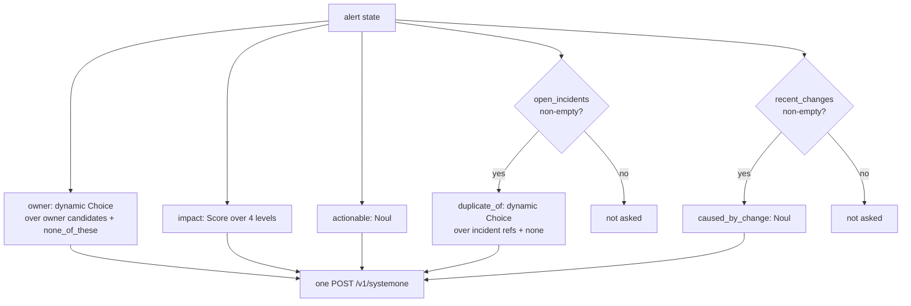
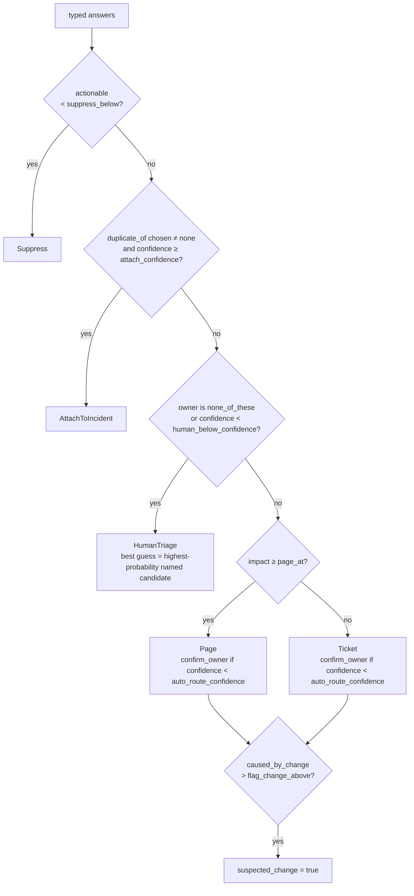

# Triage

Triage is one request to the model and one pass through a policy. The request asks every question the policy might need, including questions whose answers may go unused. The policy reads the answers in a fixed order of precedence and returns exactly one decision. Nothing in the policy calls the model, so thresholds can change without another request.

## State

The `state` is `{ "alert": Alert }`. Every field either answers a question or is left out; each one costs input tokens and dilutes attention.

| Field | Source | Read by |
|---|---|---|
| `source`, `title`, `description`, `labels` | the alert | every question |
| `runbook` | the alert, or TechDocs when Backstage is configured | owner, actionable |
| `open_incidents` | live incidents from incident.io, capped at 40 | `duplicate_of` |
| `recent_changes` | the alert file, or the [change feed](changes.md): deploys and changes posted by delivery tools that touched the component or the platform in the last two hours | `caused_by_change` |
| `component` | the Backstage catalog: owner, lifecycle, system, dependencies, dependents, tags, links | owner, impact |
| `related_alerts` | alerts firing in incident.io in the recent window (default 30 minutes, at most 20): title, age in minutes, component label | impact |

`related_alerts` is the blast radius as the hub sees it at that moment. When it is non-empty the impact question is told that several alerts on the same component, or on the component's dependents, indicate broader impact than the alert alone shows, and that unrelated ones do not raise it. The list is also written into the [qualification note](incidentio.md#the-qualification-note), so the responder sees the same context the model did.

## Which questions are asked

Speculative questions are asked in the same request when their premise can hold, and never when it cannot: the model cannot choose an option it was not offered.

| Id | Primitive | Rubric | Policy reads it for |
|---|---|---|---|
| `owner` | Choice | owner candidates: catalog groups, or the fallback team list | who receives the page or ticket |
| `impact` | Score | four concrete situations from no user impact to full outage (`[triage.text] impact_levels`) | page versus ticket |
| `actionable` | Noul | yes: failing, at risk or violating policy and will not self-resolve; no: informational, test, recovered, blip | suppression |
| `duplicate_of` | Choice | open incident references plus `none` | attaching to an existing incident |
| `caused_by_change` | Noul | is one of the listed changes a plausible direct cause | the `ai-suspected-change` tag |

Every question references the state by backticked path (`alert.title`, `alert.component.owner`). The owner question's instructions change when a catalog component is present: they name `alert.component.owner` as the registered owner and say when to deviate.

### Owner candidates

Owner candidates are data, not a type. With Backstage configured they are catalog groups assembled by the [enricher](backstage.md#owner-candidates), each described by display name, description and owned components. Without a catalog, or when nothing in it matched, the fallback list applies: `[[triage.teams]]` in the configuration file, or the built-in six teams (`triage::default_teams`) when the file defines none. `none_of_these` is always the last option so an unattributable alert is never forced onto a team. The chosen key becomes the `ai-team-<key>` tag and, for catalog groups, the notification recipient.

## The decision

`decide` in `src/triage/policy.rs` is pure code over typed answers.

Order is priority. Suppression wins over everything: a non-actionable alert is dropped even if it looks like a duplicate. Deduplication wins over routing: attaching to the incident that already has responders beats paging a second team. Only then does ownership matter, and only a confident owner gets an automatic route.

| Threshold | Default | Meaning |
|---|---|---|
| `suppress_below` | 0.25 | below this probability of being actionable, suppress |
| `attach_confidence` | 0.75 | dedup confidence needed to attach |
| `human_below_confidence` | 0.40 | owner confidence below which a person triages |
| `auto_route_confidence` | 0.70 | owner confidence below which the route is marked for confirmation |
| `page_at` | `Major` | impact level at or above which the owner is paged rather than ticketed |
| `flag_change_above` | 0.65 | probability above which a recent change is flagged as suspected cause |

These are conservative starting points from the TypeSafe documentation's three-band guidance and have not been tuned on real alerts. Automatic paging on these values should wait for the evaluation work in the [roadmap](roadmap.md).

## What is configurable

| | Where | Why there |
|---|---|---|
| Thresholds | `[policy]` in the configuration file | tuned per deployment on its own alert history; changing one must not need a build |
| Wording of every question, guidance and criterion, and the four impact level descriptions | `[triage.text]` | vocabulary and alert sources differ per organisation; the words are what a team tunes |
| Fallback owner list | `[[triage.teams]]` | one organisation's structure, not the tool's |
| The set of questions and their primitives | code, `src/triage/questions.rs` | the policy reads `owner`, `impact`, `actionable`, `duplicate_of` and `caused_by_change` through typed handles; a question the policy does not read is cost without effect, and a missing one is a policy bug the handles exist to catch ([decision 0003](decisions/0003-typed-handles-between-questions-and-answers.md)) |
| The number of impact levels | code, four | `policy.page_at` compares against the `Impact` enum; the level count is validated when the file loads |

Which questions are asked depends only on the state (open incidents present, recent changes present), never on the text. A wording change therefore cannot break the flow; it can only make the model better or worse at the same question, which the [tuning loop](#tuning) measures. Adding a judgment remains a code change with a policy change, by design ([decision 0006](decisions/0006-layered-configuration.md)).

## Confidence is not probability

A Choice answer carries both the probability of each option and a confidence, which summarises how concentrated the distribution is. The policy thresholds on confidence for routing and dedup because a spread distribution means the model saw several plausible answers, whatever the top one was. A Noul carries only a probability; the actionable threshold reads that directly.

## Tuning

Raw answers travel with every decision (`--json` on the CLI, `Outcome` in the flow), and the [evaluation harness](evaluation.md) turns labelled alerts into accuracy, calibration and decision-agreement numbers. The loop:

1. Collect alerts with the expected team, impact, actionability and action into a cases file.
2. `signalman eval cases.jsonl --record runs/<model>`: one model call per case, every raw response kept.
3. Read `conf|right` against `conf|wrong` per question and set thresholds in `[policy]`, higher for actions that are expensive when wrong.
4. `signalman eval cases.jsonl --replay runs/<model>` to see the decisions under the new thresholds, without calling the model.
5. Pin `typesafe.model` to the version recorded against in the same file and re-evaluate before moving to a new one.

## Testing

Policy tests build answers by round-tripping a fake API response through the real handles (`src/triage/policy.rs`), so they exercise the same parsing as production. Question tests assert which questions exist for a given state and what the owner criteria contain.
