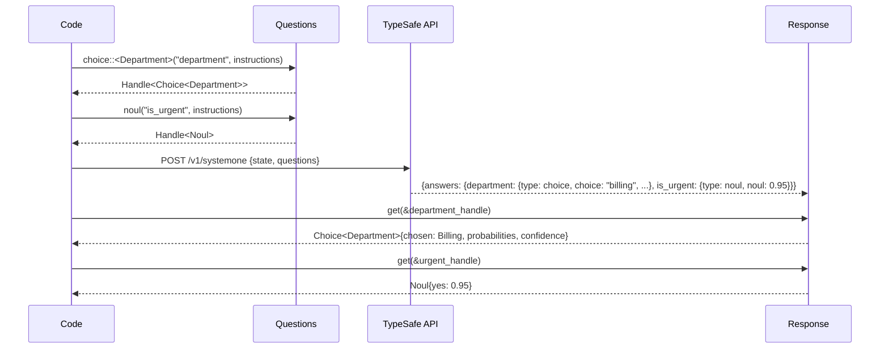
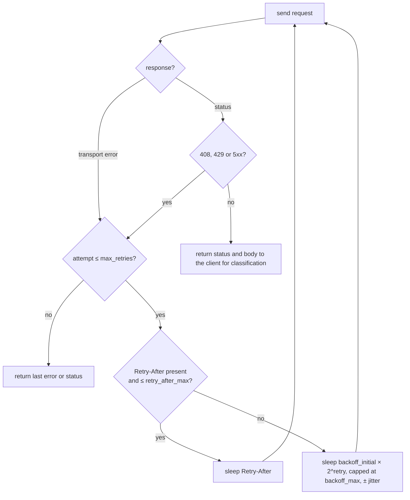

# TypeSafe client

TypeSafe's model, Jev, evaluates a `state` (any JSON) against typed questions and returns calibrated judgments rather than text. The [live documentation](https://docs.typesafe.ai/llms.txt) is the contract; this page describes how the crate implements it. There is no official Rust SDK; the client mirrors the Python SDK's defaults so behaviour matches across languages.

| Primitive | Question | Answer |
|---|---|---|
| Noul | yes or no | probability of yes |
| Choice | one of a defined set | chosen option, probability per option, confidence |
| Score | degree on ordered levels | weighted position, probability per level, confidence |

## Typed handles

On the wire, questions and answers are two maps keyed by the same ids, and nothing ties a Noul question to a Noul answer. The client closes that gap at compile time.



```rust
use signalman::{Client, Questions, options};

options! {
    enum Department {
        Billing = "billing" => "Payments, invoicing, refunds",
        Technical = "technical" => "Bugs, outages, integrations",
        Sales = "sales" => "Pricing, upgrades, new accounts",
    }
}

let mut questions = Questions::new();
let dept = questions.choice::<Department>("department", "Which team should handle `message`?")?;
let urgent = questions.noul("is_urgent", "Does `message` convey urgency?", None)?;

let client = Client::from_env()?;
let state = serde_json::json!({ "message": "Help! My payouts have been failing for 3 days." });
let response = client.system_one(&state, &questions).await?;

let dept = response.get(&dept)?;      // Choice<Department>
let urgent = response.get(&urgent)?;  // Noul
```

What the handle rules out:

| Situation | Result |
|---|---|
| Reading a Score where a Noul was asked | `Error::AnswerTypeMismatch` naming the id and both primitives |
| An option string the enum does not know | `Error::UnknownOption`, never a silent default |
| A probability or confidence outside `[0, 1]` | `Error::NotAProbability` at deserialisation; `Probability` and `Confidence` are distinct validated newtypes |
| An answer missing from the response | `Error::MissingAnswer` |
| An answer of the right primitive that does not fit its question, such as a Score on a scale the question never sent | `Error::InvalidAnswer` naming the id and the reason |

The `options!` macro writes the `Options` implementation from one definition: the wire keys, the rubric text sent as `criteria`, and the reverse lookup. For option sets known only at runtime, `Questions::dynamic_choice` takes `(key, description)` pairs and returns `Handle<Choice<String>>`; the triage uses it for incident references and catalog groups.

## Building questions

`Questions::noul`, `choice`, `dynamic_choice` and `score` reject what the API would reject before a request is sent: duplicate ids, fewer than two options, more than 255 options, fewer than two or more than ten levels. Instructions accept any JSON value, so structured instructions with a `question` field and reference data are supported as the documentation recommends.

## Retries

A transient failure upstream (a timeout, a 429, a 5xx) must not fail a triage that a second attempt would have completed, and a persistent one must surface quickly enough that the alert falls back to a person. The retry policy sits between those two costs.

All three clients share one loop in `src/http.rs`, so the retry rules and the error counting are written once and every upstream behaves the same way under failure.



| Setting | Default | Override |
|---|---|---|
| API key | `TYPESAFE_API_KEY` | `Client::builder().api_key(..)` |
| Base URL | `https://api.typesafe.ai` | `.base_url(..)`; the binary takes `typesafe.base_url` from the [configuration](configuration.md); any server speaking the System One shape works, see [Laya](laya.md) |
| Model | `jev-latest` | `.model(..)`; the binary takes `typesafe.model`, `TYPESAFE_DEFAULT_MODEL` or `--model` |
| Timeout | 10 s per attempt | `.timeout(..)` |
| Retries | 2; backoff 0.5 s doubling to 5 s; ±25 % jitter | `.retry(RetryPolicy { .. })` |
| Retry on | 408, 429, 5xx (including 529), transport errors | |
| `Retry-After` | honoured up to 30 s, delay-seconds form only | `retry_after_max` |

Why these values:

- **Two retries** is the TypeSafe Python SDK's default, and the client mirrors the SDK so a failure looks the same from Rust and from Python. The cost is bounded: three attempts of at most 10 s each plus two backoffs is how long a dead upstream holds a triage before the error surfaces. More retries would hold a webhook slot longer ([Operations](operations.md#backpressure)); fewer would fail on a single dropped connection.
- **`Retry-After` is honoured only up to 30 s.** The server knows better than the client how long to wait, so the header wins when it is present, but a hostile or misconfigured header must not stall a triage for minutes; above the cap the client's own backoff applies instead. Only the delay-seconds form is read. The HTTP-date form needs a clock comparison against a server whose clock may not match, and the backoff is a safe fallback, so the code ignores it rather than trust the arithmetic.
- **Every failed attempt is counted**, retried or not, in `signalman.upstream.errors` with the service label. A retry that succeeds hides the failure from the caller, but the failed attempt was still load on the upstream and still a symptom, so the metric sees it ([Observability](observability.md#metrics)).

`evaluate` runs inside a `typesafe.evaluate` span carrying the `model` requested and, once the response arrives, the `input_tokens` it reports; the same numbers feed the `signalman.typesafe.tokens` counter, where `input` is the billed direction. The state and the questions are never put in a span field ([Observability](observability.md)).

The response's `model` field is the versioned id that answered (for example `jev-1.13.0`) even when an alias was requested. It is logged and returned in every outcome. Thresholds tuned against one version should pin that version.

## Errors

A caller has to pick a remedy from the error alone, so `signalman::Error` separates failures by what fixes them rather than by status code. `MissingApiKey` and `Unauthorized` (401) mean the configuration is wrong. `InvalidRequest` (422, with the body) means the request is wrong and no retry will help; the body names the offending field. `RateLimited` (429) and `Overloaded` (TypeSafe's 529) are both returned only after the retries ran out and both carry the attempt count, but they are kept apart because the remedies differ: 429 is the account's rate limit, the remedy is to slow down, and the error carries the server's `Retry-After` when it sent one; 529 is TypeSafe's service being overloaded, there is no `Retry-After` to carry, and the remedy is to wait and try again later. `Http` (any other status, with the truncated body), `Transport` (network, TLS or timeout, after retries) and `Decode` (a body that is not the documented shape) cover the rest, plus the typed-layer errors above. The API key is marked sensitive and redacted from `Debug` output, so an error printed with `{:?}` cannot leak it.
