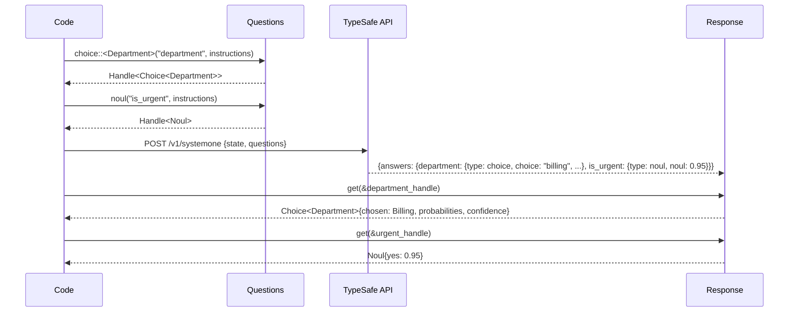
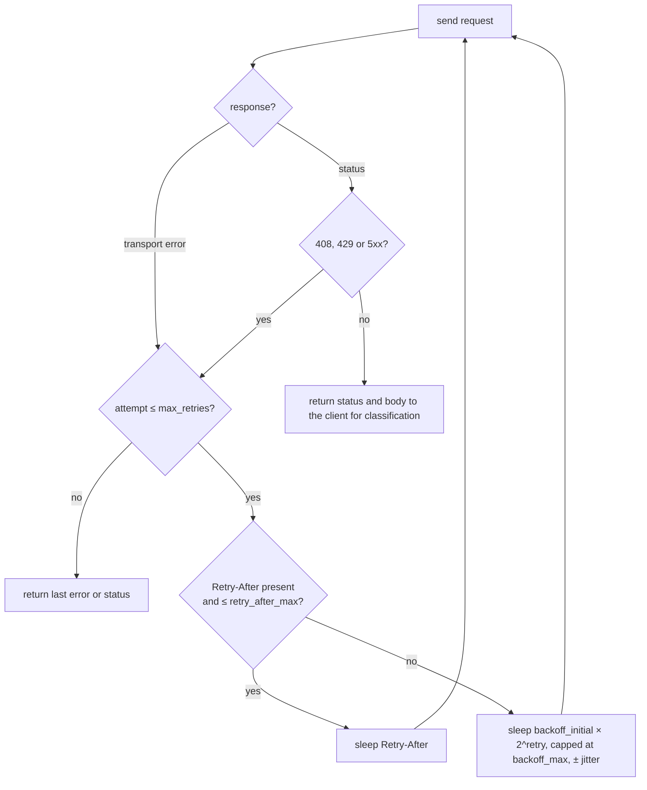

# TypeSafe client

A second project that wanted calibrated judgments from a TypeSafe System One model had to depend on the whole triager: axum, rmcp, two other API clients, OpenTelemetry and a configuration model shaped for one deployment. [Decision 0010](decisions/0010-extract-the-judgment-core-into-a-crate.md) moved the typed client into its own crate, `judgment`, a member of this workspace at `crates/judgment/`, which signalman depends on by path and re-exports; it is published when a second consumer exists, not before.

Where to read about the crate itself:

- `crates/judgment/README.md` is the front door: what it guarantees, the walkthrough, how to depend on it by git.
- `cargo doc -p judgment --open` is the reference; the rustdoc explains the why behind each type, each error and each default. There is no docs.rs page yet because the crate is not published.
- The [live TypeSafe documentation](https://docs.typesafe.ai/llms.txt) is the wire contract the crate implements. There is no official Rust SDK; the crate mirrors the Python SDK's defaults so a failure looks the same from either language.

This page keeps two diagrams rustdoc cannot render, and says what signalman does with the crate.

## Typed handles

On the wire, questions and answers are two maps keyed by the same ids, and nothing ties a Noul question to a Noul answer. The crate closes that gap at compile time ([decision 0003](decisions/0003-typed-handles-between-questions-and-answers.md)): adding a question returns a handle that fixes the answer's type, and reading through the handle yields a Rust enum, a probability or a score, or an error naming what did not fit. The error table and the `options!` macro are documented in the crate's rustdoc.

## Retries

A transient failure upstream must not fail a triage that a second attempt would have completed, and a persistent one must surface quickly enough that the alert falls back to a person. The loop below, in the crate's `http` module, sits between those two costs; the defaults (two retries, 0.5 s doubling to 5 s with jitter, `Retry-After` honoured up to 30 s, 408, 429 and 5xx retried) and the reasons for each are in the rustdoc of `RetryPolicy`.

Errors are separated by what fixes them rather than by status code; the variants and their remedies are documented on the crate's `Error` type.

TypeSafe identifies a call by an `x-typesafe-request-id` response header, which both official SDKs expose: the one link from a failed call or a surprising answer to TypeSafe's own logs. The client keeps it in three places: `Error::request_id()` on every error that came from an HTTP response (a 2xx whose body does not decode included), a ` [request_id …]` suffix at the end of that error's message, so a log line that keeps only the message still has it, and the `request_id` field of the `typesafe.evaluate` and `typesafe.list_models` spans ([Observability](observability.md#spans)). A successful response carries it too, as `Response::request_id`. Quote it to TypeSafe support when a call fails or an answer looks wrong. It is the last attempt's id when the call was retried, there is none after a transport failure (no response came back, or its body could not be read), and it is optional everywhere: the published OpenAPI document lists no response headers, the [Laya](laya.md) server sends none, and the hosted API has not yet been seen sending one to this client.

## How signalman uses it

- `signalman::Client` is a re-export of `judgment::Client`, the same type; the re-exports exist so nothing built against signalman breaks during the extraction and are dropped after one release.
- The binary builds the client from `typesafe.base_url`, `typesafe.model` and `typesafe.timeout_seconds` ([Configuration](configuration.md)); the key comes from `TYPESAFE_API_KEY` and nowhere else. Any server that speaks the System One wire works, which is how [Laya](laya.md) was run with no code change.
- signalman implements `judgment::Observer` in `src/telemetry.rs` and installs it as the process-wide observer in `Providers::init`, before the first client exists. That is why the crate's token usage and failed attempts appear as `signalman.typesafe.tokens` and `signalman.upstream.errors` ([Observability](observability.md#metrics)) while the crate names no instrument.
- The incident.io and Backstage clients call `judgment::http::send_with_retries` with their own service label, so all three upstreams retry the same way and every failed attempt is counted once.
- The triage question set (`src/triage/questions.rs`) is the pattern any consumer writes: the crate's primitives are code, and `Texts` makes the wording data that can be tuned without touching the handles ([Triage](triage.md)).
- The [evaluation harness](evaluation.md) grades through `judgment::eval`: recordings, per-question grading and the calibration metrics are the crate's; the labels and the decision are signalman's.

## What the crate does not do

- No sync client: the API documents one evaluation endpoint (and a model listing) and every consumer so far is async.
- No batching or streaming: the API documents one request shape, and no consumer has asked.
- No metrics backend: a library that named instruments would force its telemetry stack on every consumer; the `Observer` trait hands the numbers to whoever owns the instruments.
- No second backend in the product yet: the crate has a `SystemOne` trait with `Fake` and `Replay` implementations, but signalman's `Triager` holds a concrete `Client` rather than a `dyn SystemOne` until a second backend is needed there. The trait is the seam an official SDK or a local model would plug into.
