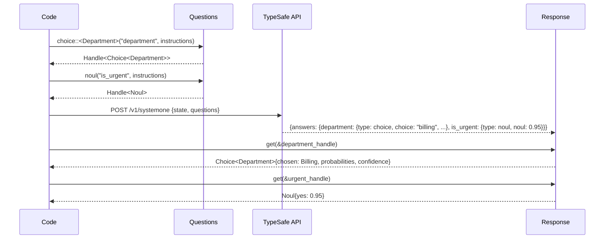
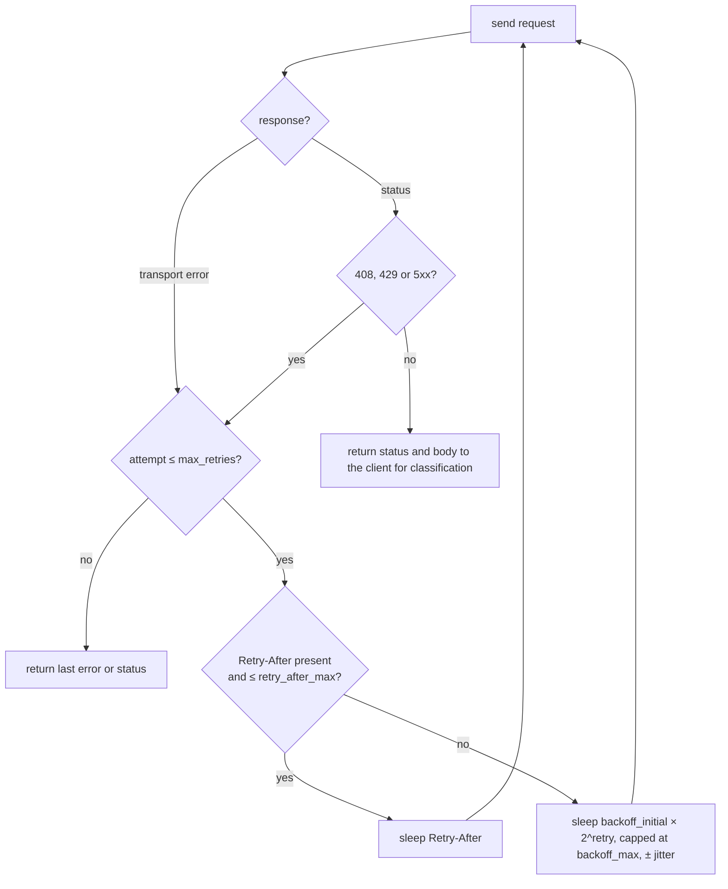

# TypeSafe client

TypeSafe's model, Jev, evaluates a `state` (any JSON) against typed questions and returns calibrated judgments rather than text. The [live documentation](https://docs.typesafe.ai/llms.txt) is the contract; this page describes how the crate implements it. There is no official Rust SDK; the client mirrors the Python SDK's defaults so behaviour matches across languages.

| Primitive | Question | Answer |
|---|---|---|
| Noul | yes or no | probability of yes |
| Choice | one of a defined set | chosen option, probability per option, confidence |
| Score | degree on ordered levels | weighted position, probability per level, confidence |

## Typed handles

On the wire, questions and answers are two maps keyed by the same ids, and nothing ties a Noul question to a Noul answer. The client closes that gap at compile time.



```rust
use signalman::{Client, Questions, options};

options! {
    enum Department {
        Billing = "billing" => "Payments, invoicing, refunds",
        Technical = "technical" => "Bugs, outages, integrations",
        Sales = "sales" => "Pricing, upgrades, new accounts",
    }
}

let mut questions = Questions::new();
let dept = questions.choice::<Department>("department", "Which team should handle `message`?")?;
let urgent = questions.noul("is_urgent", "Does `message` convey urgency?", None)?;

let client = Client::from_env()?;
let state = serde_json::json!({ "message": "Help! My payouts have been failing for 3 days." });
let response = client.system_one(&state, &questions).await?;

let dept = response.get(&dept)?;      // Choice<Department>
let urgent = response.get(&urgent)?;  // Noul
```

What the handle rules out:

| Situation | Result |
|---|---|
| Reading a Score where a Noul was asked | `Error::AnswerTypeMismatch` naming the id and both primitives |
| An option string the enum does not know | `Error::UnknownOption`, never a silent default |
| A probability or confidence outside `[0, 1]` | deserialisation fails; `Probability` and `Confidence` are distinct validated newtypes |
| An answer missing from the response | `Error::MissingAnswer` |

The `options!` macro writes the `Options` implementation from one definition: the wire keys, the rubric text sent as `criteria`, and the reverse lookup. For option sets known only at runtime, `Questions::dynamic_choice` takes `(key, description)` pairs and returns `Handle<Choice<String>>`; the triage uses it for incident references and catalog groups.

## Building questions

`Questions::noul`, `choice`, `dynamic_choice` and `score` reject what the API would reject before a request is sent: duplicate ids, fewer than two options, more than 255 options, fewer than two or more than ten levels. Instructions accept any JSON value, so structured instructions with a `question` field and reference data are supported as the documentation recommends.

## Retries

All three clients share one loop in `src/http.rs`.



| Setting | Default | Override |
|---|---|---|
| API key | `TYPESAFE_API_KEY` | `Client::builder().api_key(..)` |
| Base URL | `https://api.typesafe.ai` | `.base_url(..)`; the binary takes `typesafe.base_url` from the [configuration](configuration.md) |
| Model | `jev-latest` | `.model(..)`; the binary takes `typesafe.model`, `TYPESAFE_DEFAULT_MODEL` or `--model` |
| Timeout | 10 s per attempt | `.timeout(..)` |
| Retries | 2; backoff 0.5 s doubling to 5 s; ±25 % jitter | `.retry(RetryPolicy { .. })` |
| Retry on | 408, 429, 5xx (including 529), transport errors | |
| `Retry-After` | honoured up to 30 s, delay-seconds form only | `retry_after_max` |

The response's `model` field is the versioned id that answered (for example `jev-1.13.0`) even when an alias was requested. It is logged and returned in every outcome. Thresholds tuned against one version should pin that version.

## Errors

`signalman::Error` distinguishes `MissingApiKey`, `Unauthorized` (401), `InvalidRequest` (422 with the body), `RateLimited` and `Overloaded` (429 and 529 after retries, with attempt counts), `Http`, `Transport` and `Decode`, plus the typed-layer errors above. The API key is marked sensitive and redacted from `Debug` output.
